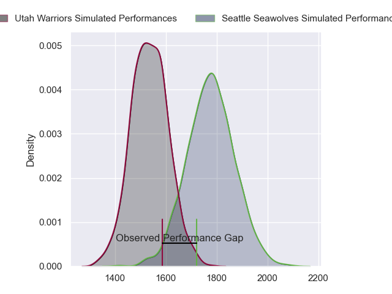
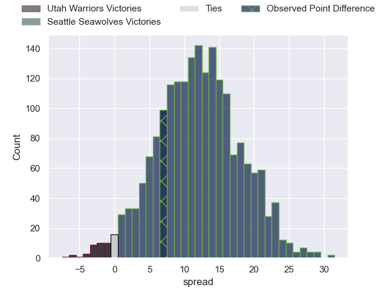

---  
layout: page  
title: Utah Warriors at Seattle Seawolves  
date: 2023-06-05 18:00:00 -0500  
categories: match review  
---
# Utah Warriors at Seattle Seawolves

# Club Level Predictions

The first set of predictions treats a club as the smallest object, as the club develops its members, organizes a gameplan, and deploys its players as needed for each match. This club model has a prediction of 0.793, which translates to predicting Seattle Seawolves to win by 12.0.

Each club has a rating and a rating deviation (simiar to a Glicko system), and expected performances can be generated. This allows for simulated matches and spreads like the ones below.
## Projected Performances

## Projected Spreads

## Projected Results

# Player Level Predictions

Treating teams instead as an entity made up of the currently active players, I have ratings for each player in an altogether different system. These can be combined to form team ratings once teamsheets are announced, weighting starters a bit higher than the reserves. After the match is played, players can be weighted by their minutes on the field, allowing for an accurate measure of the team's composition. With these compiled team ratings, we can make predictions, measure inaccuracy, and update the individual player ratings.
## Prediction with Player Minutes: Seattle Seawolves by 6.9

Seattle Seawolves by 3.8 on a neutral field
## Prediction without Player Minutes: Seattle Seawolves by 6.9

Seattle Seawolves by 3.8 on a neutral pitch

|   Away Minutes | Away Player             |   Away elo |   Away variance |   Number |   Home variance |   Home elo | Home Player          |   Home Minutes |
|---------------:|:------------------------|-----------:|----------------:|---------:|----------------:|-----------:|:---------------------|---------------:|
|             80 | Olive Kilifi            |      45.55 |           49.13 |        1 |           49.11 |      54.32 | Mzamo Majola         |             80 |
|             80 | Henry Bell              |      48.61 |           49.33 |        2 |           48.71 |      65.98 | James Malcolm        |             80 |
|             80 | Paul Mullen             |      41.76 |           49.15 |        3 |           48.77 |      65.29 | Sam Matenga          |             80 |
|             80 | Jamie Lane              |      46.84 |           48.55 |        4 |           49.52 |      58.3  | Samu Manoa           |             80 |
|             80 | Saia Uhila              |       8.22 |           48.81 |        5 |           49.51 |      62.67 | Rhyno Herbst         |             80 |
|             80 | Bailey Wilson           |      31.44 |           48.1  |        6 |           48.35 |      71.59 | Ben Landry           |             80 |
|             80 | Onehunga Havili Kaufusi |      54.19 |           48.66 |        7 |           47.98 |      70.78 | Charles Elton        |             80 |
|             80 | Thomas Tu'avao          |      50.58 |           48.14 |        8 |           49.25 |     -45.98 | Ronan Foley          |             80 |
|             80 | Connor McLeod           |      47.98 |           48.1  |        9 |           48.06 |      58.01 | JP Smith             |             80 |
|             80 | Joel Hodgson            |      52.09 |           48.06 |       10 |           49.32 |      71.22 | Jordan Chait         |             80 |
|             80 | Joseph Mano             |      66.86 |           47.9  |       11 |           48.77 |      65.57 | Martin Iosefo        |             80 |
|             80 | Calvin Whiting          |      51.79 |           48.88 |       12 |           48.49 |      73.63 | AJ Alatimu           |             80 |
|             80 | Tyler Luke Fisher       |      88.57 |           48.63 |       13 |           48.58 |      66.16 | Daniel David Kriel   |             80 |
|             80 | Mika Kruse              |      50.45 |           48.14 |       14 |           48.17 |      93.19 | Lauina Futi          |             80 |
|             80 | Caleb Makene            |      50.31 |           48.19 |       15 |           48.33 |      -4.7  | Adriaan John Carelse |             80 |

