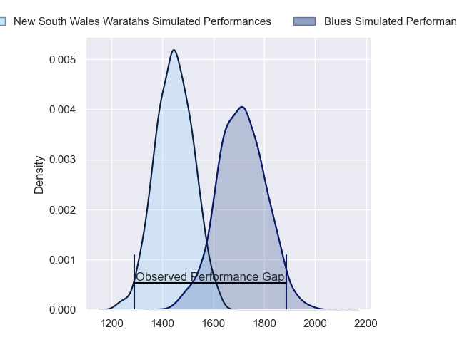
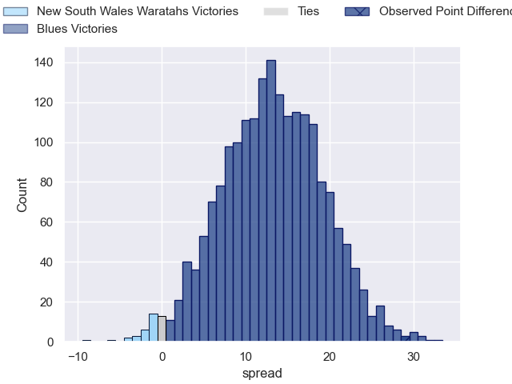
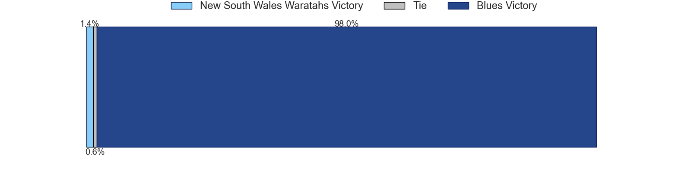

---  
layout: page  
title: New South Wales Waratahs at Blues; 12.0-41.0  
date: 2023-06-09 03:35:00 18:00:00 -0500  
categories: match review  
---
# New South Wales Waratahs at Blues; 12.0-41.0

# Club Level Predictions

The first set of predictions treats a club as the smallest object, as the club develops its members, organizes a gameplan, and deploys its players as needed for each match. This club model has a prediction of 0.817, which translates to predicting Blues to win by 13.4.

Each club has a rating and a rating deviation (simiar to a Glicko system), and expected performances can be generated. This allows for simulated matches and spreads like the ones below.
## Projected Performances

## Projected Spreads

## Projected Results

# Player Level Predictions

Treating teams instead as an entity made up of the currently active players, I have ratings for each player in an altogether different system. These can be combined to form team ratings once teamsheets are announced, weighting starters a bit higher than the reserves. After the match is played, players can be weighted by their minutes on the field, allowing for an accurate measure of the team's composition. With these compiled team ratings, we can make predictions, measure inaccuracy, and update the individual player ratings.
## Prediction with Player Minutes: Blues by 14.3

Blues by 10.3 on a neutral field

There were 3 large changes in win probability in this match
## Prediction without Player Minutes: Blues by 16.8

Blues by 12.8 on a neutral pitch

|   Away Minutes | Away Player         |   Away elo |   Away Percentile |   Number |   Home Percentile |   Home elo | Home Player      |   Home Minutes |
|---------------:|:--------------------|-----------:|------------------:|---------:|------------------:|-----------:|:-----------------|---------------:|
|             55 | Tetera Faulkner     |      90.4  |                78 |        1 |                92 |     103.06 | Ofa Tu'ungafasi  |             54 |
|             66 | Dave Porecki        |     105.12 |                92 |        2 |                68 |      85.01 | Ricky Riccitelli |             59 |
|             55 | Nephi Leatigaga     |      74.26 |                42 |        3 |                91 |     102.66 | Nepo Laulala     |             62 |
|             69 | Jed Holloway        |      76.97 |                49 |        4 |                77 |      91.16 | Tom Robinson     |             81 |
|             81 | Ned Hanigan         |      97.8  |                84 |        5 |                75 |      90.8  | James Tucker     |             62 |
|             71 | Lachlan Swinton     |      89.36 |                76 |        6 |                94 |     110.35 | Akira Ioane      |             57 |
|             81 | Michael Hooper      |     140.87 |                99 |        7 |                88 |     102.22 | Dalton Papali'i  |             81 |
|             47 | Langi Gleeson       |      89.55 |                73 |        8 |                97 |     118.88 | Hoskins Sotutu   |             81 |
|             65 | Harrison Goddard    |      76.56 |                45 |        9 |                82 |      97.56 | Finlay Christie  |             59 |
|             81 | Tane Edmed          |      83.42 |                60 |       10 |               100 |     145.55 | Beauden Barrett  |             66 |
|             81 | Dylan Pietsch       |      91.08 |                76 |       11 |                36 |      71.06 | AJ Lam           |             81 |
|             81 | Joey Walton         |      76.87 |                48 |       12 |                75 |      92.37 | Bryce Heem       |             65 |
|             41 | Izaia Perese        |      75.83 |                44 |       13 |                59 |      83.09 | Rieko Ioane      |             81 |
|             81 | Mark Nawaqanitawase |      92.08 |                72 |       14 |                89 |     103.74 | Mark Telea       |             81 |
|             81 | Ben Donaldson       |      86.19 |                63 |       15 |                67 |      88.64 | Zarn Sullivan    |             81 |
|             15 | Tolu Latu           |     110.37 |               nan |       16 |                97 |     119.27 | Kurt Eklund      |             22 |
|             26 | Tom Lambert         |      89.25 |                86 |       17 |                22 |      65.97 | Jordan Lay       |             27 |
|             26 | Daniel Botha        |      86.16 |               nan |       18 |                71 |      86.33 | Marcel Renata    |             19 |
|             34 | Taleni Seu          |      81.92 |                57 |       19 |                87 |     100.9  | Cameron Suafoa   |             19 |
|             12 | Hugh Sinclair       |      92.41 |                78 |       20 |                22 |      64.03 | Anton Segner     |             24 |
|             10 | Charlie Gamble      |      81.04 |                62 |       21 |                80 |      95.56 | Sam Nock         |             22 |
|             16 | Teddy Wilson        |      81.11 |               nan |       22 |                88 |     103.05 | Harry Plummer    |             16 |
|             40 | Lalakai Foketi      |      93.23 |                77 |       23 |                87 |     103.67 | Stephen Perofeta |             15 |

