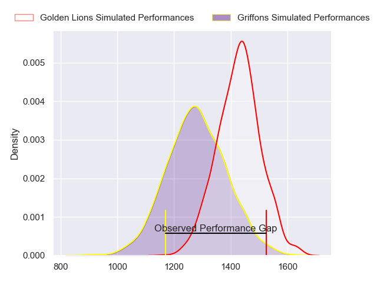
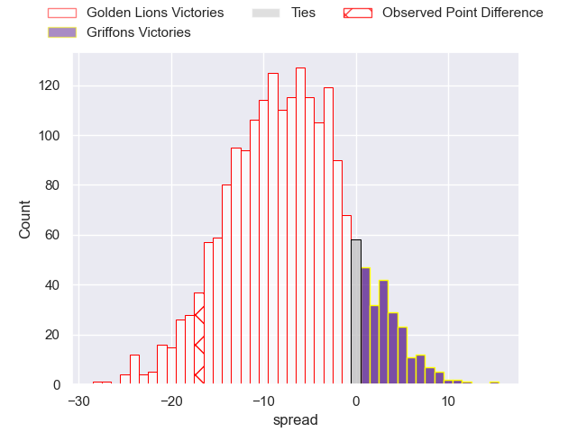
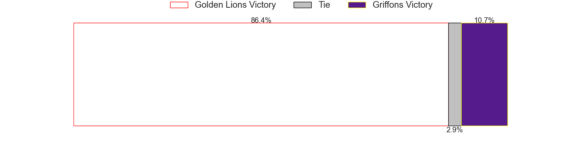

---  
layout: page  
title: Golden Lions at Griffons; 39-22  
date: 2023-06-09 15:00:00 18:00:00 -0500  
categories: match review  
---
# Golden Lions at Griffons; 39-22

# Club Level Predictions

The first set of predictions treats a club as the smallest object, as the club develops its members, organizes a gameplan, and deploys its players as needed for each match. This club model has a prediction of 0.301, which translates to predicting Golden Lions to win by 7.5.

Each club has a rating and a rating deviation (simiar to a Glicko system), and expected performances can be generated. This allows for simulated matches and spreads like the ones below.
## Projected Performances

## Projected Spreads

## Projected Results

# Player Level Predictions

Treating teams instead as an entity made up of the currently active players, I have ratings for each player in an altogether different system. These can be combined to form team ratings once teamsheets are announced, weighting starters a bit higher than the reserves. After the match is played, players can be weighted by their minutes on the field, allowing for an accurate measure of the team's composition. With these compiled team ratings, we can make predictions, measure inaccuracy, and update the individual player ratings.
## Prediction with Player Minutes: Golden Lions by 38.4

Golden Lions by 42.4 on a neutral field

There were 2 large changes in win probability in this match
## Prediction without Player Minutes: Golden Lions by 35.9

Golden Lions by 39.9 on a neutral pitch

|   Away Minutes | Away Player                 |   Away elo |   Away Percentile |   Number |   Home Percentile |   Home elo | Home Player                 |   Home Minutes |
|---------------:|:----------------------------|-----------:|------------------:|---------:|------------------:|-----------:|:----------------------------|---------------:|
|             80 | Rhynardt Rijnsburger        |     107.4  |                95 |        1 |                 9 |      55.25 | Xolani Jacobs               |             40 |
|             67 | Gerrit Jacobus Visagie      |      88.39 |                76 |        2 |                21 |      63    | Hendrik Petrus van Schoor   |             54 |
|             58 | Ruan Martin Dreyer          |      83.88 |                66 |        3 |                31 |      65.13 | Buhle Nojekwa               |             57 |
|             80 | Ruben (Hobo) Schoeman       |      90.65 |                74 |        4 |               nan |      72.97 | Wikus Nieuwenhuis           |             67 |
|             80 | Raynard Roets               |      94.24 |                81 |        5 |                10 |      54.75 | Rian Olivier                |             40 |
|             80 | Johannes JC Pretorius       |     101.91 |                88 |        6 |                43 |      75.19 | Jean-Jacques Pretorius      |             60 |
|             55 | Jarod Cairns                |      79.54 |                56 |        7 |                26 |      67.11 | Thomas Ongera               |             80 |
|             67 | Francke Horn                |      96.86 |                82 |        8 |                 7 |      51.44 | Sokuphumla (Soso) Xakalashe |             80 |
|             67 | Sanele Nohamba              |      91.37 |                74 |        9 |                47 |      77.13 | Jaywinn Juries              |             80 |
|             80 | Gianni Dean Lombard         |      83.41 |                60 |       10 |                 3 |      40.28 | Robbie Petzer               |             57 |
|             80 | Edwill Charl van der Merwe  |      89.74 |                74 |       11 |                 1 |      37.06 | Keanu Armandio Vers         |             80 |
|             76 | Rynardt Jonker              |     105.35 |                90 |       12 |                18 |      61.63 | Jeandre De Beer             |             60 |
|             80 | Manuel Johern (Mannie) Rass |      69.57 |                31 |       13 |                21 |      63.85 | Carel-Jan Coetzee           |             80 |
|             77 | Boldwin Hansen              |      88.89 |                73 |       14 |                 6 |      48.43 | Domenic Smit                |             80 |
|             80 | Quan Horn                   |      92.81 |                74 |       15 |                72 |      91.73 | Duan Pretorius              |             80 |
|             25 | Emmanuel Tshituka           |      78.87 |                64 |       16 |                 5 |      49.18 | Michael Benadie             |             40 |
|             22 | Asenathi Ntlabakanye        |      83.85 |                69 |       17 |                25 |      64.85 | Stephan de Jager            |             40 |
|             13 | PJ Botha                    |      80.72 |                58 |       18 |                63 |      81.04 | Dandré Delport              |             26 |
|             13 | Morne van der Berg          |      85.38 |                61 |       19 |                 1 |      37.55 | Duren Hoffman               |             23 |
|             13 | Travis Gordon               |      65.36 |                23 |       20 |               nan |      59.08 | Hillary Mwanjilwa           |             23 |
|              3 | Stean Pienaar               |      84.96 |                57 |       21 |                93 |     108.47 | Thato Siward Mavundla       |             20 |
|              4 | Tyler Bocks                 |      86.75 |                66 |       22 |                 1 |      38.27 | Marquit Virgil September    |             20 |
|            nan | nan                         |     nan    |               nan |       23 |                26 |      63.84 | Curtley Thomas              |             13 |

