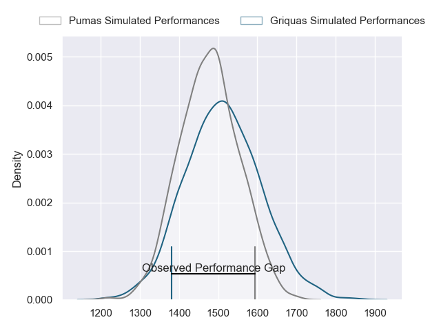
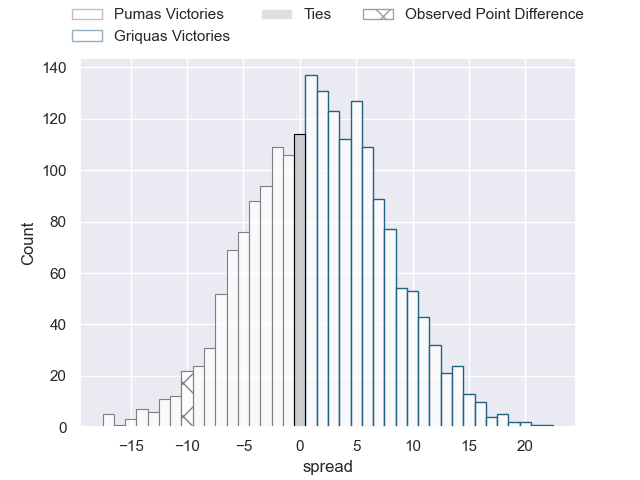
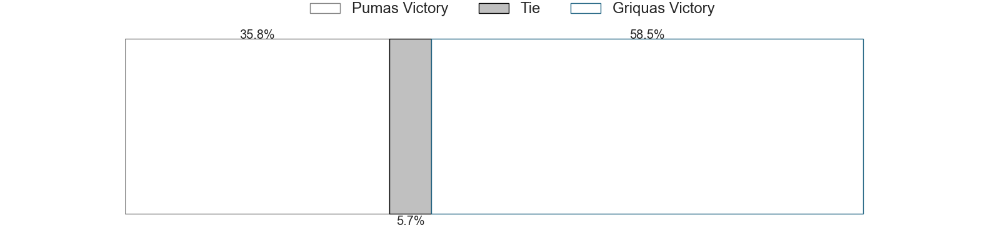

---  
layout: page  
title: Pumas at Griquas; 27-17  
date: 2023-06-09 14:00:00 18:00:00 -0500  
categories: match review  
---
# Pumas at Griquas; 27-17

# Club Level Predictions

The first set of predictions treats a club as the smallest object, as the club develops its members, organizes a gameplan, and deploys its players as needed for each match. This club model has a prediction of 0.552, which translates to predicting Griquas to win by 1.9.

Each club has a rating and a rating deviation (simiar to a Glicko system), and expected performances can be generated. This allows for simulated matches and spreads like the ones below.
## Projected Performances

## Projected Spreads

## Projected Results

# Player Level Predictions

Treating teams instead as an entity made up of the currently active players, I have ratings for each player in an altogether different system. These can be combined to form team ratings once teamsheets are announced, weighting starters a bit higher than the reserves. After the match is played, players can be weighted by their minutes on the field, allowing for an accurate measure of the team's composition. With these compiled team ratings, we can make predictions, measure inaccuracy, and update the individual player ratings.
## Prediction with Player Minutes: Griquas by 21.5

Griquas by 17.5 on a neutral field

There were 7 large changes in win probability in this match
## Prediction without Player Minutes: Griquas by 18.4

Griquas by 14.4 on a neutral pitch

|   Away Minutes | Away Player          |   Away elo |   Away Percentile |   Number |   Home Percentile |   Home elo | Home Player                |   Home Minutes |
|---------------:|:---------------------|-----------:|------------------:|---------:|------------------:|-----------:|:---------------------------|---------------:|
|             59 | Corne Fourie         |      61.77 |                19 |        1 |                65 |      83.85 | Kudzwai Dube               |             67 |
|             74 | PJ Jacobs            |      81.38 |               nan |        2 |                42 |      73.78 | Janco Uys                  |             80 |
|             59 | Simon Raw            |      45.74 |                 3 |        3 |                48 |      76.87 | Janu Botha                 |             40 |
|             69 | Deon Slabbert        |      56.75 |                12 |        4 |                60 |      82.34 | Dylan Sjoblom              |             80 |
|             80 | Shane Monro Kirkwood |      94.78 |                80 |        5 |                44 |      75    | Derrick Pretorius          |             80 |
|             80 | Andre Fouché         |      49.91 |                 5 |        6 |                73 |      87.53 | Thabo Ndimande             |             80 |
|             64 | Francois Kleinhans   |      61.28 |                17 |        7 |                85 |      98.24 | Hanru Sirgel               |             51 |
|             80 | Kwanda Dimaza        |      79.96 |                52 |        8 |                48 |      78.09 | Carl Els                   |             80 |
|             64 | Chriswill September  |      99.52 |                86 |        9 |                60 |      83.65 | Johan Mulder               |             67 |
|             79 | Tinus de Beer        |      89.45 |                69 |       10 |                76 |      93.41 | Lubabalo Dobela            |             80 |
|             80 | Etienne Taljaard     |      80.63 |                56 |       11 |                73 |      89.11 | Luther Obi                 |             80 |
|             54 | Ali Mgijima          |     104.16 |                89 |       12 |                79 |      96.17 | Eduard (Eddie) Fouche      |             56 |
|             80 | Diego Appollis       |      65.8  |                25 |       13 |                91 |     107.79 | Jay Cee Nel                |             80 |
|             80 | Andrew Kota          |      68.69 |                29 |       14 |                52 |      78.55 | Rosco Shane Specman        |             80 |
|             80 | Devon Frank Williams |      58.61 |                13 |       15 |                51 |      79.54 | George Alexander Whitehead |             76 |
|             26 | Wian van Niekerk     |      70.77 |                34 |       16 |                59 |      85.03 | Cebolenkosi Dlamini        |             40 |
|             21 | Etienne Janeke       |      86.92 |               nan |       17 |                21 |      67.43 | Stephan Smit               |             29 |
|             21 | Dewald Maritz        |      73.42 |               nan |       18 |                80 |      99.54 | Ashlon Davids              |              4 |
|             16 | Ruwald Van der Merwe |      76.18 |                50 |       19 |                62 |      82.1  | Justin Forwood             |             13 |
|             16 | Giovanne Snyman      |      46.36 |                 2 |       20 |                74 |      86.17 | Raegan Oranje              |             13 |
|             11 | Malembe Mpofu        |      70.49 |                40 |       21 |                27 |      68.42 | Sango (Saida) Xamlashe     |             24 |
|              6 | Darnell Osuagwu      |      73.85 |               nan |       22 |               nan |     nan    | nan                        |            nan |
|              1 | Gene Willemse        |      69.41 |                29 |       23 |               nan |     nan    | nan                        |            nan |

