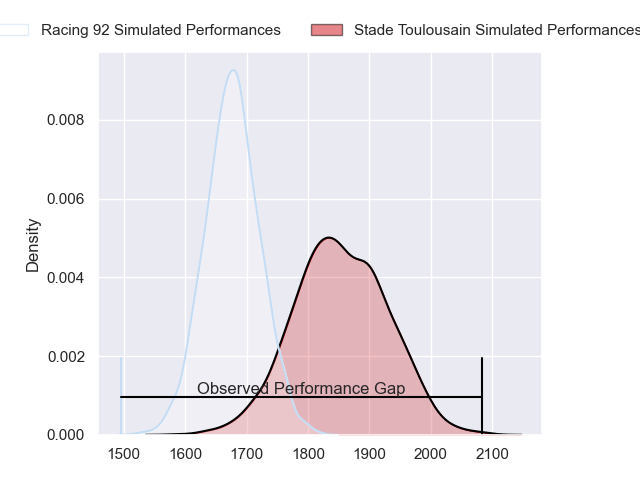
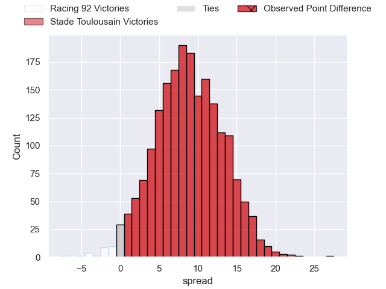
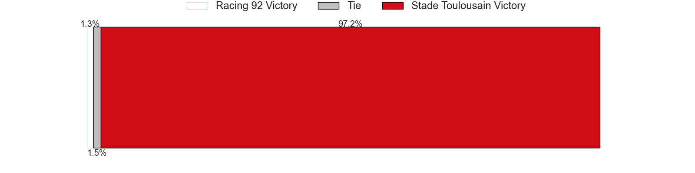

---  
layout: page  
title: Racing 92 at Stade Toulousain; 14-41  
date: 2023-06-09 21:05:00 18:00:00 -0500  
categories: match review  
---
# Racing 92 at Stade Toulousain; 14-41

# Club Level Predictions

The first set of predictions treats a club as the smallest object, as the club develops its members, organizes a gameplan, and deploys its players as needed for each match. This club model has a prediction of 0.732, which translates to predicting Stade Toulousain to win by 8.8.

Each club has a rating and a rating deviation (simiar to a Glicko system), and expected performances can be generated. This allows for simulated matches and spreads like the ones below.
## Projected Performances

## Projected Spreads

## Projected Results

# Player Level Predictions

Treating teams instead as an entity made up of the currently active players, I have ratings for each player in an altogether different system. These can be combined to form team ratings once teamsheets are announced, weighting starters a bit higher than the reserves. After the match is played, players can be weighted by their minutes on the field, allowing for an accurate measure of the team's composition. With these compiled team ratings, we can make predictions, measure inaccuracy, and update the individual player ratings.
## Prediction with Player Minutes: Stade Toulousain by 11.7

Stade Toulousain by 7.7 on a neutral field

There were 3 large changes in win probability in this match
## Prediction without Player Minutes: Stade Toulousain by 10.8

Stade Toulousain by 6.8 on a neutral pitch

|   Away Minutes | Away Player           |   Away elo |   Away Percentile |   Number |   Home Percentile |   Home elo | Home Player         |   Home Minutes |
|---------------:|:----------------------|-----------:|------------------:|---------:|------------------:|-----------:|:--------------------|---------------:|
|             47 | Guram Gogichashvili   |      84.38 |                67 |        1 |                77 |      89.32 | Cyril Baille        |             55 |
|             47 | Camille Chat          |      75.39 |                46 |        2 |                73 |      87.62 | Julien Marchand     |             52 |
|             47 | Trevor Ntando Nyakane |      85.07 |                68 |        3 |                68 |      83.05 | Dorian Aldegheri    |             55 |
|             47 | Fabien Sanconnie      |      91.3  |                75 |        4 |                76 |      91.32 | Richie Arnold       |             58 |
|             80 | Veikoso Poloniati     |      78.34 |                52 |        5 |                72 |      89.54 | Emmanuel Meafou     |             47 |
|             47 | Ibrahim Diallo        |      84.06 |                65 |        6 |                63 |      83.26 | Jack Willis         |             60 |
|             80 | Baptiste Chouzenoux   |      85.54 |                68 |        7 |                78 |      91.18 | Francois Cros       |             80 |
|             67 | Cameron Woki          |      73.37 |                38 |        8 |                29 |      69.25 | Alexandre Roumat    |             80 |
|             58 | Nolann Le Garrec      |      85.86 |                64 |        9 |                79 |      94.38 | Antoine Dupont      |             66 |
|             80 | Finn Russell          |      82.41 |                58 |       10 |                91 |     107.27 | Romain Ntamack      |             63 |
|             80 | Juan Imhoff           |      80.47 |                56 |       11 |                46 |      81.38 | Matthis Lebel       |             80 |
|             47 | Henry Chavancy        |      87.91 |                68 |       12 |                77 |      93.95 | Pita Ahki           |             80 |
|             80 | Gael Fickou           |     101.09 |                86 |       13 |                31 |      69.52 | Santiago Chocobares |             80 |
|             80 | Donovan Taofifenua    |      55.58 |                12 |       14 |                67 |      85.35 | Arthur Retière      |             80 |
|             80 | Max Spring            |      89.84 |                70 |       15 |                68 |      89.05 | Thomas Ramos        |             80 |
|             33 | Wenceslas Lauret      |      67.57 |                27 |       16 |                77 |      90.92 | Thibaud Flament     |             33 |
|             33 | Francis Saili         |      73.61 |                37 |       17 |                61 |      83.09 | Peato Mauvaka       |             28 |
|             33 | Janick Tarrit         |      72.64 |                35 |       18 |               nan |      79.76 | Charlie Faumuina    |             25 |
|             33 | Cedate Gomes Sa       |      72.21 |               nan |       19 |                44 |      75    | Rodrigue Neti       |             25 |
|             33 | Eddy Ben Arous        |      75.52 |                43 |       20 |                28 |      69.53 | Alban Placines      |             22 |
|             33 | Boris Palu            |      64.75 |                18 |       21 |               nan |      79.51 | Selevasio Tolofua   |             20 |
|             22 | Antoine Gibert        |      74.1  |                33 |       22 |                37 |      73.25 | Tim Nanai-Williams  |             17 |
|             13 | Kitione Kamikamica    |      78.31 |                48 |       23 |               nan |      77.64 | Lucas Tauzin        |             14 |

