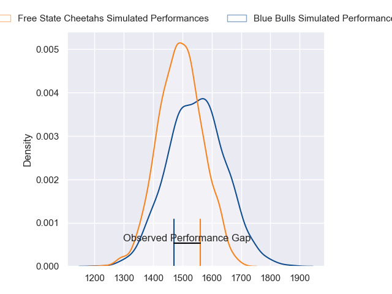
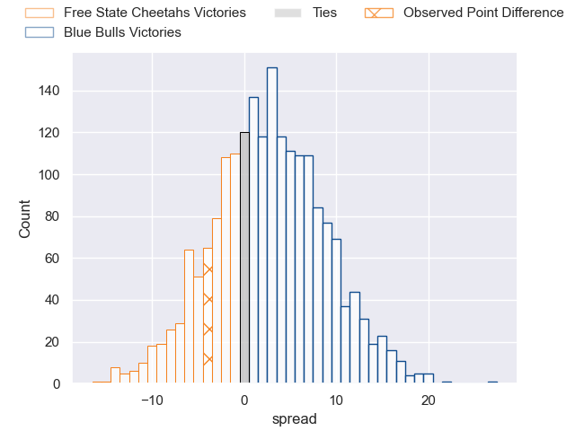
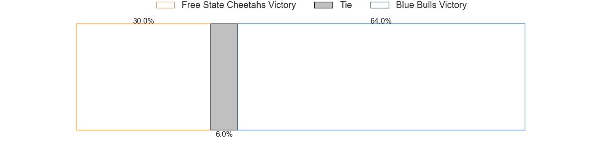

---  
layout: page  
title: Free State Cheetahs at Blue Bulls; 31-27  
date: 2023-06-10 15:00:00 18:00:00 -0500  
categories: match review  
---
# Free State Cheetahs at Blue Bulls; 31-27

# Club Level Predictions

The first set of predictions treats a club as the smallest object, as the club develops its members, organizes a gameplan, and deploys its players as needed for each match. This club model has a prediction of 0.579, which translates to predicting Blue Bulls to win by 2.8.

Each club has a rating and a rating deviation (simiar to a Glicko system), and expected performances can be generated. This allows for simulated matches and spreads like the ones below.
## Projected Performances

## Projected Spreads

## Projected Results

# Player Level Predictions

Treating teams instead as an entity made up of the currently active players, I have ratings for each player in an altogether different system. These can be combined to form team ratings once teamsheets are announced, weighting starters a bit higher than the reserves. After the match is played, players can be weighted by their minutes on the field, allowing for an accurate measure of the team's composition. With these compiled team ratings, we can make predictions, measure inaccuracy, and update the individual player ratings.
## Prediction with Player Minutes: Blue Bulls by 14.5

Blue Bulls by 10.5 on a neutral field

There were 12 large changes in win probability in this match
## Prediction without Player Minutes: Blue Bulls by 15.0

Blue Bulls by 11.0 on a neutral pitch

|   Away Minutes | Away Player                 |   Away elo |   Away Percentile |   Number |   Home Percentile |   Home elo | Home Player                  |   Home Minutes |
|---------------:|:----------------------------|-----------:|------------------:|---------:|------------------:|-----------:|:-----------------------------|---------------:|
|             59 | Schalk Ferreira             |      69.99 |                31 |        1 |                75 |      88.41 | Gerhardus Cornelis Steenkamp |             59 |
|             49 | Marnus van der Merwe        |      98.1  |                86 |        2 |                18 |      61.87 | Jan Hendrik Wessels          |             59 |
|             36 | Jacobus Conradus van Vuuren |      76.2  |                46 |        3 |                83 |      95.69 | Mornay Jan Jakobus Smith     |             59 |
|             80 | Rynier Mark Bernardo        |      57.66 |                12 |        4 |                57 |      81.5  | Ruan Vermaak                 |             80 |
|             80 | Victor Kutlwano Sekekete    |      75.52 |                44 |        5 |                83 |      98.72 | Ruan Nortje                  |             80 |
|             64 | Gideon van der Merwe        |      64.77 |                22 |        6 |                53 |      78.83 | Marcell Coetzee              |             80 |
|             37 | Sibabalo Qoma               |      75.16 |                44 |        7 |                55 |      79.34 | Cyle Justin Brink            |             48 |
|             80 | Friedle Olivier             |     107.51 |                92 |        8 |                81 |      95.66 | Elrigh Louw                  |             80 |
|             80 | Rewan Kruger                |      89.33 |                70 |        9 |                71 |      89.77 | Embrose Cheldon Papier       |             61 |
|             80 | Siya Masuku                 |      71.25 |                38 |       10 |                32 |      70.81 | Morne Steyn                  |             53 |
|             80 | Cohen Jasper                |      81.32 |                58 |       11 |                79 |      94.17 | David Kriel                  |             80 |
|             80 | Reinhardt Fortuin           |      92.36 |                74 |       12 |                82 |      98.48 | Harold William Vorster       |             80 |
|             80 | David Benjamin Brits        |      83.29 |                59 |       13 |                88 |     103.92 | Stedman-Gee Rivett Gans      |             80 |
|             80 | Daniel Kasende Kalepula     |      86.25 |                68 |       14 |                40 |      73.62 | Cornal Hendricks             |             80 |
|             80 | Tapiwa Lloyd Mafura         |      71.02 |                32 |       15 |                47 |      79.37 | Johannes Lodewikus Goosen    |             80 |
|             44 | Hencus van Wyk              |      72.55 |                29 |       16 |                78 |      93.64 | Nizaam Carr                  |             32 |
|             43 | George Cronje               |      75.53 |                41 |       17 |                59 |      84.11 | Chris Smith                  |             27 |
|             31 | Jeandre Rudolph             |      75.6  |                39 |       18 |                53 |      81.22 | Simphiwe Matanzima           |             21 |
|             21 | Ngobisizwe Mxoli            |      67.83 |               nan |       19 |               nan |      73.76 | Bismarck du Plessis          |             21 |
|             16 | Louis van der Westhuizen    |      69.16 |                37 |       20 |                25 |      67.46 | Francois Klopper             |             21 |
|            nan | nan                         |     nan    |               nan |       21 |                74 |      91.72 | Keagan Johannes              |             19 |

