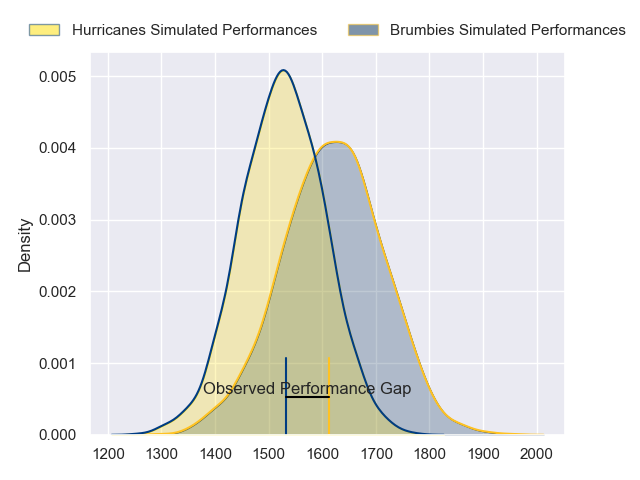
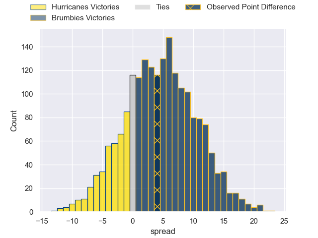

---  
layout: page  
title: Hurricanes at Brumbies; 33.0-37.0  
date: 2023-06-10 05:35:00 18:00:00 -0500  
categories: match review  
---
# Hurricanes at Brumbies; 33.0-37.0

# Club Level Predictions

The first set of predictions treats a club as the smallest object, as the club develops its members, organizes a gameplan, and deploys its players as needed for each match. This club model has a prediction of 0.625, which translates to predicting Brumbies to win by 4.6.

Each club has a rating and a rating deviation (simiar to a Glicko system), and expected performances can be generated. This allows for simulated matches and spreads like the ones below.
## Projected Performances

## Projected Spreads

## Projected Results

# Player Level Predictions

Treating teams instead as an entity made up of the currently active players, I have ratings for each player in an altogether different system. These can be combined to form team ratings once teamsheets are announced, weighting starters a bit higher than the reserves. After the match is played, players can be weighted by their minutes on the field, allowing for an accurate measure of the team's composition. With these compiled team ratings, we can make predictions, measure inaccuracy, and update the individual player ratings.
## Prediction with Player Minutes: Brumbies by 2.7

Hurricanes by 1.3 on a neutral field

There were 17 large changes in win probability in this match
## Prediction without Player Minutes: Brumbies by 4.3

Brumbies by 0.3 on a neutral pitch

|   Away Minutes | Away Player          |   Away elo |   Away Percentile |   Number |   Home Percentile |   Home elo | Home Player      |   Home Minutes |
|---------------:|:---------------------|-----------:|------------------:|---------:|------------------:|-----------:|:-----------------|---------------:|
|             48 | Xavier Numia         |     100.64 |                90 |        1 |               100 |     141.61 | James Slipper    |             73 |
|             48 | Dane Coles           |     120.75 |                97 |        2 |                26 |      66.37 | Lachlan Lonergan |             59 |
|             61 | Tyrel Lomax          |     136.63 |                99 |        3 |                69 |      85.54 | Sefo Kautai      |             57 |
|             80 | James Blackwell      |      86.34 |                67 |        4 |                35 |      71.72 | Nick Frost       |             80 |
|             69 | Caleb Delany         |      96.94 |                84 |        5 |                95 |     115.45 | Cadeyrn Neville  |             41 |
|             80 | Devan Flanders       |      87.53 |                72 |        6 |                85 |      99.3  | Rob Valetini     |             80 |
|             80 | Ardie Savea          |     119.87 |                96 |        7 |                94 |     110.39 | Jahrome Brown    |             52 |
|             50 | Brayden Iose         |      58.24 |                14 |        8 |                69 |      88.16 | Pete Samu        |             80 |
|             73 | Cam Roigard          |      95.61 |                80 |        9 |                97 |     121.66 | Nic White        |             57 |
|             80 | Brett Cameron        |      97.01 |                80 |       10 |                75 |      92.76 | Jack Debreczeni  |             69 |
|             61 | Kini Naholo          |     112.27 |                94 |       11 |                59 |      82.84 | Ollie Sapsford   |             80 |
|             80 | Jordie Barrett       |     109.75 |                92 |       12 |                77 |      93.62 | Tamati Tua       |             80 |
|             73 | Billy Proctor        |     111.54 |                93 |       13 |                90 |     106.11 | Len Ikitau       |             80 |
|             80 | Daniel Sinkinson     |      60.15 |                17 |       14 |                92 |     107.51 | Andy Muirhead    |             80 |
|             80 | Joshua Moorby        |      84.55 |                59 |       15 |                81 |      98.96 | Tom Wright       |             80 |
|             32 | Asafo Aumua          |     109.74 |                94 |       16 |                97 |     118.91 | Connal McInerney |             21 |
|             32 | Tevita Mafileo       |      98.47 |                88 |       17 |                73 |      88.21 | Blake Schoupp    |              7 |
|             19 | Owen Franks          |     102.91 |                92 |       18 |                60 |      82.49 | Rhys Van Nek     |             23 |
|             11 | Isaia Walker-Leawere |     103.73 |                90 |       19 |                50 |      77.32 | Tom Hooper       |             39 |
|             30 | Du'Plessis Kirifi    |      91.97 |                79 |       20 |                83 |      94.86 | Luke Reimer      |             28 |
|              7 | Jamie Booth          |      52.46 |                 6 |       21 |                79 |      95.86 | Ryan Lonergan    |             23 |
|              7 | Ruben Love           |     121.8  |                95 |       22 |                77 |      94.55 | Noah Lolesio     |             11 |
|             19 | Bailyn Sullivan      |      98.4  |                82 |       23 |               nan |     125.48 | Jesse Mogg       |              0 |

