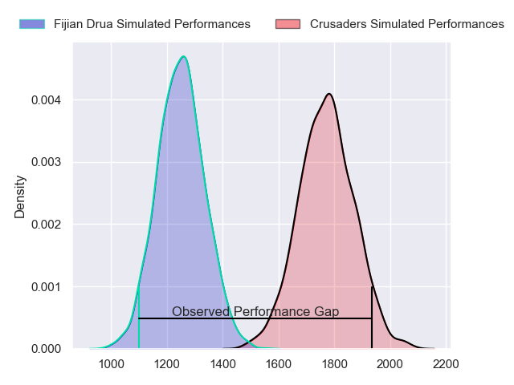
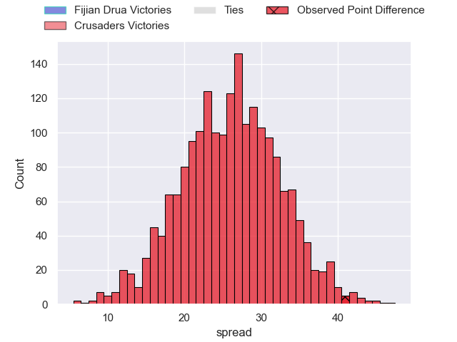
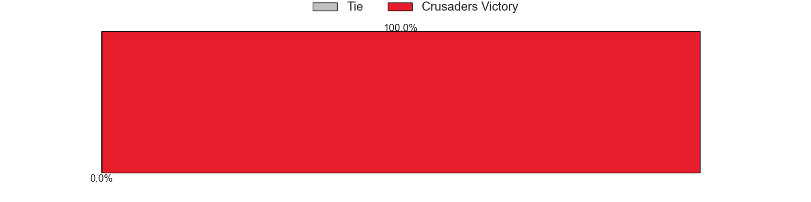

---  
layout: page  
title: Fijian Drua at Crusaders; 8.0-49.0  
date: 2023-06-10 03:05:00 18:00:00 -0500  
categories: match review  
---
# Fijian Drua at Crusaders; 8.0-49.0

# Club Level Predictions

The first set of predictions treats a club as the smallest object, as the club develops its members, organizes a gameplan, and deploys its players as needed for each match. This club model has a prediction of 0.946, which translates to predicting Crusaders to win by 25.8.

Each club has a rating and a rating deviation (simiar to a Glicko system), and expected performances can be generated. This allows for simulated matches and spreads like the ones below.
## Projected Performances

## Projected Spreads

## Projected Results

# Player Level Predictions

Treating teams instead as an entity made up of the currently active players, I have ratings for each player in an altogether different system. These can be combined to form team ratings once teamsheets are announced, weighting starters a bit higher than the reserves. After the match is played, players can be weighted by their minutes on the field, allowing for an accurate measure of the team's composition. With these compiled team ratings, we can make predictions, measure inaccuracy, and update the individual player ratings.
## Prediction with Player Minutes: Crusaders by 18.8

Crusaders by 14.8 on a neutral field

There were 2 large changes in win probability in this match
## Prediction without Player Minutes: Crusaders by 20.2

Crusaders by 16.2 on a neutral pitch

|   Away Minutes | Away Player             |   Away elo |   Away Percentile |   Number |   Home Percentile |   Home elo | Home Player            |   Home Minutes |
|---------------:|:------------------------|-----------:|------------------:|---------:|------------------:|-----------:|:-----------------------|---------------:|
|             28 | Haereiti Hetet          |      95.93 |                86 |        1 |                85 |      95.28 | Tamaiti Williams       |             57 |
|             57 | Tevita Ikanivere        |     112.02 |                96 |        2 |                79 |      91.94 | Codie Taylor           |             51 |
|             77 | Mesake Doge             |      60.18 |                15 |        3 |                92 |     104.15 | Oli Jager              |             51 |
|             80 | Isoa Nasilasila         |     117.12 |                96 |        4 |                98 |     127.36 | Scott Barrett          |             80 |
|             62 | Te Ahiwaru Cirikidaveta |      98.09 |                84 |        5 |                46 |      75.92 | Quinten Strange        |             80 |
|             80 | Vilive Miramira         |      73.2  |                41 |        6 |                45 |      75.48 | Sione Havili           |             80 |
|             51 | Motikiai Murray         |      82.17 |               nan |        7 |                87 |     100.26 | Tom Christie           |             80 |
|             80 | Ratu Meli Derenalagi    |      90.07 |                73 |        8 |                57 |      81.78 | Christian Lio-Willie   |             51 |
|             62 | Frank Lomani            |      73.31 |                39 |        9 |                70 |      88.92 | Mitchell Drummond      |             51 |
|             51 | Caleb Muntz             |      76.58 |                47 |       10 |                99 |     141.49 | Richie Mo'unga         |             71 |
|             57 | Kalaveti Ravouvou       |     139.5  |                99 |       11 |                52 |      78.45 | Leicester Fainga'anuku |             80 |
|             80 | Teti Tela               |      99.74 |                84 |       12 |                81 |      97.56 | Jack Goodhue           |             80 |
|             80 | Iosefo Masi             |      75.51 |                44 |       13 |                87 |     102.35 | Braydon Ennor          |             51 |
|             80 | Selestino Ravutaumada   |      75.6  |                41 |       14 |                90 |     103.38 | Dallas McLeod          |             43 |
|             80 | Ilaisa Droasese         |      79.16 |                50 |       15 |                97 |     127.54 | Will Jordan            |             80 |
|             23 | Zuriel Togiatama        |      76.11 |                49 |       16 |                92 |     104.74 | Brodie McAlister       |             29 |
|             43 | Meli Tuni               |      82.26 |                66 |       17 |                79 |      91.43 | Kershawl Sykes-Martin  |             23 |
|             12 | Samuela Tawake          |      72.81 |                35 |       18 |               nan |      85.22 | Reuben O'Neill         |             29 |
|             18 | Etonia Waqa             |      82.29 |               nan |       19 |                74 |      89.87 | Zach Gallagher         |              7 |
|             29 | Elia Canakaivata        |      77.72 |                49 |       20 |                98 |     127.7  | Ethan Blackadder       |              5 |
|             18 | Peni Matawalu           |      87.76 |                68 |       21 |                76 |      93.88 | Willi Heinz            |             29 |
|             29 | Michael Naitokani       |      80.73 |                53 |       22 |                61 |      85.21 | Fergus Burke           |             29 |
|             23 | Eroni Sau               |      77.19 |                48 |       23 |                94 |     111.9  | Chay Fihaki            |             37 |

