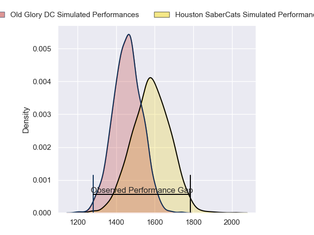
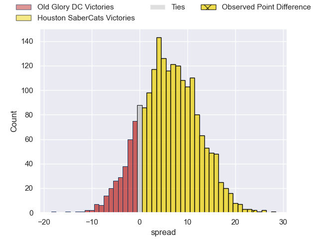
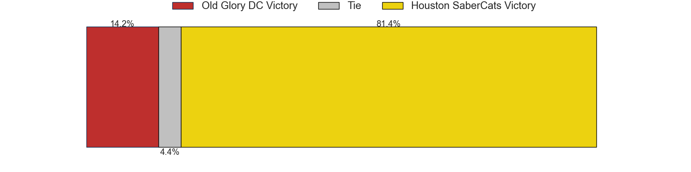

---  
layout: page  
title: Old Glory DC at Houston SaberCats; 7-31  
date: 2023-06-10 00:00:00 18:00:00 -0500  
categories: match review  
---
# Old Glory DC at Houston SaberCats; 7-31

# Club Level Predictions

The first set of predictions treats a club as the smallest object, as the club develops its members, organizes a gameplan, and deploys its players as needed for each match. This club model has a prediction of 0.668, which translates to predicting Houston SaberCats to win by 6.2.

Each club has a rating and a rating deviation (simiar to a Glicko system), and expected performances can be generated. This allows for simulated matches and spreads like the ones below.
## Projected Performances

## Projected Spreads

## Projected Results

# Player Level Predictions

Treating teams instead as an entity made up of the currently active players, I have ratings for each player in an altogether different system. These can be combined to form team ratings once teamsheets are announced, weighting starters a bit higher than the reserves. After the match is played, players can be weighted by their minutes on the field, allowing for an accurate measure of the team's composition. With these compiled team ratings, we can make predictions, measure inaccuracy, and update the individual player ratings.
## Prediction with Player Minutes: Houston SaberCats by 19.8

Houston SaberCats by 15.8 on a neutral field

There were 2 large changes in win probability in this match
## Prediction without Player Minutes: Houston SaberCats by 18.1

Houston SaberCats by 14.1 on a neutral pitch

|   Away Minutes | Away Player           |   Away elo |   Away Percentile |   Number |   Home Percentile |   Home elo | Home Player              |   Home Minutes |
|---------------:|:----------------------|-----------:|------------------:|---------:|------------------:|-----------:|:-------------------------|---------------:|
|             54 | Cali Martinez         |      62.51 |               nan |        1 |                23 |      66.13 | Rob Cobb                 |             50 |
|             48 | Koikoi Nelligan       |      55.81 |               nan |        2 |                15 |      59.78 | Dean Muir                |             62 |
|             48 | Quentin Newcomer      |      40.11 |                 1 |        3 |                28 |      67.15 | Joseph Taufete'e         |             38 |
|             66 | Tevita Naqali         |      43.5  |                 3 |        4 |                63 |      84.47 | Siaosi Mahoni            |             48 |
|             80 | Colin Grosse          |      68.8  |                29 |        5 |                72 |      89.9  | Marno Redelinghuys       |             80 |
|             56 | Langilangi Haupeakui  |     101.57 |                88 |        6 |                59 |      81.31 | Wynand Grassmann         |             61 |
|             80 | Alejandro Daireaux    |      88.16 |                74 |        7 |                36 |      72.45 | Malon Maurice Al-Jiboori |             48 |
|             80 | Niko Jones            |      73.6  |                39 |        8 |                67 |      86.83 | Gideon van Wyk           |             80 |
|             80 | John LeFevre          |      56.09 |               nan |        9 |                28 |      68.45 | Dillon Smit              |             80 |
|             40 | Joaquin Diaz Bonilla  |      50.9  |                 8 |       10 |                 9 |      55.13 | David Coetzer            |             77 |
|             80 | Tafeaga Junior Sau    |      48.58 |                 6 |       11 |                35 |      71.59 | Vereniki Tikoisolomone   |             80 |
|             80 | Douglas Fraser        |      57.95 |                12 |       12 |                25 |      66.59 | Louritz van der Schyff   |             80 |
|              5 | Marcos Young          |      76.55 |                46 |       13 |                20 |      62.93 | Dominic Akina            |             80 |
|             80 | John Rizzo            |      52.62 |                 9 |       14 |                16 |      59.39 | Christian Dyer           |             36 |
|             50 | Owen Sheehy           |      47.71 |                 7 |       15 |                23 |      66.2  | Drew Wild                |             80 |
|             26 | Kyle Stewart          |      56.45 |                10 |       16 |                19 |      60.63 | Alec McDonnell           |             30 |
|             32 | Nic Souchon           |      63.88 |                23 |       17 |                85 |      92.52 | Axel Zapata              |             18 |
|             32 | Jack Iscaro           |      24.34 |                 0 |       18 |                41 |      73.84 | Pono Davis               |             42 |
|             14 | Api Naikatini         |      51.53 |               nan |       19 |                11 |      56.63 | Emmanuel Albert          |             32 |
|             24 | Fintan Coleman        |      70.17 |                29 |       20 |                 2 |      40.24 | Keni Nasoqeqe            |             19 |
|             40 | Mike Weir             |      55.94 |               nan |       21 |                22 |      64.4  | Danny Barrett            |             32 |
|             75 | Thretton Palamo       |      53.15 |                 8 |       22 |                33 |      70.9  | Carlo de Nysschen        |             44 |
|             30 | Danny Joseph Tusitala |      48.36 |                 3 |       23 |                25 |      67.38 | Robert Povey             |              3 |

