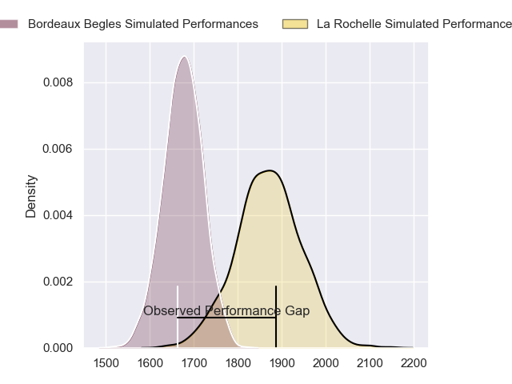
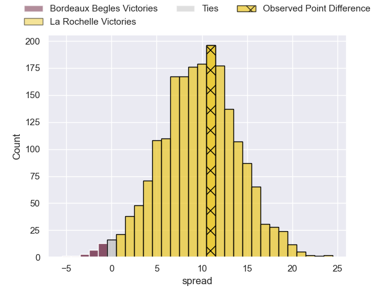
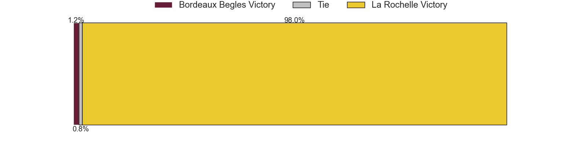

---  
layout: page  
title: Bordeaux Begles at La Rochelle; 13-24  
date: 2023-06-10 17:00:00 18:00:00 -0500  
categories: match review  
---
# Bordeaux Begles at La Rochelle; 13-24

# Club Level Predictions

The first set of predictions treats a club as the smallest object, as the club develops its members, organizes a gameplan, and deploys its players as needed for each match. This club model has a prediction of 0.754, which translates to predicting La Rochelle to win by 9.8.

Each club has a rating and a rating deviation (simiar to a Glicko system), and expected performances can be generated. This allows for simulated matches and spreads like the ones below.
## Projected Performances

## Projected Spreads

## Projected Results

# Player Level Predictions

Treating teams instead as an entity made up of the currently active players, I have ratings for each player in an altogether different system. These can be combined to form team ratings once teamsheets are announced, weighting starters a bit higher than the reserves. After the match is played, players can be weighted by their minutes on the field, allowing for an accurate measure of the team's composition. With these compiled team ratings, we can make predictions, measure inaccuracy, and update the individual player ratings.
## Prediction with Player Minutes: La Rochelle by 25.8

La Rochelle by 21.8 on a neutral field

There were 4 large changes in win probability in this match
## Prediction without Player Minutes: La Rochelle by 28.5

La Rochelle by 24.5 on a neutral pitch

|   Away Minutes | Away Player          |   Away elo |   Away Percentile |   Number |   Home Percentile |   Home elo | Home Player               |   Home Minutes |
|---------------:|:---------------------|-----------:|------------------:|---------:|------------------:|-----------:|:--------------------------|---------------:|
|             55 | Jefferson Poirot     |      81.15 |                58 |        1 |                78 |      89.64 | Reda Wardi                |             50 |
|             55 | Maxime Lamothe       |      86.63 |                71 |        2 |                90 |     102.76 | Pierre Bourgarit          |             50 |
|             41 | Sipili Falatea       |      84.31 |                61 |        3 |                92 |     103.66 | Uini Atonio               |             50 |
|             44 | Thomas Jolmes        |      79.39 |                53 |        4 |                82 |      95.94 | Romain Sazy               |             50 |
|             80 | Cyril Cazeaux        |      80.62 |                56 |        5 |                93 |     109.24 | William Skelton           |             73 |
|             80 | Mahamadou Diaby      |      75.12 |                44 |        6 |                77 |      91.1  | Paul Boudehent            |             80 |
|             80 | Pierre Bochaton      |      88.12 |                74 |        7 |                85 |      97.67 | Levani Botia              |             46 |
|             61 | Tom Willis           |      79.65 |                51 |        8 |                82 |      96.6  | Gregory Alldritt          |             80 |
|             80 | Maxime Lucu          |      82.71 |                59 |        9 |                88 |     102.74 | Tawera Kerr-Barlow        |             80 |
|             80 | Matthieu Jalibert    |      83.61 |                59 |       10 |                81 |      97.18 | Antoine Hastoy            |             80 |
|             80 | Santiago Cordero     |      85.25 |                67 |       11 |                95 |     114.54 | Raymond Rhule             |             78 |
|             80 | Yoram Moefana        |      87.89 |                68 |       12 |                69 |      88.71 | Jonathan Danty            |             56 |
|             44 | Jean-Baptiste Dubié  |      78.66 |                51 |       13 |                89 |     104.77 | UJ Seuteni                |             80 |
|             80 | Madosh Tambwe        |      73.03 |                39 |       14 |                73 |      89.54 | Dillyn Leyds              |             80 |
|             73 | Louis Bielle Biarrey |      87.42 |                64 |       15 |                84 |     101.48 | Brice Dulin               |             80 |
|             39 | Ben Tameifuna        |      77.07 |                41 |       16 |                23 |      64.99 | Rémi Bourdeau             |             34 |
|             36 | Nicolas Depoortere   |      91.88 |                73 |       17 |                62 |      83.42 | Joel Sclavi               |             30 |
|             36 | Kane Douglas         |      76.82 |                35 |       18 |                67 |      87.67 | Thomas Lavault            |             30 |
|             25 | Lesko Kaulashvili    |      92.2  |                76 |       19 |                70 |      87.26 | Georges-Henri Colombe     |             30 |
|             25 | Gabriel Oghre        |      75.62 |                39 |       20 |                74 |      93.29 | Quentin Lespiaucq-Brettes |             30 |
|             19 | Caleb Timu           |      84.48 |                58 |       21 |                60 |      83.48 | Jules Favre               |             24 |
|              7 | Zack Holmes          |      82.6  |                57 |       22 |                84 |      98.93 | Ultan Dillane             |              7 |
|            nan | nan                  |     nan    |               nan |       23 |                69 |      88.37 | Thomas Berjon             |              2 |

