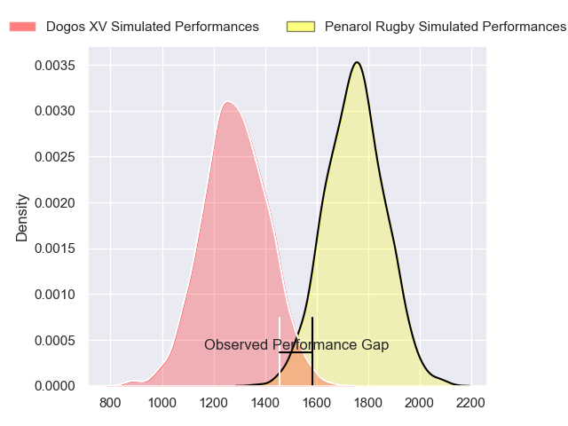
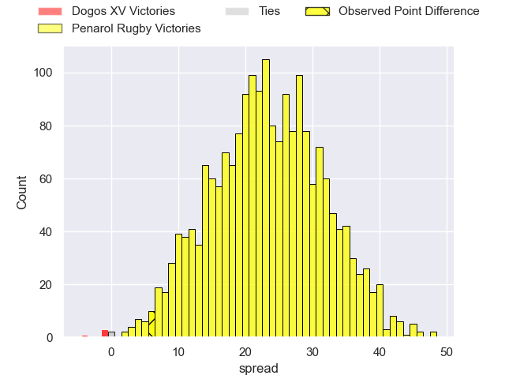
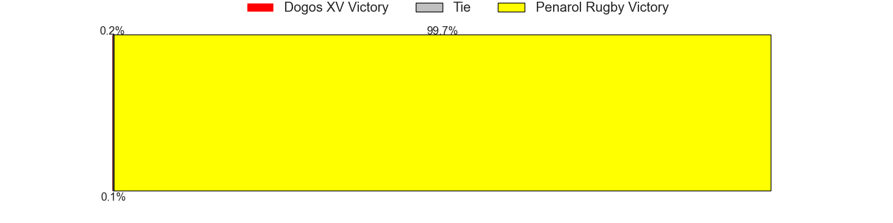

---  
layout: page  
title: Dogos XV at Penarol Rugby; 17-23  
date: 2023-06-10 00:00:00 18:00:00 -0500  
categories: match review  
---
# Dogos XV at Penarol Rugby; 17-23

# Club Level Predictions

The first set of predictions treats a club as the smallest object, as the club develops its members, organizes a gameplan, and deploys its players as needed for each match. This club model has a prediction of 0.923, which translates to predicting Penarol Rugby to win by 23.2.

Each club has a rating and a rating deviation (simiar to a Glicko system), and expected performances can be generated. This allows for simulated matches and spreads like the ones below.
## Projected Performances

## Projected Spreads

## Projected Results

# Player Level Predictions

Treating teams instead as an entity made up of the currently active players, I have ratings for each player in an altogether different system. These can be combined to form team ratings once teamsheets are announced, weighting starters a bit higher than the reserves. After the match is played, players can be weighted by their minutes on the field, allowing for an accurate measure of the team's composition. With these compiled team ratings, we can make predictions, measure inaccuracy, and update the individual player ratings.
## Prediction with Player Minutes: Penarol Rugby by 19.4

Penarol Rugby by 15.4 on a neutral field

There were 7 large changes in win probability in this match
## Prediction without Player Minutes: Penarol Rugby by 18.3

Penarol Rugby by 14.3 on a neutral pitch

|   Away Minutes | Away Player               |   Away elo |   Away Percentile |   Number |   Home Percentile |   Home elo | Home Player                        |   Home Minutes |
|---------------:|:--------------------------|-----------:|------------------:|---------:|------------------:|-----------:|:-----------------------------------|---------------:|
|             66 | Santiago Pulella          |      76.44 |                48 |        1 |                19 |      63.99 | Matteo Sanguinetti                 |             66 |
|             80 | Boris Wenger              |      51.36 |                 7 |        2 |                41 |      72.88 | Guillermo Pujadas Leon             |             66 |
|             66 | Octavio Filippa           |      62.32 |                17 |        3 |                66 |      83.65 | Ignacio Alfredo Peculo Rodriguez   |             50 |
|             52 | Gregorio Hernandez        |      70.56 |                33 |        4 |                21 |      64.45 | Ignacio Dotti                      |             51 |
|             80 | Lautaro Simes             |      53.53 |                 9 |        5 |                50 |      77.57 | Felipe Aliaga                      |             71 |
|             80 | Ignacio Jose Gandini      |      70.73 |                33 |        6 |                12 |      57.54 | Manuel Ardao                       |             80 |
|             80 | Efrain Elias              |      68.16 |                28 |        7 |                48 |      76.46 | Lucas Bianchi                      |             80 |
|             52 | Juan Bautista Mernes      |      50.08 |                 7 |        8 |                10 |      55.49 | Carlos Manuel Deus Lopes de Amorin |             80 |
|             40 | Agustin Moyano            |      66.03 |                23 |        9 |                52 |      79.35 | Santiago Álvarez Viera Da Cunha    |             79 |
|             80 | Julian Ignacio Hernandez  |      60.69 |                16 |       10 |                52 |      79.96 | Felipe Etcheverry                  |             80 |
|             80 | Ernesto Giudice           |      69.16 |                30 |       11 |                41 |      74.25 | Juan Manuel Alonso                 |             80 |
|             80 | Leonardo Gea Salim        |      60.95 |                17 |       12 |                32 |      69.78 | Juan Zuccarino                     |             80 |
|             63 | Faustino Sánchez Valarolo |      62.66 |                18 |       13 |                50 |      78.37 | Tomas Inciarte Rachetti            |             80 |
|             80 | Lautaro Cipriani          |      52.86 |                 9 |       14 |                42 |      74.81 | Alfonso Silva                      |             80 |
|             80 | Mateo Soler               |      55.52 |                11 |       15 |                37 |      72.8  | Rodrigo Silva                      |             80 |
|             40 | Juan Cruz Strada          |      56.25 |                12 |       16 |                 9 |      60.28 | Diego Arbelo                       |             30 |
|             17 | Felipe Mallia             |      61.45 |               nan |       17 |                48 |      79.86 | Juan Manuel Rodriguez              |             29 |
|             14 | Octavio Barbatti          |      67.98 |               nan |       18 |                14 |      60.43 | Mateo Perillo                      |             14 |
|             14 | Tomas Bartolini           |      45.43 |                 2 |       19 |                15 |      61.17 | Emiliano Faccennini                |             14 |
|             28 | Valentin Cabral           |      63.9  |                23 |       20 |                22 |      65.86 | Eric Dosantos                      |              9 |
|             28 | Aitor Bildosola           |      52.65 |                 7 |       21 |               nan |      69.43 | Juan Francisco Torres Burwood      |              1 |

