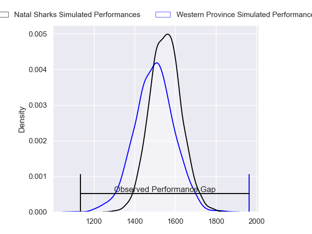
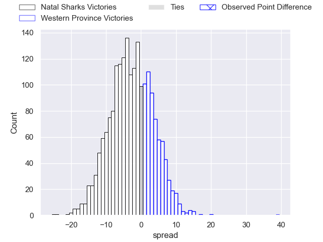
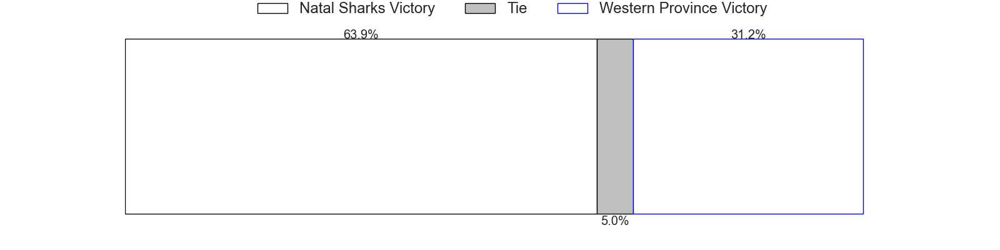

---  
layout: page  
title: Natal Sharks at Western Province; 5-44  
date: 2023-06-10 17:00:00 18:00:00 -0500  
categories: match review  
---
# Natal Sharks at Western Province; 5-44

# Club Level Predictions

The first set of predictions treats a club as the smallest object, as the club develops its members, organizes a gameplan, and deploys its players as needed for each match. This club model has a prediction of 0.422, which translates to predicting Natal Sharks to win by 2.8.

Each club has a rating and a rating deviation (simiar to a Glicko system), and expected performances can be generated. This allows for simulated matches and spreads like the ones below.
## Projected Performances

## Projected Spreads

## Projected Results

# Player Level Predictions

Treating teams instead as an entity made up of the currently active players, I have ratings for each player in an altogether different system. These can be combined to form team ratings once teamsheets are announced, weighting starters a bit higher than the reserves. After the match is played, players can be weighted by their minutes on the field, allowing for an accurate measure of the team's composition. With these compiled team ratings, we can make predictions, measure inaccuracy, and update the individual player ratings.
## Prediction with Player Minutes: Natal Sharks by 0.2

Natal Sharks by 4.2 on a neutral field

There were 3 large changes in win probability in this match
## Prediction without Player Minutes: Western Province by 1.0

Natal Sharks by 3.0 on a neutral pitch

|   Away Minutes | Away Player                |   Away elo |   Away Percentile |   Number |   Home Percentile |   Home elo | Home Player                       |   Home Minutes |
|---------------:|:---------------------------|-----------:|------------------:|---------:|------------------:|-----------:|:----------------------------------|---------------:|
|             38 | Khwezi Jongamazizi Mona    |      85.93 |                70 |        1 |                43 |      74.76 | Alistair Fernando Vermaak         |             51 |
|             58 | Kerron van Vuuren          |      73.6  |                38 |        2 |                61 |      78.74 | Andre-Hugo Venter                 |             51 |
|             38 | Carlu Johann Sadie         |      71.1  |                34 |        3 |                49 |      77.2  | Johan Neethling Fouche            |             51 |
|             40 | Hyron Diego Andrews        |      69.87 |                30 |        4 |                83 |      96.02 | Ben-Jason Dixon                   |             80 |
|             80 | Douw Gerbrandt Grobler     |      73.67 |                41 |        5 |                53 |      78.23 | Ruben van Heerden                 |             80 |
|             40 | Thembelani Bholi           |      86.47 |                71 |        6 |                50 |      74.69 | Willem Gerhardus Engelbrecht      |             55 |
|             80 | Phendulani Buthelezi       |      75.73 |                36 |        7 |                67 |      84.7  | Marcel Theunissen                 |             55 |
|             65 | Sikhumbuzo Notshe          |      81.73 |                49 |        8 |                50 |      78.67 | Hacjivah Dayimani                 |             55 |
|             58 | Cameron Robin Wright       |      70.99 |                32 |        9 |                73 |      86.49 | Godlen Herschelle Derrick Masimla |             45 |
|             80 | Curwin Dominique Bosch     |      82.91 |                58 |       10 |                39 |      73.84 | Jurie Matthee                     |             80 |
|             80 | Phiko Sobahle              |      79.26 |                53 |       11 |                50 |      78.21 | Leolin Lucien Zas                 |             58 |
|             80 | Marnus Potgieter           |     101.33 |                87 |       12 |                67 |      81.56 | Cornel Smit                       |             80 |
|             80 | Rohan Janse van Rensburg   |      80.48 |                52 |       13 |                45 |      71.12 | Thomas Nel                        |             80 |
|             80 | Werner Kok                 |      88.53 |                72 |       14 |                67 |      80.47 | Mnombo Zwelendaba                 |             80 |
|             63 | Thaakir Abrahams           |      84.66 |                60 |       15 |                45 |      76.91 | Clayton Blommetjies               |             80 |
|             42 | Dian Bleuler               |      87.73 |                74 |       16 |                33 |      71.46 | Albertus Paul de Wet              |             35 |
|             42 | Hanro Jacobs               |      76.38 |                30 |       17 |                92 |      98.45 | Lee-Marvin Lofty Siyanda Mazibuko |             29 |
|             22 | Dameon Venter              |      75.8  |                47 |       18 |                58 |      77.13 | Leon Lyons                        |             29 |
|             40 | Celimpilo Gumede           |      68.4  |                28 |       19 |                35 |      70.6  | Siyabonga Ntubeni                 |             29 |
|             40 | Corne Rahl                 |      89.39 |                72 |       20 |                38 |      73.06 | Connor Evans                      |             25 |
|             22 | Tiaan Fourie               |      97.15 |                82 |       21 |                36 |      66.28 | Jarrod Taylor                     |             25 |
|             17 | Frederik Johannes Zeilinga |      79.34 |                39 |       22 |                25 |      61.76 | Louw Nel                          |             25 |
|             15 | Nick Hatton                |      89.26 |               nan |       23 |                41 |      69.98 | Luke John Burger                  |             22 |

