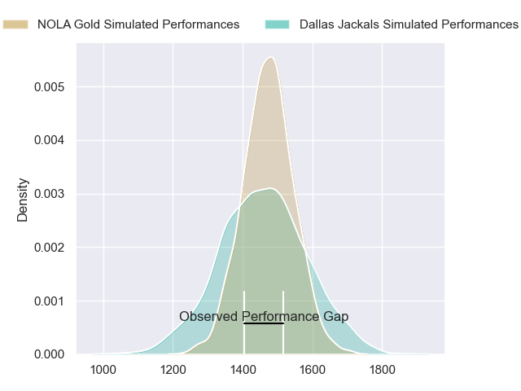
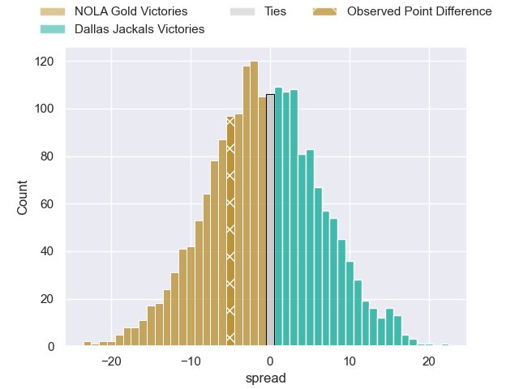

---  
layout: page  
title: NOLA Gold at Dallas Jackals; 15-10  
date: 2023-06-11 00:00:00 18:00:00 -0500  
categories: match review  
---
# NOLA Gold at Dallas Jackals; 15-10

# Club Level Predictions

The first set of predictions treats a club as the smallest object, as the club develops its members, organizes a gameplan, and deploys its players as needed for each match. This club model has a prediction of 0.477, which translates to predicting NOLA Gold to win by 0.8.

Each club has a rating and a rating deviation (simiar to a Glicko system), and expected performances can be generated. This allows for simulated matches and spreads like the ones below.
## Projected Performances

## Projected Spreads

## Projected Results

# Player Level Predictions

Treating teams instead as an entity made up of the currently active players, I have ratings for each player in an altogether different system. These can be combined to form team ratings once teamsheets are announced, weighting starters a bit higher than the reserves. After the match is played, players can be weighted by their minutes on the field, allowing for an accurate measure of the team's composition. With these compiled team ratings, we can make predictions, measure inaccuracy, and update the individual player ratings.
## Prediction with Player Minutes: Dallas Jackals by 6.3

Dallas Jackals by 2.3 on a neutral field

There were 5 large changes in win probability in this match
## Prediction without Player Minutes: Dallas Jackals by 5.8

Dallas Jackals by 1.8 on a neutral pitch

|   Away Minutes | Away Player            |   Away elo |   Away Percentile |   Number |   Home Percentile |   Home elo | Home Player         |   Home Minutes |
|---------------:|:-----------------------|-----------:|------------------:|---------:|------------------:|-----------:|:--------------------|---------------:|
|             53 | Matt Harmon            |      57.9  |                16 |        1 |                17 |      62.74 | Liam Murray         |             30 |
|             53 | Eric Howard            |      46.81 |                 5 |        2 |                 9 |      54.44 | Tomas Baravalle     |             54 |
|             53 | Doc Irey               |      65.73 |               nan |        3 |                14 |      60.1  | Juan Pablo Zeiss    |             64 |
|             80 | Cameron Dolan          |      48.27 |                 5 |        4 |                 3 |      44.25 | Sam Golla           |             80 |
|             23 | Liam Hallam-Eames      |      50.7  |                 6 |        5 |                 9 |      54.21 | Lucas Bur           |             67 |
|             80 | Malcolm May            |      53.73 |                 8 |        6 |                12 |      57.15 | Jeronimo Gomez Vara |             80 |
|             68 | Moni Tonga'uiha        |       3.59 |                 0 |        7 |                 0 |      18.54 | Conrado Roura       |             80 |
|             80 | Maciu Koroi            |      73.61 |                42 |        8 |                 9 |      55.67 | Jan Adriaan Booysen |             80 |
|             80 | Damian Leothon Stevens |      48.06 |                 3 |        9 |               nan |      40.14 | Danny Christensen   |             80 |
|             80 | Reece Botha            |      58.63 |                13 |       10 |                 3 |      42.32 | Alejandro Torres    |             80 |
|             80 | Dougie Fife            |      60.68 |                18 |       11 |                 7 |      50.14 | Lui Sitama          |             80 |
|             71 | Aaron Matthews         |      -2.09 |                 0 |       12 |                 0 |      23.85 | Tomas Cubilla       |             80 |
|             80 | Ross Depperschmidt     |      36.35 |                 1 |       13 |                77 |      94.83 | Tomas Malanos       |             80 |
|             71 | Harley Wheeler         |      37.88 |                 2 |       14 |                 0 |      26.39 | Campbell Johnstone  |             71 |
|             80 | Jordan Trainor         |      51.68 |                 8 |       15 |                17 |      62.11 | Marcos Moroni       |             80 |
|             27 | Jarred Adams           |      50.62 |                 5 |       16 |               nan |      43.23 | Alex Tucci          |             50 |
|             27 | Alex Lopeti            |      48.15 |                 8 |       17 |                 1 |      32.35 | Dewald Kotze        |             26 |
|             27 | Dino Waldren           |      49.67 |               nan |       18 |                 5 |      50.51 | Kyle Steeves        |             16 |
|             57 | Will Waguespack        |      59.21 |                14 |       19 |               nan |      62.56 | Maikeli Naromaitoga |             13 |
|             12 | Osaiaisi Tonga’uiha    |      73.18 |                41 |       20 |               nan |      52.29 | Jason Tidwell       |              9 |
|              9 | Jack Webster           |      36.21 |                 2 |       21 |               nan |     nan    | nan                 |            nan |
|              9 | Kenneth Jinkins        |      54.8  |               nan |       22 |               nan |     nan    | nan                 |            nan |

