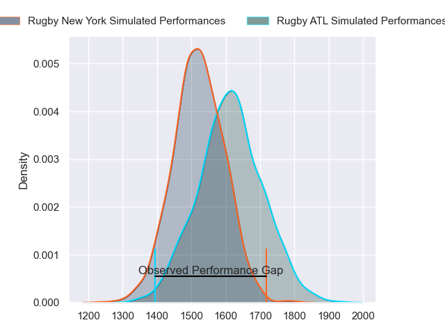
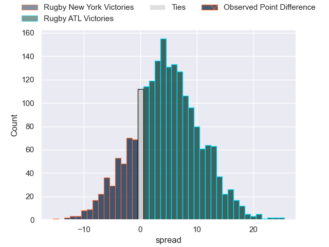
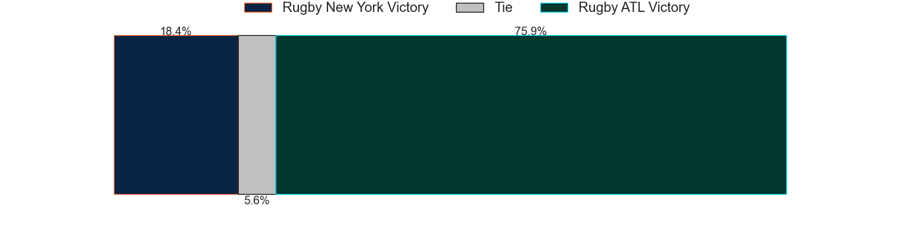

---  
layout: page  
title: Rugby New York at Rugby ATL; 39-24  
date: 2023-06-11 02:00:00 18:00:00 -0500  
categories: match review  
---
# Rugby New York at Rugby ATL; 39-24

# Club Level Predictions

The first set of predictions treats a club as the smallest object, as the club develops its members, organizes a gameplan, and deploys its players as needed for each match. This club model has a prediction of 0.627, which translates to predicting Rugby ATL to win by 4.6.

Each club has a rating and a rating deviation (simiar to a Glicko system), and expected performances can be generated. This allows for simulated matches and spreads like the ones below.
## Projected Performances

## Projected Spreads

## Projected Results

# Player Level Predictions

Treating teams instead as an entity made up of the currently active players, I have ratings for each player in an altogether different system. These can be combined to form team ratings once teamsheets are announced, weighting starters a bit higher than the reserves. After the match is played, players can be weighted by their minutes on the field, allowing for an accurate measure of the team's composition. With these compiled team ratings, we can make predictions, measure inaccuracy, and update the individual player ratings.
## Prediction with Player Minutes: Rugby New York by 15.1

Rugby New York by 19.1 on a neutral field

There were 9 large changes in win probability in this match
## Prediction without Player Minutes: Rugby New York by 16.7

Rugby New York by 20.7 on a neutral pitch

|   Away Minutes | Away Player       |   Away elo |   Away Percentile |   Number |   Home Percentile |   Home elo | Home Player            |   Home Minutes |
|---------------:|:------------------|-----------:|------------------:|---------:|------------------:|-----------:|:-----------------------|---------------:|
|             51 | Chance Wenglewski |      71.18 |                33 |        1 |                 0 |      -7.87 | Alex Maughan           |             61 |
|             69 | Dylan Fawsitt     |      58.44 |                13 |        2 |                 6 |      50.48 | Sidney Tobias          |             74 |
|             56 | Kaleb Geiger      |      98.12 |                88 |        3 |                 4 |      49.23 | John Roy Jenkinson     |             54 |
|             40 | Charlie Hewitt    |      96.82 |                81 |        4 |                 5 |      49.09 | Justin Johan Basson    |             80 |
|             80 | Hamish Dalzell    |      58.14 |                12 |        5 |                27 |      67.94 | Johannes Momsen        |             40 |
|             80 | Brad Tucker       |      55.27 |                10 |        6 |                89 |     103.03 | Vili Helu              |             68 |
|             80 | Brendon O'Connor  |      62.99 |               nan |        7 |                 3 |      44.08 | Matthew Heaton         |             80 |
|             58 | Pago Haini        |      59.16 |                14 |        8 |                 0 |       4.89 | Ross Deacon            |             54 |
|             52 | Connor Buckley    |      52.13 |                 5 |        9 |                28 |      68.61 | Ryan Rees              |             68 |
|             52 | Jason Emery       |      58.07 |                11 |       10 |                36 |      72.65 | Christopher Hilsenbeck |             54 |
|             80 | Teofilo Ed Fidow  |      84.07 |                62 |       11 |                 0 |      14.28 | Nolan Tuamoheloa       |             80 |
|             80 | Teihorangi Walden |      66.55 |                24 |       12 |                68 |      88.12 | Martini Talapusi       |             80 |
|             80 | Fa'asiu Fuatai    |      60.97 |                15 |       13 |                99 |     141.54 | Will Leonard           |             80 |
|             80 | Brooklyn Hardaker |      61.61 |                19 |       14 |                 3 |      43.3  | Te Rangatira Waitokia  |             80 |
|             46 | Andrew Coe        |      55.89 |                10 |       15 |                 0 |       1.81 | Austin White           |             80 |
|             29 | Tevita Langi      |      74.95 |                32 |       16 |                 9 |      53.26 | Lincoln Sii            |             19 |
|             11 | DaQuan Perry      |      70.24 |               nan |       17 |               nan |      67.96 | Isaac Bales            |              6 |
|             24 | Nic Mayhew        |      72.6  |                37 |       18 |                 1 |      38.07 | Will Burke             |             26 |
|             40 | Kara Pryor        |      60.2  |                16 |       19 |                 8 |      53.09 | Christian Nahuel Milan |             40 |
|             22 | Quinn Ngawati     |      47.3  |                 4 |       20 |                 1 |      34.1  | Connor Cook            |             12 |
|             28 | Connor McManus    |      96.71 |                78 |       21 |                88 |      94.54 | Daemon Torres          |             26 |
|             28 | Jack Heighton     |      65.33 |                21 |       22 |                14 |      59.89 | Niall Saunders         |             12 |
|             34 | Samuel Windsor    |      70.34 |                28 |       23 |                 5 |      51.43 | Kurt Kendall Coleman   |             26 |

