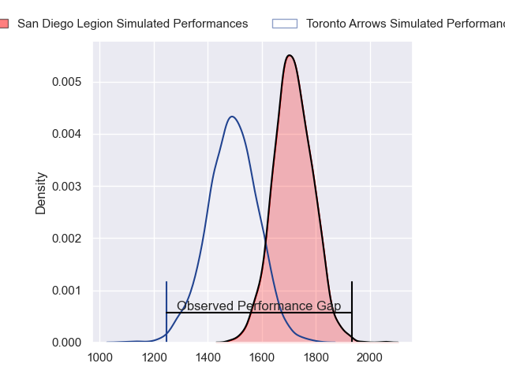
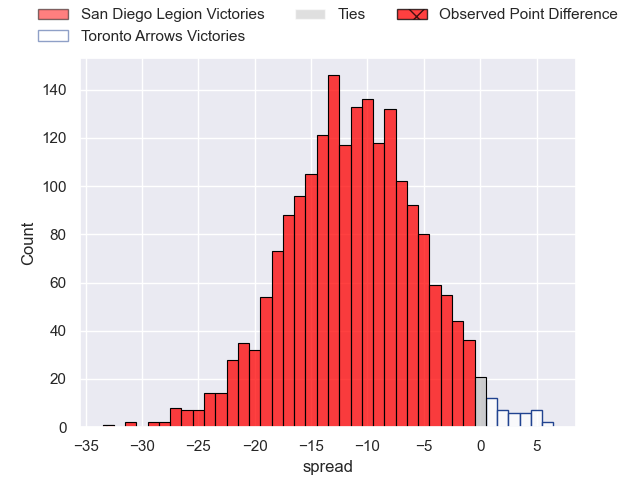
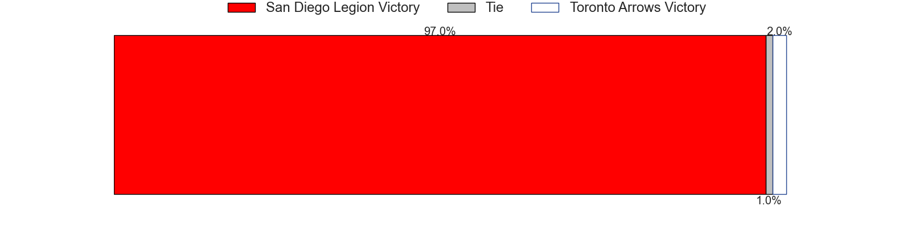

---  
layout: page  
title: San Diego Legion at Toronto Arrows; 50-17  
date: 2023-06-11 22:00:00 18:00:00 -0500  
categories: match review  
---
# San Diego Legion at Toronto Arrows; 50-17

# Club Level Predictions

The first set of predictions treats a club as the smallest object, as the club develops its members, organizes a gameplan, and deploys its players as needed for each match. This club model has a prediction of 0.218, which translates to predicting San Diego Legion to win by 11.4.

Each club has a rating and a rating deviation (simiar to a Glicko system), and expected performances can be generated. This allows for simulated matches and spreads like the ones below.
## Projected Performances

## Projected Spreads

## Projected Results

# Player Level Predictions

Treating teams instead as an entity made up of the currently active players, I have ratings for each player in an altogether different system. These can be combined to form team ratings once teamsheets are announced, weighting starters a bit higher than the reserves. After the match is played, players can be weighted by their minutes on the field, allowing for an accurate measure of the team's composition. With these compiled team ratings, we can make predictions, measure inaccuracy, and update the individual player ratings.
## Prediction with Player Minutes: San Diego Legion by 41.2

San Diego Legion by 45.2 on a neutral field

There were 3 large changes in win probability in this match
## Prediction without Player Minutes: San Diego Legion by 41.2

San Diego Legion by 45.2 on a neutral pitch

|   Away Minutes | Away Player          |   Away elo |   Away Percentile |   Number |   Home Percentile |   Home elo | Home Player      |   Home Minutes |
|---------------:|:---------------------|-----------:|------------------:|---------:|------------------:|-----------:|:-----------------|---------------:|
|             80 | Faka'osi Pifeleti    |      47.67 |                 4 |        1 |                 1 |      38.77 | Connor Grindal   |             80 |
|             80 | Shilo Klein          |      69.86 |                33 |        2 |                 3 |      43.5  | Tyler Wong       |             80 |
|             80 | Luke Green           |      82    |                60 |        3 |                 1 |      38.57 | Tyler Rowland    |             80 |
|             80 | Ben Grant            |     102.92 |                89 |        4 |                 0 |      20.73 | Mason Flesch     |             80 |
|             80 | Thomas Franklin      |      59.04 |                13 |        5 |                 8 |      56.48 | Michael Sheppard |             80 |
|             80 | Christian Poidevin   |      73.15 |                40 |        6 |                 3 |      45.94 | Lucas Rumball    |             80 |
|             80 | Dan Pryor            |      57.43 |                12 |        7 |                15 |      60.76 | Travis Larsen    |             80 |
|             80 | David Tameilau       |      57.72 |                12 |        8 |                 9 |      55.04 | Owain Ruttan     |             80 |
|             80 | Richard Judd         |      78.67 |                50 |        9 |                 8 |      54.34 | Will Grant       |             80 |
|             80 | Will Hooley          |      70.84 |                31 |       10 |                 2 |      37.86 | Peter Nelson     |             80 |
|             80 | Nathaniel Augspurger |      80.86 |                56 |       11 |                 6 |      49.11 | Dawson Fatoric   |             80 |
|             80 | Tiaan Loots          |      82.97 |                59 |       12 |                 1 |      38.24 | Liam Bowman      |             80 |
|             80 | Marcel Brache        |      89.24 |                69 |       13 |                 0 |      11.98 | Mitch Richardson |             80 |
|             80 | Tomas Aoake          |      69.12 |                30 |       14 |                 8 |      51.14 | D'Shawn Bowen    |             80 |
|             80 | Mike Te'o            |      77.99 |                44 |       15 |                 5 |      45.15 | Shane O'Leary    |             80 |

