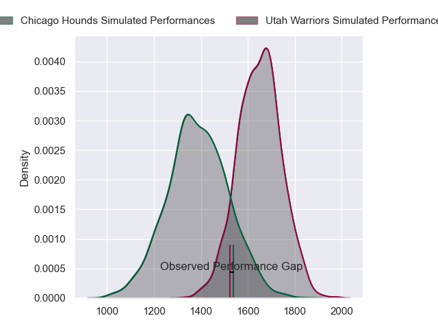
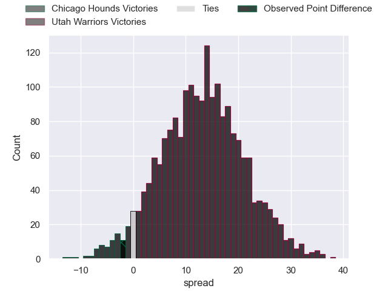

---  
layout: page  
title: Chicago Hounds at Utah Warriors; 26-24  
date: 2023-06-11 04:00:00 18:00:00 -0500  
categories: match review  
---
# Chicago Hounds at Utah Warriors; 26-24

# Club Level Predictions

The first set of predictions treats a club as the smallest object, as the club develops its members, organizes a gameplan, and deploys its players as needed for each match. This club model has a prediction of 0.799, which translates to predicting Utah Warriors to win by 12.9.

Each club has a rating and a rating deviation (simiar to a Glicko system), and expected performances can be generated. This allows for simulated matches and spreads like the ones below.
## Projected Performances

## Projected Spreads

## Projected Results

# Player Level Predictions

Treating teams instead as an entity made up of the currently active players, I have ratings for each player in an altogether different system. These can be combined to form team ratings once teamsheets are announced, weighting starters a bit higher than the reserves. After the match is played, players can be weighted by their minutes on the field, allowing for an accurate measure of the team's composition. With these compiled team ratings, we can make predictions, measure inaccuracy, and update the individual player ratings.
## Prediction with Player Minutes: Utah Warriors by 17.6

Utah Warriors by 13.6 on a neutral field

There were 13 large changes in win probability in this match
## Prediction without Player Minutes: Utah Warriors by 17.5

Utah Warriors by 13.5 on a neutral pitch

|   Away Minutes | Away Player          |   Away elo |   Away Percentile |   Number |   Home Percentile |   Home elo | Home Player             |   Home Minutes |
|---------------:|:---------------------|-----------:|------------------:|---------:|------------------:|-----------:|:------------------------|---------------:|
|             80 | LaRome White         |      59    |                18 |        1 |                15 |      60.79 | Olive Kilifi            |             61 |
|             56 | Hugh Roach           |      52.91 |                 8 |        2 |                28 |      67.36 | Henry Bell              |             80 |
|             54 | Paddy Ryan           |      59.81 |                14 |        3 |                15 |      60.17 | Paul Mullen             |             61 |
|             68 | John Cullen          |      72.72 |                38 |        4 |                11 |      56.33 | Jamie Lane              |             71 |
|             79 | Dineshwaran Krishnan |      95.07 |                79 |        5 |                34 |      70.27 | Onehunga Havili Kaufusi |             80 |
|             80 | Mike Matarazzo       |       1.66 |                 0 |        6 |                56 |      79.17 | Bailey Wilson           |             80 |
|             71 | Maclean Jones        |      50.39 |                 6 |        7 |                81 |      95.97 | Lance Williams          |             80 |
|             80 | Tinashe Muchena      |      53.83 |               nan |        8 |                59 |      82.51 | Thomas Tu'avao          |             63 |
|             80 | Sidney Shoop         |      88.79 |                72 |        9 |                32 |      71.03 | Connor McLeod           |             80 |
|             80 | Luke Carty           |      52.78 |                 7 |       10 |                27 |      68.19 | Joel Hodgson            |             80 |
|             80 | Julian Dominguez     |      60.76 |                17 |       11 |                 8 |      50.96 | Joseph Mano             |             80 |
|             80 | Bill Meakes          |      57.75 |                13 |       12 |                21 |      63.95 | Calvin Whiting          |             80 |
|             80 | Bryce Campbell       |      53.98 |                 9 |       13 |                20 |      62.76 | Mika Kruse              |             29 |
|             13 | Matai Leuta          |      56.99 |                13 |       14 |                18 |      62.73 | Caleb Makene            |             80 |
|             60 | Jean-Pierre Eloff    |      31.37 |                 1 |       15 |                12 |      58.64 | Cliven Loubser          |             80 |
|             24 | Lindsey Stevens      |      56.91 |                12 |       16 |                20 |      66.81 | Emerson Prior           |             19 |
|             26 | Charles Abel         |      48.24 |                 5 |       17 |                14 |      61.92 | Angus McLellan          |             19 |
|             12 | Justice Nkombua      |      59.52 |               nan |       18 |                15 |      62.85 | Jurie George van Vuuren |              9 |
|              1 | Sam Peri             |      81.96 |               nan |       19 |                48 |      76.81 | Saia Uhila              |             17 |
|              9 | Michael De Waal      |      29.56 |                 0 |       20 |               nan |      62.64 | Tomasi Tonga            |             42 |
|             67 | Michael Baska        |      77.95 |                49 |       21 |                96 |     117.12 | Tyler Luke Fisher       |              9 |
|             20 | Chris Mattina        |     127.87 |                97 |       22 |               nan |     nan    | nan                     |            nan |

