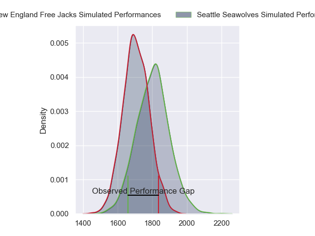
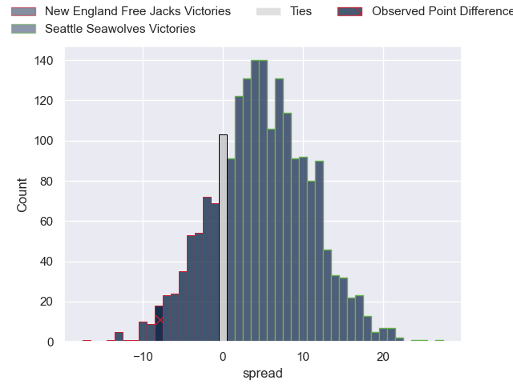

---  
layout: page  
title: New England Free Jacks at Seattle Seawolves; 34-26  
date: 2023-06-12 04:30:00 18:00:00 -0500  
categories: match review  
---
# New England Free Jacks at Seattle Seawolves; 34-26

# Club Level Predictions

The first set of predictions treats a club as the smallest object, as the club develops its members, organizes a gameplan, and deploys its players as needed for each match. This club model has a prediction of 0.629, which translates to predicting Seattle Seawolves to win by 4.7.

Each club has a rating and a rating deviation (simiar to a Glicko system), and expected performances can be generated. This allows for simulated matches and spreads like the ones below.
## Projected Performances

## Projected Spreads

## Projected Results

# Player Level Predictions

Treating teams instead as an entity made up of the currently active players, I have ratings for each player in an altogether different system. These can be combined to form team ratings once teamsheets are announced, weighting starters a bit higher than the reserves. After the match is played, players can be weighted by their minutes on the field, allowing for an accurate measure of the team's composition. With these compiled team ratings, we can make predictions, measure inaccuracy, and update the individual player ratings.
## Prediction with Player Minutes: New England Free Jacks by 2.5

New England Free Jacks by 6.5 on a neutral field

There were 10 large changes in win probability in this match
## Prediction without Player Minutes: New England Free Jacks by 0.5

New England Free Jacks by 4.5 on a neutral pitch

|   Away Minutes | Away Player        |   Away elo |   Away Percentile |   Number |   Home Percentile |   Home elo | Home Player            |   Home Minutes |
|---------------:|:-------------------|-----------:|------------------:|---------:|------------------:|-----------:|:-----------------------|---------------:|
|             61 | Kianu Kereru-Symes |      61.82 |                20 |        1 |                66 |      78.91 | Jake Turnbull          |             51 |
|             61 | Andrew Quattrin    |      59.68 |                15 |        2 |                16 |      60.45 | James Malcolm          |             51 |
|             61 | Joel Hintz         |      54.21 |                11 |        3 |                17 |      62.71 | Sam Matenga            |             51 |
|             80 | Semisi Paea        |      78.52 |                58 |        4 |                13 |      58.67 | Samu Manoa             |             80 |
|             61 | Reegan O'Gorman    |      65.32 |                23 |        5 |                50 |      77.72 | Taylor Krumrei         |             32 |
|             80 | Sam Fischli        |      55.87 |                10 |        6 |                 0 |     -34.9  | Ben Mitchell           |             80 |
|             68 | Joe Johnston       |      11.65 |                 0 |        7 |                22 |      64.53 | Charles Elton          |             80 |
|             55 | Cam Davidowicz     |      35.51 |                 0 |        8 |               nan |      63.15 | Andrew Durutalo        |             46 |
|             61 | John Poland        |      98.8  |                84 |        9 |                45 |      76.39 | JP Smith               |             75 |
|             80 | Jayson Potroz      |      83.17 |                58 |       10 |                24 |      65.7  | AJ Alatimu             |             80 |
|             80 | Paul Balekana      |      77.93 |                50 |       11 |                12 |      56.19 | Martin Iosefo          |             73 |
|             63 | Spencer Jones      |      57.4  |                12 |       12 |                11 |      56.62 | Daniel David Kriel     |             80 |
|             80 | Wayne van der Bank |      76.61 |                48 |       13 |                33 |      66.84 | Tevita Lopeti          |             80 |
|             80 | Taniela Filimone   |      56.07 |                12 |       14 |                95 |     114.2  | Lauina Futi            |             80 |
|             80 | Beaudein Waaka     |      86.53 |                63 |       15 |                28 |      68.33 | Duncan Victor Matthews |             63 |
|             19 | Foster Dewitt      |     101.21 |                85 |       16 |               nan |      62.77 | Dewald Donald          |             29 |
|             19 | James Hilterbrand  |      64.01 |               nan |       17 |                24 |      65.76 | Peter Malcolm          |             29 |
|             19 | Conor Young        |      58.06 |               nan |       18 |                30 |      70.72 | Mason Pedersen         |             29 |
|             19 | Jesse Parete       |      65.46 |                23 |       19 |                 6 |      49.72 | Ronan Foley            |             48 |
|             12 | Mitchell Jacobson  |      58.64 |                13 |       20 |                 6 |      53.71 | Nakai Penny            |             34 |
|             25 | Ethan Fryer        |      57.48 |               nan |       21 |                 0 |      28.5  | Conner Mooneyham       |              7 |
|             19 | Holden Yungert     |      41.41 |               nan |       22 |                46 |      77.59 | Adriaan John Carelse   |             17 |
|             17 | Isaac Olson        |      73.19 |               nan |       23 |               nan |       6.38 | Devereaux Ferris       |              5 |

