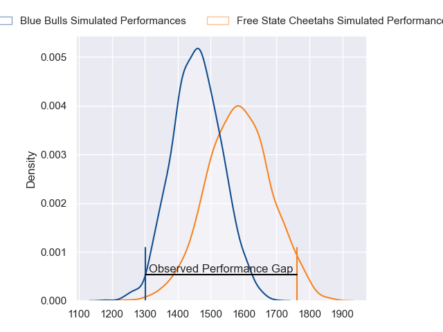
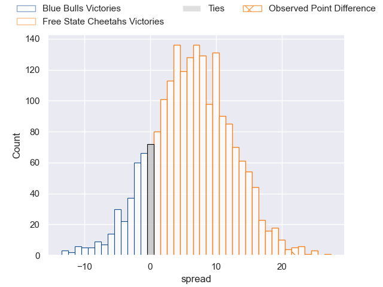
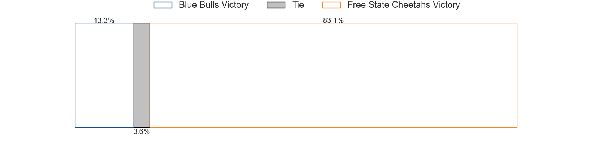

---  
layout: page  
title: Blue Bulls at Free State Cheetahs; 10-32  
date: 2023-06-17 15:00:00 18:00:00 -0500  
categories: match review  
---
# Blue Bulls at Free State Cheetahs; 10-32

# Club Level Predictions

The first set of predictions treats a club as the smallest object, as the club develops its members, organizes a gameplan, and deploys its players as needed for each match. This club model has a prediction of 0.666, which translates to predicting Free State Cheetahs to win by 6.2.

Each club has a rating and a rating deviation (simiar to a Glicko system), and expected performances can be generated. This allows for simulated matches and spreads like the ones below.
## Projected Performances

## Projected Spreads

## Projected Results

# Player Level Predictions

Treating teams instead as an entity made up of the currently active players, I have ratings for each player in an altogether different system. These can be combined to form team ratings once teamsheets are announced, weighting starters a bit higher than the reserves. After the match is played, players can be weighted by their minutes on the field, allowing for an accurate measure of the team's composition. With these compiled team ratings, we can make predictions, measure inaccuracy, and update the individual player ratings.
## Prediction with Player Minutes: Free State Cheetahs by 8.0

Free State Cheetahs by 4.0 on a neutral field

There were 5 large changes in win probability in this match
## Prediction without Player Minutes: Free State Cheetahs by 4.2

Free State Cheetahs by 0.2 on a neutral pitch

|   Away Minutes | Away Player                  |   Away elo |   Away Percentile |   Number |   Home Percentile |   Home elo | Home Player                 |   Home Minutes |
|---------------:|:-----------------------------|-----------:|------------------:|---------:|------------------:|-----------:|:----------------------------|---------------:|
|             57 | Gerhardus Cornelis Steenkamp |      86.75 |                71 |        1 |                47 |      76.29 | Schalk Ferreira             |             48 |
|             65 | Cornelis Johannes Grobbelaar |      92.09 |                79 |        2 |                89 |     101.64 | Marnus van der Merwe        |             60 |
|             49 | Mornay Jan Jakobus Smith     |      86.93 |                72 |        3 |                59 |      80.57 | Jacobus Conradus van Vuuren |             80 |
|             68 | Ruan Vermaak                 |      71.57 |                35 |        4 |                29 |      68.53 | Rynier Mark Bernardo        |             64 |
|             80 | Ruan Nortje                  |      91.41 |                75 |        5 |                70 |      88.11 | Victor Kutlwano Sekekete    |             80 |
|             80 | Marcell Coetzee              |      68.74 |                30 |        6 |                34 |      70.22 | Gideon van der Merwe        |             51 |
|             57 | Nizaam Carr                  |      90.8  |                78 |        7 |                59 |      80.93 | Sibabalo Qoma               |             51 |
|             80 | Elrigh Louw                  |      94.42 |                78 |        8 |                97 |     116.67 | Friedle Olivier             |             80 |
|             45 | Keagan Johannes              |      91.86 |                76 |        9 |                89 |     104.58 | Rewan Kruger                |             80 |
|             80 | Chris Smith                  |      88.77 |                73 |       10 |                21 |      65.57 | Ruan Pienaar                |             80 |
|             80 | David Kriel                  |      88.52 |                72 |       11 |                74 |      90.32 | Cohen Jasper                |             74 |
|             80 | Harold William Vorster       |      90.78 |                73 |       12 |                80 |      96.85 | Reinhardt Fortuin           |             80 |
|             80 | Stedman-Gee Rivett Gans      |      92.56 |                75 |       13 |                71 |      89.57 | David Benjamin Brits        |             70 |
|             61 | Cornal Hendricks             |      70.39 |                34 |       14 |                77 |      92.15 | Daniel Kasende Kalepula     |             80 |
|             71 | Johannes Lodewikus Goosen    |      74.18 |                38 |       15 |                42 |      75.52 | Tapiwa Lloyd Mafura         |             80 |
|             35 | Bernard van der Linde        |      81.28 |                50 |       16 |                74 |      88.62 | Alulutho Tshakweni          |             32 |
|             31 | Francois Klopper             |      68.35 |                33 |       17 |                50 |      84.18 | George Cronje               |             29 |
|             23 | WJ Steenkamp                 |      66.14 |                21 |       18 |                25 |      71.75 | Jeandre Rudolph             |             29 |
|             23 | Simphiwe Matanzima           |      84.37 |                66 |       19 |                32 |      67.9  | Louis van der Westhuizen    |             20 |
|             19 | Sibongile Vukile Novuka      |      83.01 |                61 |       20 |                93 |     107.04 | Daniel Johannes Maartens    |             16 |
|             15 | Jan Hendrik Wessels          |      54.37 |                 9 |       21 |                14 |      59.63 | Robert Thompson Ebersohn    |             10 |
|             12 | Janko Swanepoel              |      82.49 |                59 |       22 |                10 |      55.53 | Evardi Boshoff              |              6 |
|              9 | Wandisile Simelane           |      71.87 |                36 |       23 |               nan |     nan    | nan                         |            nan |

