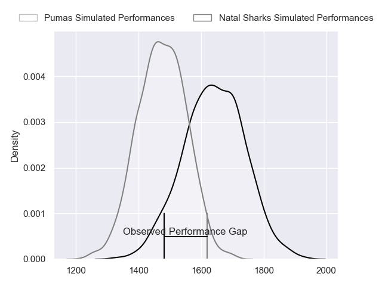
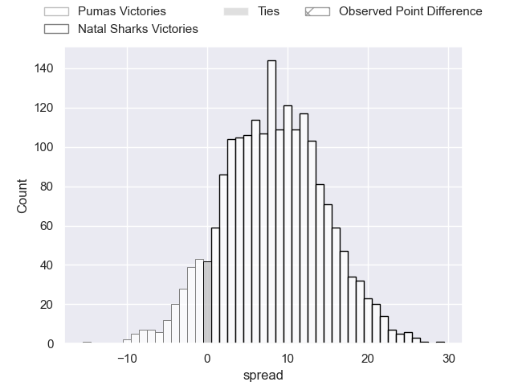
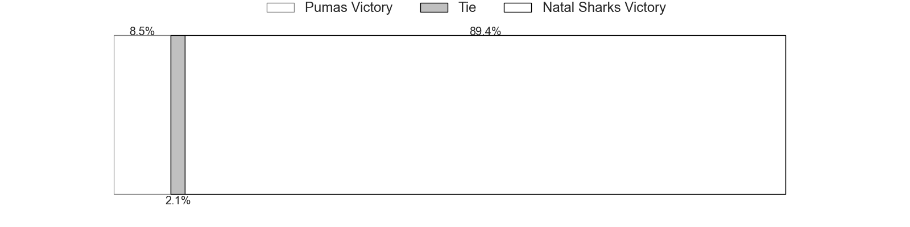

---  
layout: page  
title: Pumas at Natal Sharks; 26-20  
date: 2023-06-17 17:30:00 18:00:00 -0500  
categories: match review  
---
# Pumas at Natal Sharks; 26-20

# Club Level Predictions

The first set of predictions treats a club as the smallest object, as the club develops its members, organizes a gameplan, and deploys its players as needed for each match. This club model has a prediction of 0.715, which translates to predicting Natal Sharks to win by 8.2.

Each club has a rating and a rating deviation (simiar to a Glicko system), and expected performances can be generated. This allows for simulated matches and spreads like the ones below.
## Projected Performances

## Projected Spreads

## Projected Results

# Player Level Predictions

Treating teams instead as an entity made up of the currently active players, I have ratings for each player in an altogether different system. These can be combined to form team ratings once teamsheets are announced, weighting starters a bit higher than the reserves. After the match is played, players can be weighted by their minutes on the field, allowing for an accurate measure of the team's composition. With these compiled team ratings, we can make predictions, measure inaccuracy, and update the individual player ratings.
## Prediction with Player Minutes: Natal Sharks by 5.0

Natal Sharks by 1.0 on a neutral field

There were 13 large changes in win probability in this match
## Prediction without Player Minutes: Natal Sharks by 5.7

Natal Sharks by 1.7 on a neutral pitch

|   Away Minutes | Away Player          |   Away elo |   Away Percentile |   Number |   Home Percentile |   Home elo | Home Player                   |   Home Minutes |
|---------------:|:---------------------|-----------:|------------------:|---------:|------------------:|-----------:|:------------------------------|---------------:|
|             72 | Corne Fourie         |      75.36 |                45 |        1 |                54 |      79.06 | Khwezi Jongamazizi Mona       |             38 |
|             75 | PJ Jacobs            |      93.66 |                81 |        2 |                66 |      84.12 | Fezokuhle Mbatha              |             62 |
|             40 | Simon Raw            |      54.27 |                 8 |        3 |                43 |      74.53 | Khuthuzani Kingdom Mchunu     |             71 |
|             63 | Deon Slabbert        |      64.02 |                21 |        4 |                80 |      90.87 | Corne Rahl                    |             56 |
|             80 | Shane Monro Kirkwood |     110.92 |                93 |        5 |                61 |      83.22 | Daniel Pieter (Reniel) Hugo   |             80 |
|             80 | Andre Fouché         |      59.48 |                13 |        6 |                66 |      83.8  | James Venter                  |             80 |
|             61 | Francois Kleinhans   |      74.98 |                45 |        7 |                48 |      69.72 | Vincent Tshikaya Tshituka     |             62 |
|             80 | Kwanda Dimaza        |      90.54 |                74 |        8 |                61 |      84.23 | Hendrik Petrus (Henco) Venter |             68 |
|             61 | Chriswill September  |     100.88 |                86 |        9 |                69 |      86.44 | Bradley Davids                |             68 |
|             80 | Tinus de Beer        |      98.3  |                82 |       10 |                77 |      94.28 | Lionel Cronje                 |             80 |
|             80 | Etienne Taljaard     |      88.92 |                72 |       11 |                29 |      67.57 | Aphelele Onke Okuhle Fassi    |             80 |
|             52 | Ali Mgijima          |     112.98 |                94 |       12 |                93 |     112.49 | Alwayno Visagie               |             80 |
|             80 | Diego Appollis       |      75.81 |                44 |       13 |                54 |      80.72 | Murray Koster                 |             80 |
|             80 | Andrew Kota          |      80.12 |                54 |       14 |                61 |      82.93 | Yaw Osei Penxe                |             80 |
|             78 | Devon Frank Williams |      74.38 |                39 |       15 |                65 |      87.93 | Nevaldo Fleurs                |             59 |
|             40 | Dewald Maritz        |      73.82 |               nan |       16 |               nan |      64.92 | Ntuthuko Mchunu               |             42 |
|             28 | Wian van Niekerk     |      75.38 |                37 |       17 |                85 |      98.34 | Ockie Barnard                 |             24 |
|             19 | Ruwald Van der Merwe |      76.71 |                48 |       18 |                50 |      79.09 | Curwin Dominique Bosch        |             21 |
|             19 | Giovanne Snyman      |      52.59 |                 5 |       19 |                43 |      76.04 | Sikhumbuzo Notshe             |             18 |
|             17 | Malembe Mpofu        |      73.12 |                43 |       20 |                25 |      65.15 | Kerron van Vuuren             |             18 |
|              8 | Etienne Janeke       |      90.06 |               nan |       21 |                25 |      67.1  | Carlu Johann Sadie            |              9 |
|              5 | Darnell Osuagwu      |      72.01 |               nan |       22 |               nan |      86.68 | Marco De Witt                 |             12 |
|              2 | Gene Willemse        |      71.54 |                33 |       23 |                78 |      93.01 | Tiaan Fourie                  |             12 |

