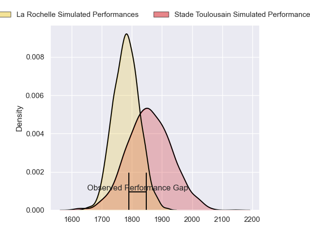
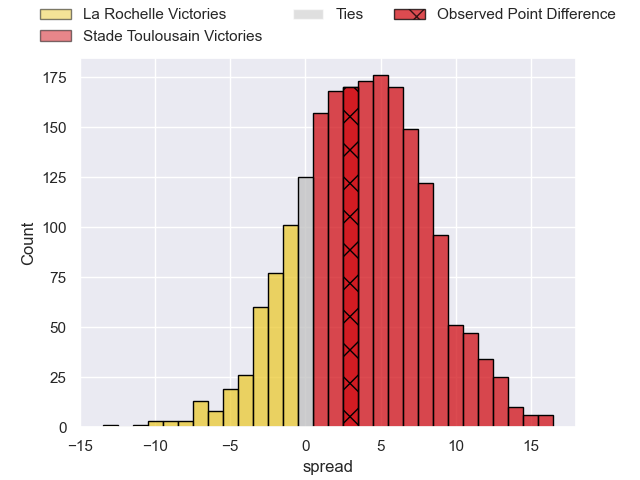
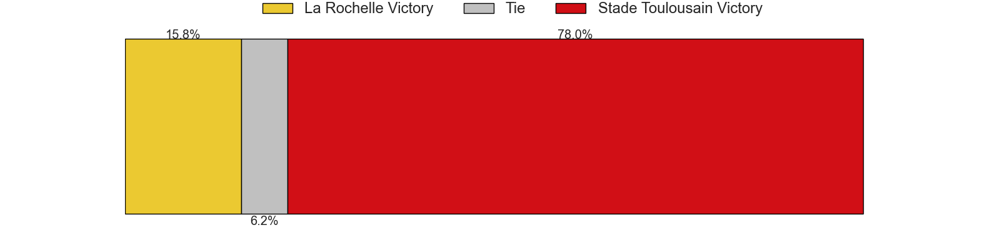

---  
layout: page  
title: La Rochelle at Stade Toulousain; 26-29  
date: 2023-06-17 21:00:00 18:00:00 -0500  
categories: match review  
---
# La Rochelle at Stade Toulousain; 26-29

# Club Level Predictions

The first set of predictions treats a club as the smallest object, as the club develops its members, organizes a gameplan, and deploys its players as needed for each match. This club model has a prediction of 0.601, which translates to predicting Stade Toulousain to win by 3.6.

Each club has a rating and a rating deviation (simiar to a Glicko system), and expected performances can be generated. This allows for simulated matches and spreads like the ones below.
## Projected Performances

## Projected Spreads

## Projected Results

# Player Level Predictions

Treating teams instead as an entity made up of the currently active players, I have ratings for each player in an altogether different system. These can be combined to form team ratings once teamsheets are announced, weighting starters a bit higher than the reserves. After the match is played, players can be weighted by their minutes on the field, allowing for an accurate measure of the team's composition. With these compiled team ratings, we can make predictions, measure inaccuracy, and update the individual player ratings.
## Prediction with Player Minutes: Stade Toulousain by 2.9

La Rochelle by 1.1 on a neutral field

There were 14 large changes in win probability in this match
## Prediction without Player Minutes: Stade Toulousain by 3.0

La Rochelle by 1.0 on a neutral pitch

|   Away Minutes | Away Player               |   Away elo |   Away Percentile |   Number |   Home Percentile |   Home elo | Home Player          |   Home Minutes |
|---------------:|:--------------------------|-----------:|------------------:|---------:|------------------:|-----------:|:---------------------|---------------:|
|             61 | Reda Wardi                |      84.88 |                67 |        1 |                77 |      89.78 | Cyril Baille         |             67 |
|             56 | Pierre Bourgarit          |      95.14 |                83 |        2 |                72 |      88.27 | Julien Marchand      |             61 |
|             61 | Uini Atonio               |     101.13 |                91 |        3 |                76 |      89.14 | Dorian Aldegheri     |             58 |
|             52 | Romain Sazy               |      87.53 |                69 |        4 |                83 |      97.38 | Richie Arnold        |             54 |
|             80 | William Skelton           |     104.81 |                90 |        5 |                86 |     100.64 | Emmanuel Meafou      |             80 |
|             67 | Paul Boudehent            |      81.34 |                59 |        6 |                79 |      92.23 | Jack Willis          |             67 |
|             67 | Levani Botia              |      89.14 |                75 |        7 |                79 |      92.24 | Francois Cros        |             80 |
|             80 | Gregory Alldritt          |      98.83 |                84 |        8 |                55 |      81.32 | Alexandre Roumat     |             61 |
|             69 | Tawera Kerr-Barlow        |     100.49 |                85 |        9 |                81 |      96.46 | Antoine Dupont       |             80 |
|             80 | Antoine Hastoy            |      89.93 |                68 |       10 |                83 |     100.91 | Romain Ntamack       |             80 |
|             80 | Raymond Rhule             |     110.06 |                93 |       11 |                78 |      93.54 | Matthis Lebel        |             80 |
|             57 | Jonathan Danty            |      76.34 |                46 |       12 |                85 |     100.01 | Pita Ahki            |             80 |
|             80 | UJ Seuteni                |      93.7  |                76 |       13 |                47 |      77.29 | Santiago Chocobares  |             76 |
|             80 | Dillyn Leyds              |      80.01 |                55 |       14 |                75 |      91.1  | Arthur Retière       |             54 |
|             80 | Brice Dulin               |      95.08 |                75 |       15 |                69 |      90.46 | Thomas Ramos         |             80 |
|             28 | Thomas Lavault            |      86.06 |                69 |       16 |                51 |      80.21 | Thibaud Flament      |             26 |
|             24 | Quentin Lespiaucq-Brettes |      81.22 |                54 |       17 |                61 |      83.77 | Juan Cruz Mallia     |             26 |
|             19 | Georges-Henri Colombe     |      80.85 |                63 |       18 |               nan |      80.34 | Charlie Faumuina     |             22 |
|             19 | Joel Sclavi               |      77.1  |                54 |       19 |                29 |      72.13 | Alban Placines       |             19 |
|             13 | Ultan Dillane             |     102.71 |                87 |       20 |                61 |      86.12 | Peato Mauvaka        |             19 |
|             13 | Rémi Bourdeau             |      59.98 |                20 |       21 |                44 |      77.15 | Rodrigue Neti        |             13 |
|             11 | Thomas Berjon             |      87.42 |                67 |       22 |               nan |      80.08 | Selevasio Tolofua    |             13 |
|             23 | Jules Favre               |      80.25 |                58 |       23 |                52 |      79.64 | Pierre-Louis Barassi |              4 |

