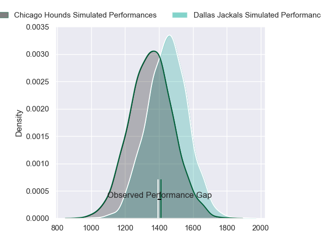
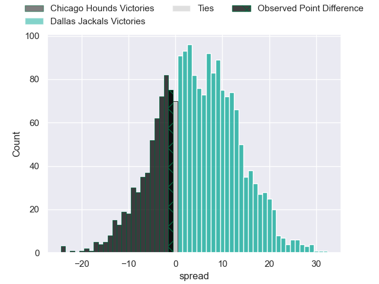
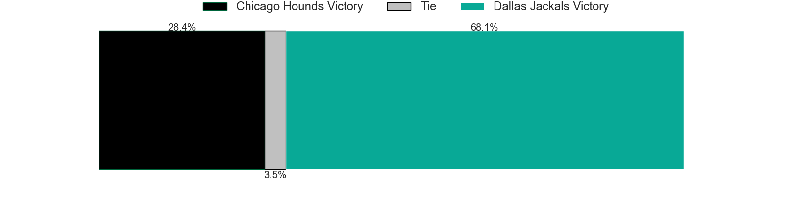

---  
layout: page  
title: Chicago Hounds at Dallas Jackals; 29-28  
date: 2023-06-18 00:00:00 18:00:00 -0500  
categories: match review  
---
# Chicago Hounds at Dallas Jackals; 29-28

# Club Level Predictions

The first set of predictions treats a club as the smallest object, as the club develops its members, organizes a gameplan, and deploys its players as needed for each match. This club model has a prediction of 0.62, which translates to predicting Dallas Jackals to win by 4.6.

Each club has a rating and a rating deviation (simiar to a Glicko system), and expected performances can be generated. This allows for simulated matches and spreads like the ones below.
## Projected Performances

## Projected Spreads

## Projected Results

# Player Level Predictions

Treating teams instead as an entity made up of the currently active players, I have ratings for each player in an altogether different system. These can be combined to form team ratings once teamsheets are announced, weighting starters a bit higher than the reserves. After the match is played, players can be weighted by their minutes on the field, allowing for an accurate measure of the team's composition. With these compiled team ratings, we can make predictions, measure inaccuracy, and update the individual player ratings.
## Prediction with Player Minutes: Chicago Hounds by 31.4

Chicago Hounds by 35.4 on a neutral field

There were 10 large changes in win probability in this match
## Prediction without Player Minutes: Chicago Hounds by 28.9

Chicago Hounds by 32.9 on a neutral pitch

|   Away Minutes | Away Player          |   Away elo |   Away Percentile |   Number |   Home Percentile |   Home elo | Home Player         |   Home Minutes |
|---------------:|:---------------------|-----------:|------------------:|---------:|------------------:|-----------:|:--------------------|---------------:|
|             57 | LaRome White         |      66.53 |                24 |        1 |                 9 |      55.58 | Liam Murray         |             59 |
|             67 | Lindsey Stevens      |      55.28 |                 8 |        2 |                 8 |      53.57 | Tomas Baravalle     |             49 |
|             46 | Paddy Ryan           |      57.53 |                11 |        3 |                 6 |      52.39 | Juan Pablo Zeiss    |             63 |
|             33 | John Cullen          |      75.17 |                43 |        4 |                 2 |      39.65 | Sam Golla           |             80 |
|             80 | Dineshwaran Krishnan |      94.02 |                80 |        5 |                 7 |      50.85 | Lucas Bur           |             80 |
|             80 | Mike Matarazzo       |      14.13 |                 0 |        6 |                 7 |      53    | Jeronimo Gomez Vara |             80 |
|             67 | Maclean Jones        |      61.59 |                17 |        7 |                 0 |      17.51 | Conrado Roura       |             63 |
|             80 | Tinashe Muchena      |      61.82 |                18 |        8 |                 5 |      46.81 | Jan Adriaan Booysen |             67 |
|             80 | Sidney Shoop         |     101.87 |                86 |        9 |                 0 |      35.2  | Danny Christensen   |             80 |
|             80 | Luke Carty           |      59.19 |                12 |       10 |                 2 |      38.22 | Alejandro Torres    |             63 |
|             73 | Julian Dominguez     |      69.72 |                33 |       11 |                 7 |      51.37 | Lui Sitama          |             40 |
|             80 | Bill Meakes          |      68.29 |                28 |       12 |                 0 |      20.17 | Tomas Cubilla       |             80 |
|             80 | Bryce Campbell       |      62.09 |                17 |       13 |                67 |      87.05 | Tomas Malanos       |             80 |
|             80 | Michael Baska        |      79.67 |                43 |       14 |                 0 |      15.22 | Campbell Johnstone  |             80 |
|             80 | Chris Mattina        |     123.09 |                95 |       15 |                11 |      56.18 | Marcos Moroni       |             80 |
|             23 | George Thornton      |      46.14 |                 3 |       16 |               nan |      36.44 | Alex Tucci          |             21 |
|             13 | Mika Felix           |      49.79 |                 4 |       17 |                 1 |      36.43 | Dewald Kotze        |             31 |
|             34 | Charles Abel         |      52.14 |                 7 |       18 |                 7 |      51.56 | Kyle Steeves        |             17 |
|             34 | Cam Dodson           |      80.94 |                56 |       19 |               nan |      60.93 | Cameron Nelson      |             17 |
|             13 | Michael De Waal      |      21.22 |                 0 |       20 |               nan |      61.44 | Maikeli Naromaitoga |             13 |
|             13 | Jean-Pierre Eloff    |      38.16 |                 1 |       21 |                 8 |      52.51 | Juan Pablo Aguirre  |             17 |
|              7 | Caleb Strum          |      59.45 |                16 |       22 |               nan |      51.94 | Jason Tidwell       |             40 |

