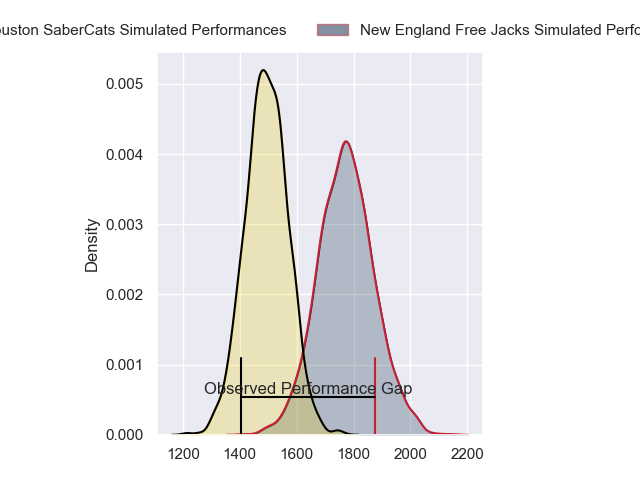
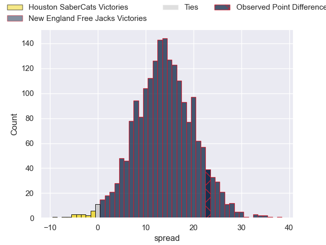
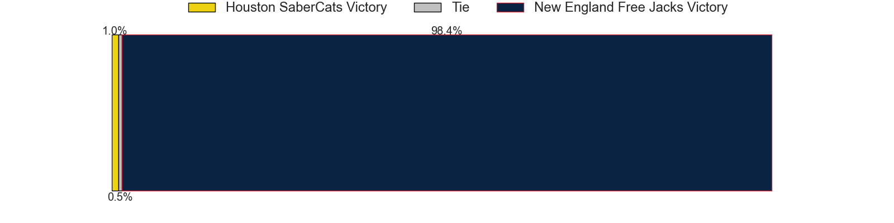

---  
layout: page  
title: Houston SaberCats at New England Free Jacks; 24-47  
date: 2023-06-18 19:30:00 18:00:00 -0500  
categories: match review  
---
# Houston SaberCats at New England Free Jacks; 24-47

# Club Level Predictions

The first set of predictions treats a club as the smallest object, as the club develops its members, organizes a gameplan, and deploys its players as needed for each match. This club model has a prediction of 0.83, which translates to predicting New England Free Jacks to win by 14.2.

Each club has a rating and a rating deviation (simiar to a Glicko system), and expected performances can be generated. This allows for simulated matches and spreads like the ones below.
## Projected Performances

## Projected Spreads

## Projected Results

# Player Level Predictions

Treating teams instead as an entity made up of the currently active players, I have ratings for each player in an altogether different system. These can be combined to form team ratings once teamsheets are announced, weighting starters a bit higher than the reserves. After the match is played, players can be weighted by their minutes on the field, allowing for an accurate measure of the team's composition. With these compiled team ratings, we can make predictions, measure inaccuracy, and update the individual player ratings.
## Prediction with Player Minutes: New England Free Jacks by 9.5

New England Free Jacks by 5.5 on a neutral field

There were 7 large changes in win probability in this match
## Prediction without Player Minutes: New England Free Jacks by 17.3

New England Free Jacks by 13.3 on a neutral pitch

|   Away Minutes | Away Player                   |   Away elo |   Away Percentile |   Number |   Home Percentile |   Home elo | Home Player        |   Home Minutes |
|---------------:|:------------------------------|-----------:|------------------:|---------:|------------------:|-----------:|:-------------------|---------------:|
|             50 | Alec McDonnell                |      66.55 |                21 |        1 |                56 |      79.51 | Kyle Ciquera       |             48 |
|             40 | Dean Muir                     |      66.61 |                27 |        2 |                37 |      68.98 | Millenium Sanerivi |             48 |
|             50 | Val Lee-Lo                    |      65.99 |               nan |        3 |                19 |      63.98 | Cole Keith         |             48 |
|             50 | Siaosi Mahoni                 |      83.9  |                62 |        4 |                45 |      75.62 | Semisi Paea        |             54 |
|             80 | Emmanuel Albert               |      63.95 |                18 |        5 |                49 |      77.14 | Conor Keys         |             80 |
|             50 | Danny Barrett                 |      68.42 |                26 |        6 |                25 |      67.39 | Mitchell Jacobson  |             80 |
|             80 | Keni Nasoqeqe                 |      39.53 |                 1 |        7 |                19 |      62.91 | Slade McDowall     |             60 |
|             80 | Hanco Germishuys              |      59.84 |               nan |        8 |                57 |      82.67 | Wian Conradie      |             80 |
|             80 | Carlo de Nysschen             |      74.36 |                35 |        9 |                88 |     103.67 | John Poland        |             60 |
|             80 | Kian Meadon                   |      75.34 |                41 |       10 |                72 |      91.93 | Beaudein Waaka     |              1 |
|             60 | Zach Pangeliman               |      86.87 |               nan |       11 |                57 |      80.86 | Paul Balekana      |             80 |
|             21 | Robert Povey                  |      69.26 |                28 |       12 |                41 |      73.87 | Le Roux Malan      |             80 |
|             80 | Kainoa Lloyd                  |      64.61 |               nan |       13 |                23 |      65.36 | Ben Lesage         |             80 |
|             80 | Nick Boyer                    |      -4.39 |               nan |       14 |                50 |      77.88 | Mitchell Wilson    |             13 |
|             80 | Gherardus Jacobus Labuschagne |      75.1  |                37 |       15 |                20 |      65.47 | Reece MacDonald    |             80 |
|             30 | Frikkie de Beer               |      61.38 |               nan |       16 |                80 |     101.57 | Foster Dewitt      |             32 |
|             40 | Axel Zapata                   |      97.02 |                85 |       17 |                23 |      63.95 | Andrew Quattrin    |             32 |
|             30 | Will Vakalahi                 |      59.49 |               nan |       18 |                12 |      58.25 | Joel Hintz         |             32 |
|             30 | Wynand Grassmann              |      82.72 |                63 |       19 |                18 |      62.17 | Sam Fischli        |             26 |
|             30 | Asa Carter                    |      69.75 |               nan |       20 |                 1 |      40.16 | Cam Davidowicz     |             20 |
|             20 | Gideon van Wyk                |      90.02 |                72 |       21 |               nan |      29.74 | Holden Yungert     |             20 |
|             59 | Jake Hidalgo                  |      76.47 |               nan |       22 |                19 |      62.67 | Spencer Jones      |             79 |
|            nan | nan                           |     nan    |               nan |       23 |                 0 |      10.74 | Joe Johnston       |             67 |

