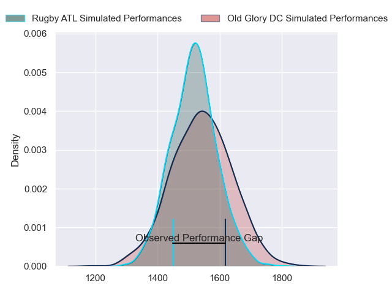
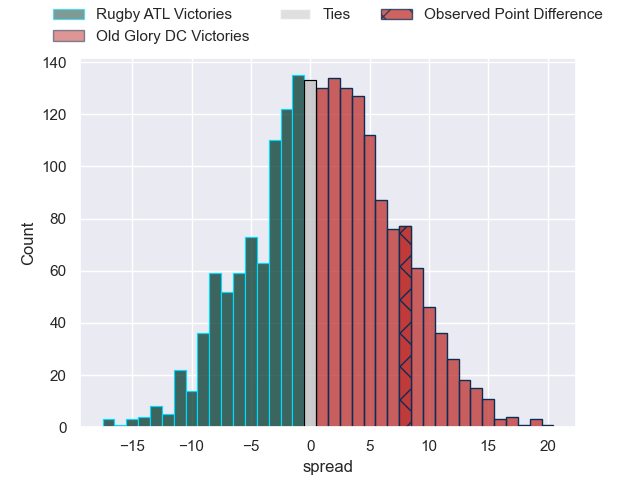

---  
layout: page  
title: Rugby ATL at Old Glory DC; 28-36  
date: 2023-06-18 01:00:00 18:00:00 -0500  
categories: match review  
---
# Rugby ATL at Old Glory DC; 28-36

# Club Level Predictions

The first set of predictions treats a club as the smallest object, as the club develops its members, organizes a gameplan, and deploys its players as needed for each match. This club model has a prediction of 0.54, which translates to predicting Old Glory DC to win by 1.4.

Each club has a rating and a rating deviation (simiar to a Glicko system), and expected performances can be generated. This allows for simulated matches and spreads like the ones below.
## Projected Performances

## Projected Spreads

## Projected Results

# Player Level Predictions

Treating teams instead as an entity made up of the currently active players, I have ratings for each player in an altogether different system. These can be combined to form team ratings once teamsheets are announced, weighting starters a bit higher than the reserves. After the match is played, players can be weighted by their minutes on the field, allowing for an accurate measure of the team's composition. With these compiled team ratings, we can make predictions, measure inaccuracy, and update the individual player ratings.
## Prediction with Player Minutes: Old Glory DC by 14.1

Old Glory DC by 10.1 on a neutral field

There were 8 large changes in win probability in this match
## Prediction without Player Minutes: Old Glory DC by 15.8

Old Glory DC by 11.8 on a neutral pitch

|   Away Minutes | Away Player            |   Away elo |   Away Percentile |   Number |   Home Percentile |   Home elo | Home Player              |   Home Minutes |
|---------------:|:-----------------------|-----------:|------------------:|---------:|------------------:|-----------:|:-------------------------|---------------:|
|             59 | Alex Maughan           |      -9.9  |                 0 |        1 |                 0 |      29.17 | Jack Iscaro              |             75 |
|             56 | Sidney Tobias          |      51.79 |                 7 |        2 |                30 |      66.34 | Nic Souchon              |             80 |
|             56 | John Roy Jenkinson     |      43.63 |                 2 |        3 |                11 |      56.05 | Kyle Stewart             |             64 |
|             69 | Christian Nahuel Milan |      45.44 |                 3 |        4 |                 4 |      45.3  | Tevita Naqali            |             59 |
|             80 | Jordan Brown           |      69.61 |                35 |        5 |                16 |      60.45 | Kyle Baillie             |             78 |
|             56 | Vili Helu              |     109.53 |                93 |        6 |                91 |     106.29 | Langilangi Haupeakui     |             52 |
|             80 | Matthew Heaton         |      39.96 |                 1 |        7 |                50 |      77.15 | Lautaro Ezequiel Bavaro  |             80 |
|             80 | Daemon Torres          |      88.96 |                78 |        8 |                32 |      71.28 | Niko Jones               |             59 |
|             58 | Niall Saunders         |      61.14 |                14 |        9 |                 6 |      51.11 | Danny Joseph Tusitala    |             80 |
|             49 | Duncan van Schalkwyk   |      37.01 |                 1 |       10 |                26 |      68.42 | Gradyn Bowd              |             52 |
|             80 | Nolan Tuamoheloa       |      23.77 |                 0 |       11 |                 3 |      43.7  | Tafeaga Junior Sau       |             80 |
|             62 | Seth Purdey            |      42    |                 2 |       12 |                 9 |      55    | Douglas Fraser           |             64 |
|             80 | Te Rangatira Waitokia  |      39.24 |                 2 |       13 |                 0 |      35.93 | William Talataina-Mu     |             80 |
|             80 | Jack Shaw              |      63.61 |                21 |       14 |                 7 |      50.34 | John Rizzo               |             80 |
|             80 | Christopher Hilsenbeck |      72.94 |                36 |       15 |                17 |      60.63 | Peni Lasaqa              |             80 |
|             21 | Lincoln Sii            |      55.41 |                10 |       16 |                11 |      57.79 | Cali Martinez            |              5 |
|             24 | Ben Strang             |      61.44 |                18 |       17 |                 1 |      38.81 | Quentin Newcomer         |             16 |
|             24 | Will Burke             |      40.4  |                 1 |       18 |                32 |      70.24 | Colin Grosse             |             21 |
|             11 | Matt Gelhaus           |      46.98 |               nan |       19 |                10 |      55.36 | Koikoi Nelligan          |              2 |
|             24 | Ross Deacon            |       5.15 |                 0 |       20 |                74 |      90.68 | Jamason Fa'anana Schultz |             28 |
|             22 | Evan Conlon            |      46.88 |               nan |       21 |                63 |      82.46 | Alejandro Daireaux       |             21 |
|             31 | Kurt Kendall Coleman   |      52.23 |                 5 |       22 |                 7 |      45.42 | Thretton Palamo          |             28 |
|             18 | George Barton          |      45.21 |                 3 |       23 |                 5 |      51.24 | John LeFevre             |             16 |

