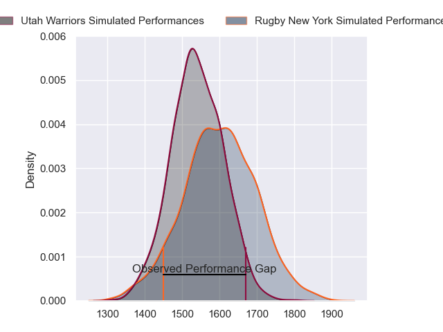
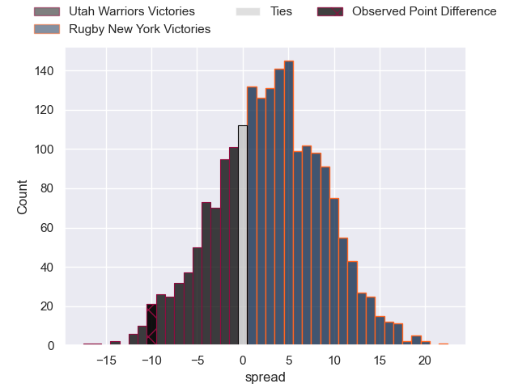

---  
layout: page  
title: Utah Warriors at Rugby New York; 43-33  
date: 2023-06-18 21:00:00 18:00:00 -0500  
categories: match review  
---
# Utah Warriors at Rugby New York; 43-33

# Club Level Predictions

The first set of predictions treats a club as the smallest object, as the club develops its members, organizes a gameplan, and deploys its players as needed for each match. This club model has a prediction of 0.579, which translates to predicting Rugby New York to win by 2.8.

Each club has a rating and a rating deviation (simiar to a Glicko system), and expected performances can be generated. This allows for simulated matches and spreads like the ones below.
## Projected Performances

## Projected Spreads

## Projected Results

# Player Level Predictions

Treating teams instead as an entity made up of the currently active players, I have ratings for each player in an altogether different system. These can be combined to form team ratings once teamsheets are announced, weighting starters a bit higher than the reserves. After the match is played, players can be weighted by their minutes on the field, allowing for an accurate measure of the team's composition. With these compiled team ratings, we can make predictions, measure inaccuracy, and update the individual player ratings.
## Prediction with Player Minutes: Rugby New York by 1.4

Utah Warriors by 2.6 on a neutral field

There were 14 large changes in win probability in this match
## Prediction without Player Minutes: Rugby New York by 3.4

Utah Warriors by 0.6 on a neutral pitch

|   Away Minutes | Away Player             |   Away elo |   Away Percentile |   Number |   Home Percentile |   Home elo | Home Player       |   Home Minutes |
|---------------:|:------------------------|-----------:|------------------:|---------:|------------------:|-----------:|:------------------|---------------:|
|             40 | Olive Kilifi            |      56.22 |                10 |        1 |                23 |      66.23 | Chance Wenglewski |             48 |
|             66 | Henry Bell              |      63    |                21 |        2 |                 8 |      53.04 | Dylan Fawsitt     |             50 |
|             40 | Paul Mullen             |      57.03 |                11 |        3 |                82 |      93.47 | Kaleb Geiger      |             48 |
|             50 | Saia Uhila              |      72.01 |                40 |        4 |                86 |      99.74 | Charlie Hewitt    |             80 |
|             80 | Jamie Lane              |      59.21 |                14 |        5 |                 6 |      51.21 | Brad Tucker       |             60 |
|             80 | Bailey Wilson           |      62.43 |                18 |        6 |                13 |      55.64 | Kara Pryor        |             80 |
|             69 | Lance Williams          |      84.33 |                67 |        7 |                13 |      58.65 | Brendon O'Connor  |             80 |
|             50 | Onehunga Havili Kaufusi |      64.19 |                21 |        8 |                 9 |      55.04 | Pago Haini        |             60 |
|             60 | Zion Going              |      68.12 |                25 |        9 |                71 |      90.62 | Connor McManus    |             52 |
|             80 | Joel Hodgson            |      59.14 |                12 |       10 |                 8 |      54.3  | Jason Emery       |             80 |
|             80 | Jesse Hamilton          |      62.72 |               nan |       11 |               nan |      57.33 | Ishmail Shabazz   |             80 |
|             80 | Calvin Whiting          |      62.56 |                19 |       12 |                24 |      66.21 | Teihorangi Walden |             52 |
|             80 | Tyler Luke Fisher       |     111.8  |                93 |       13 |                 9 |      54.12 | Fa'asiu Fuatai    |             50 |
|             40 | Caleb Makene            |      54.75 |                10 |       14 |                14 |      58    | Brooklyn Hardaker |             80 |
|             80 | Cliven Loubser          |      45.4  |                 5 |       15 |                25 |      66.32 | Samuel Windsor    |             80 |
|             47 | Emerson Prior           |      66.98 |                23 |       16 |                43 |      77.44 | Tevita Langi      |             39 |
|             21 | Joey Backe              |      65.07 |                24 |       17 |               nan |      68.53 | DaQuan Perry      |             37 |
|             47 | Angus McLellan          |      59.44 |                13 |       18 |                35 |      70.2  | Nic Mayhew        |             39 |
|             37 | Jurie George van Vuuren |      60.51 |                14 |       19 |                 7 |      50.8  | Hamish Dalzell    |             27 |
|             18 | Jeremiah Noaese         |      73.19 |                42 |       20 |                84 |      96.78 | Joseph Basser     |             27 |
|             37 | Thomas Tu'avao          |      69.9  |                30 |       21 |                 6 |      51.87 | Connor Buckley    |             35 |
|             27 | Connor McLeod           |      56.47 |                10 |       22 |                 5 |      48.58 | Quinn Ngawati     |             35 |
|             47 | Logan Tago              |      80.63 |                54 |       23 |                 8 |      53.23 | Nick Feakes       |             37 |

