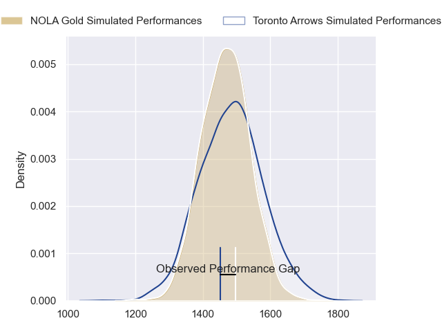
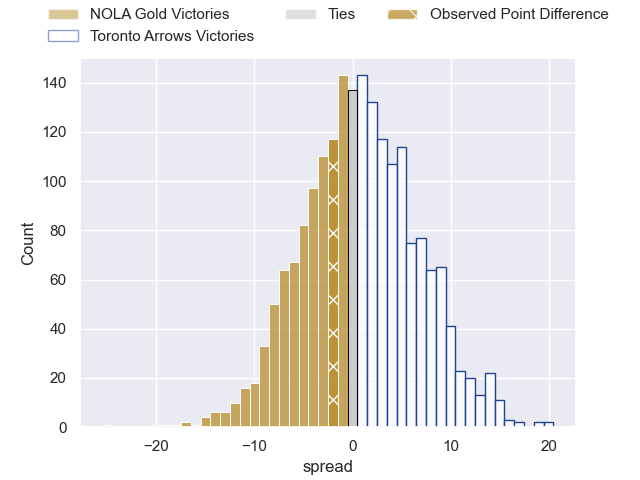

---  
layout: page  
title: NOLA Gold at Toronto Arrows; 26-24  
date: 2023-06-18 01:00:00 18:00:00 -0500  
categories: match review  
---
# NOLA Gold at Toronto Arrows; 26-24

# Club Level Predictions

The first set of predictions treats a club as the smallest object, as the club develops its members, organizes a gameplan, and deploys its players as needed for each match. This club model has a prediction of 0.531, which translates to predicting Toronto Arrows to win by 1.1.

Each club has a rating and a rating deviation (simiar to a Glicko system), and expected performances can be generated. This allows for simulated matches and spreads like the ones below.
## Projected Performances

## Projected Spreads

## Projected Results

# Player Level Predictions

Treating teams instead as an entity made up of the currently active players, I have ratings for each player in an altogether different system. These can be combined to form team ratings once teamsheets are announced, weighting starters a bit higher than the reserves. After the match is played, players can be weighted by their minutes on the field, allowing for an accurate measure of the team's composition. With these compiled team ratings, we can make predictions, measure inaccuracy, and update the individual player ratings.
## Prediction with Player Minutes: Toronto Arrows by 0.8

NOLA Gold by 3.2 on a neutral field

There were 10 large changes in win probability in this match
## Prediction without Player Minutes: Toronto Arrows by 1.1

NOLA Gold by 2.9 on a neutral pitch

|   Away Minutes | Away Player                              |   Away elo |   Away Percentile |   Number |   Home Percentile |   Home elo | Home Player      |   Home Minutes |
|---------------:|:-----------------------------------------|-----------:|------------------:|---------:|------------------:|-----------:|:-----------------|---------------:|
|             60 | Matt Harmon                              |      55.68 |                 9 |        1 |                 3 |      46.66 | Connor Grindal   |             52 |
|             28 | Eric Howard                              |      54.84 |                 9 |        2 |               nan |      39.89 | Jack McRogers    |             66 |
|             31 | Jarred Adams                             |      50.27 |                 4 |        3 |                17 |      67.39 | Isaac Salmon     |             66 |
|             80 | Cameron Dolan                            |      54.45 |                10 |        4 |                25 |      62.33 | Hank Stevenson   |             80 |
|             28 | Malcolm May                              |      68.28 |                29 |        5 |                44 |      75.39 | Michael Sheppard |             51 |
|             60 | Moni Tonga'uiha                          |       3.62 |                 0 |        6 |                 0 |      18.35 | Mason Flesch     |             58 |
|             63 | Tom Florence                             |      46.63 |                 5 |        7 |                56 |      80.29 | James O'Neill    |             80 |
|             80 | Maciu Koroi                              |      81.3  |                54 |        8 |                38 |      72.4  | Travis Larsen    |             80 |
|             80 | Sebastiano Villani                       |      60.3  |               nan |        9 |                 7 |      53.97 | Will Grant       |             40 |
|             80 | Reece Botha                              |      71.52 |                32 |       10 |                 3 |      44.63 | Peter Nelson     |             32 |
|             80 | Dougie Fife                              |      63.68 |                21 |       11 |                61 |      81.89 | Fabian Goodall   |             60 |
|             80 | Ross Depperschmidt                       |      46.3  |                 3 |       12 |                 0 |       7.6  | Mitch Richardson |             80 |
|             78 | Philippus Jacobus Snyman (JP) du Plessis |      50.34 |                 6 |       13 |                 1 |      42.2  | Tautalatasi Tasi |             80 |
|             80 | Harley Wheeler                           |      54.38 |                10 |       14 |                 8 |      45.33 | Kobe Faust       |             80 |
|             71 | Jordan Trainor                           |      60    |                15 |       15 |                 6 |      46.77 | Shane O'Leary    |             80 |
|             20 | Kevin Sullivan                           |      87.93 |                77 |       16 |                79 |      91.91 | Ramon Ayarza     |             28 |
|             52 | Pat O'Toole                              |      67.28 |                29 |       17 |                15 |      59.41 | Gene Syminton    |             14 |
|             49 | Dino Waldren                             |      50.85 |               nan |       18 |               nan |      52.32 | Conan O'Donnell  |             14 |
|             52 | Will Waguespack                          |      73.05 |                31 |       19 |                19 |      62.76 | Owain Ruttan     |             29 |
|             20 | Alex Lopeti                              |      54.7  |                12 |       20 |                18 |      64.21 | Ross Braude      |             40 |
|             17 | Jack Webster                             |      48.65 |                 6 |       21 |                41 |      77.14 | Sam Malcolm      |             48 |
|              9 | Kenneth Jinkins                          |      56.63 |               nan |       22 |               nan |      53.42 | Matt Fish        |             22 |
|              2 | Rory Edwards                             |      54.44 |               nan |       23 |                 3 |      44.16 | Liam Bowman      |             20 |

