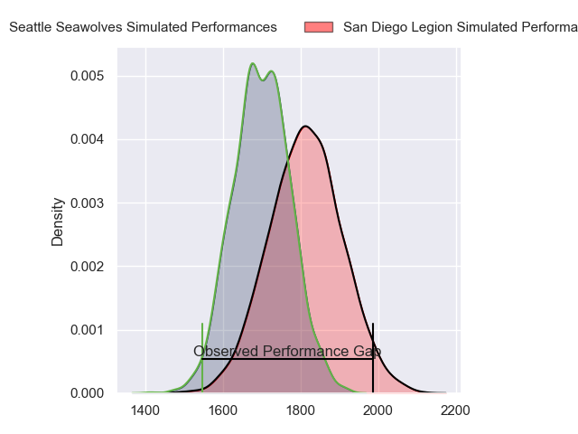
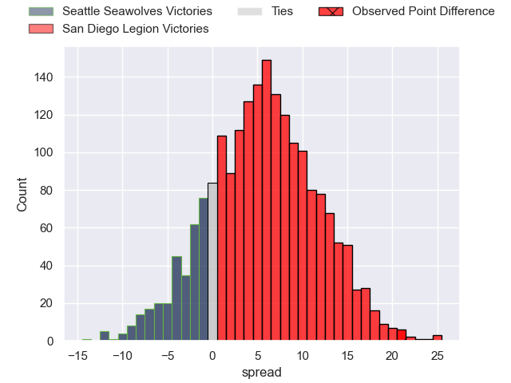
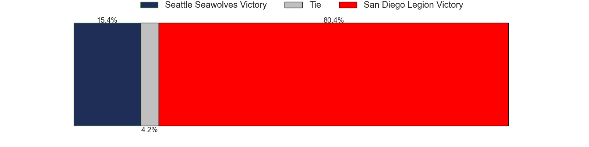

---  
layout: page  
title: Seattle Seawolves at San Diego Legion; 19-40  
date: 2023-06-19 01:00:00 18:00:00 -0500  
categories: match review  
---
# Seattle Seawolves at San Diego Legion; 19-40

# Club Level Predictions

The first set of predictions treats a club as the smallest object, as the club develops its members, organizes a gameplan, and deploys its players as needed for each match. This club model has a prediction of 0.652, which translates to predicting San Diego Legion to win by 5.6.

Each club has a rating and a rating deviation (simiar to a Glicko system), and expected performances can be generated. This allows for simulated matches and spreads like the ones below.
## Projected Performances

## Projected Spreads

## Projected Results

# Player Level Predictions

Treating teams instead as an entity made up of the currently active players, I have ratings for each player in an altogether different system. These can be combined to form team ratings once teamsheets are announced, weighting starters a bit higher than the reserves. After the match is played, players can be weighted by their minutes on the field, allowing for an accurate measure of the team's composition. With these compiled team ratings, we can make predictions, measure inaccuracy, and update the individual player ratings.
## Prediction with Player Minutes: San Diego Legion by 30.0

San Diego Legion by 26.0 on a neutral field
## Prediction without Player Minutes: San Diego Legion by 30.0

San Diego Legion by 26.0 on a neutral pitch

|   Away Minutes | Away Player      |   Away elo |   Away Percentile |   Number |   Home Percentile |   Home elo | Home Player          |   Home Minutes |
|---------------:|:-----------------|-----------:|------------------:|---------:|------------------:|-----------:|:---------------------|---------------:|
|             80 | Dewald Donald    |      61.87 |               nan |        1 |                25 |      68.83 | Nathan Sylvia        |             80 |
|             80 | James Malcolm    |      60.94 |                17 |        2 |                85 |      97.58 | Sama Malolo          |             80 |
|             80 | Mason Pedersen   |      70.2  |                33 |        3 |                10 |      58.98 | Chris Baumann        |             80 |
|             80 | Isaia Lotawa     |      59.92 |               nan |        4 |                11 |      56.4  | Thomas Franklin      |             80 |
|             80 | Ben Mitchell     |     -36.48 |                 0 |        5 |                19 |      63.49 | Isaac Ross           |             80 |
|             80 | Page             |      49.81 |               nan |        6 |                23 |      68.49 | Michael Smith        |             80 |
|             80 | Nakai Penny      |      53.16 |                 6 |        7 |                47 |      76.78 | Blair Cowan          |             80 |
|             80 | Ronan Foley      |      47.09 |                 5 |        8 |                19 |      63.14 | Finn Kearns          |             80 |
|             80 | Reid Watkins     |      77.64 |               nan |        9 |                16 |      61.08 | Jason Higgins        |             80 |
|             80 | Devereaux Ferris |       9.39 |               nan |       10 |                24 |      69.82 | Josh Henderson       |             80 |
|             80 | Jeremiah Sio     |      49.62 |               nan |       11 |                30 |      70.41 | Mike Te'o            |             80 |
|             80 | Lopeti Aisea     |      68.95 |               nan |       12 |                56 |      81.29 | Ma'a Nonu            |             80 |
|             80 | David Busby      |      94.02 |                78 |       13 |                58 |      81.49 | Filimona Waqainabete |             80 |
|             80 | Cole Zarcone     |      62.48 |               nan |       14 |               nan |      60.31 | Ryan Matyas          |             80 |
|             80 | Shane Barry      |      49.44 |               nan |       15 |               nan |      60.43 | Alex Horan           |             80 |

