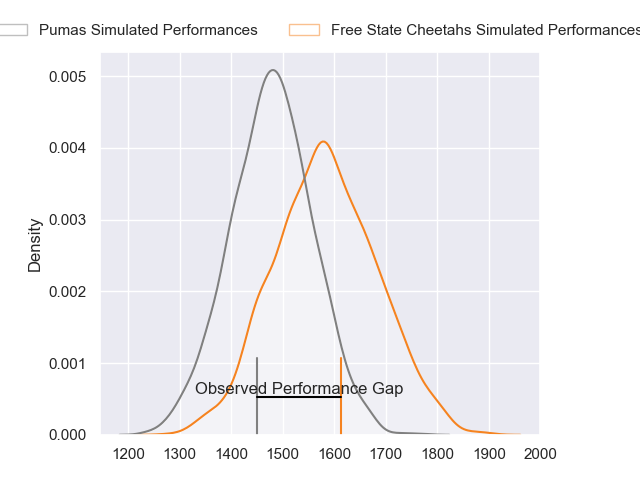
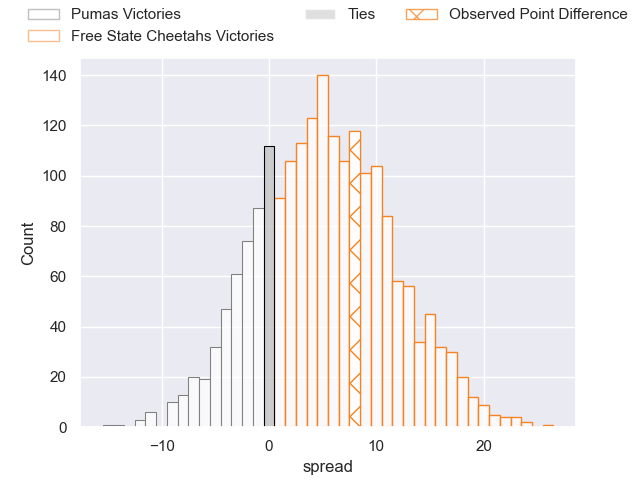
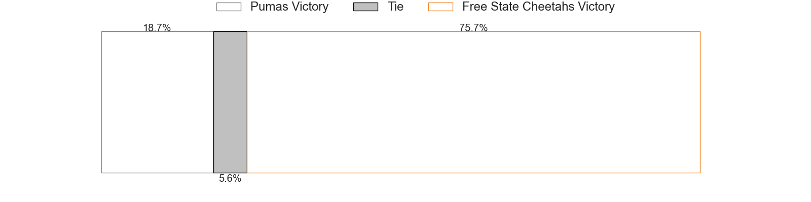

---  
layout: page  
title: Pumas at Free State Cheetahs; 17-25  
date: 2023-06-24 17:00:00 18:00:00 -0500  
categories: match review  
---
# Pumas at Free State Cheetahs; 17-25

# Club Level Predictions

The first set of predictions treats a club as the smallest object, as the club develops its members, organizes a gameplan, and deploys its players as needed for each match. This club model has a prediction of 0.644, which translates to predicting Free State Cheetahs to win by 5.3.

Each club has a rating and a rating deviation (simiar to a Glicko system), and expected performances can be generated. This allows for simulated matches and spreads like the ones below.
## Projected Performances

## Projected Spreads

## Projected Results

# Player Level Predictions

Treating teams instead as an entity made up of the currently active players, I have ratings for each player in an altogether different system. These can be combined to form team ratings once teamsheets are announced, weighting starters a bit higher than the reserves. After the match is played, players can be weighted by their minutes on the field, allowing for an accurate measure of the team's composition. With these compiled team ratings, we can make predictions, measure inaccuracy, and update the individual player ratings.
## Prediction with Player Minutes: Free State Cheetahs by 8.3

Free State Cheetahs by 4.3 on a neutral field

There were 11 large changes in win probability in this match
## Prediction without Player Minutes: Free State Cheetahs by 6.7

Free State Cheetahs by 2.7 on a neutral pitch

|   Away Minutes | Away Player          |   Away elo |   Away Percentile |   Number |   Home Percentile |   Home elo | Home Player                 |   Home Minutes |
|---------------:|:---------------------|-----------:|------------------:|---------:|------------------:|-----------:|:----------------------------|---------------:|
|             40 | Corne Fourie         |      80.31 |                57 |        1 |               nan |      69.71 | Ngobisizwe Mxoli            |             35 |
|             70 | PJ Jacobs            |     100.14 |                88 |        2 |                93 |     106.73 | Marnus van der Merwe        |             59 |
|             40 | Simon Raw            |      58.07 |                12 |        3 |                70 |      86.52 | Jacobus Conradus van Vuuren |             35 |
|             80 | Deon Slabbert        |      68.71 |                30 |        4 |                40 |      73.56 | Rynier Mark Bernardo        |             66 |
|             62 | Shane Monro Kirkwood |     114.91 |                94 |        5 |                80 |      94.49 | Victor Kutlwano Sekekete    |             80 |
|             80 | Andre Fouché         |      65.88 |                24 |        6 |                34 |      70.38 | Gideon van der Merwe        |             40 |
|             67 | Francois Kleinhans   |      78.41 |                53 |        7 |                64 |      83.29 | Sibabalo Qoma               |             59 |
|             80 | Kwanda Dimaza        |      97.3  |                82 |        8 |                98 |     121.41 | Friedle Olivier             |             80 |
|             58 | Chriswill September  |     108.25 |                91 |        9 |                92 |     109.8  | Rewan Kruger                |             77 |
|             77 | Tinus de Beer        |     104.29 |                87 |       10 |                35 |      72.64 | Ruan Pienaar                |             80 |
|             80 | Etienne Taljaard     |      95.18 |                81 |       11 |                83 |      96.98 | Cohen Jasper                |             80 |
|             58 | Ali Mgijima          |     116.82 |                96 |       12 |                84 |     100.03 | Reinhardt Fortuin           |             80 |
|             80 | Diego Appollis       |      83.53 |                60 |       13 |                78 |      95.22 | David Benjamin Brits        |             71 |
|             80 | Andrew Kota          |      87.35 |                70 |       14 |                84 |      98.13 | Daniel Kasende Kalepula     |             80 |
|             80 | Devon Frank Williams |      79.37 |                49 |       15 |                48 |      78.92 | Tapiwa Lloyd Mafura         |             80 |
|             40 | Etienne Janeke       |      91.52 |               nan |       16 |                77 |      91.97 | Alulutho Tshakweni          |             45 |
|             40 | Dewald Maritz        |      78.73 |               nan |       17 |                32 |      77.87 | Hencus van Wyk              |             45 |
|             22 | Giovanne Snyman      |      55.4  |                 5 |       18 |                25 |      74.09 | Jeandre Rudolph             |             40 |
|             22 | Wian van Niekerk     |      82.36 |                46 |       19 |                33 |      70.1  | Louis van der Westhuizen    |             21 |
|             18 | Malembe Mpofu        |      75.52 |                46 |       20 |                52 |      87.33 | George Cronje               |             21 |
|             13 | Ruwald Van der Merwe |      78.44 |                48 |       21 |                14 |      60.86 | Robert Thompson Ebersohn    |              9 |
|             10 | Darnell Osuagwu      |      75.86 |               nan |       22 |                58 |      83.89 | Siya Masuku                 |              3 |
|              3 | Gene Willemse        |      71.65 |               nan |       23 |                93 |     107.24 | Daniel Johannes Maartens    |             14 |

