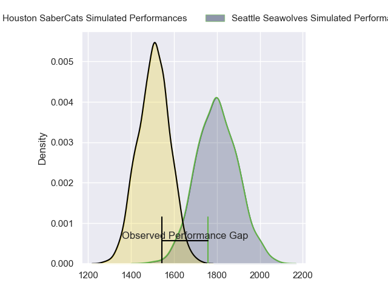
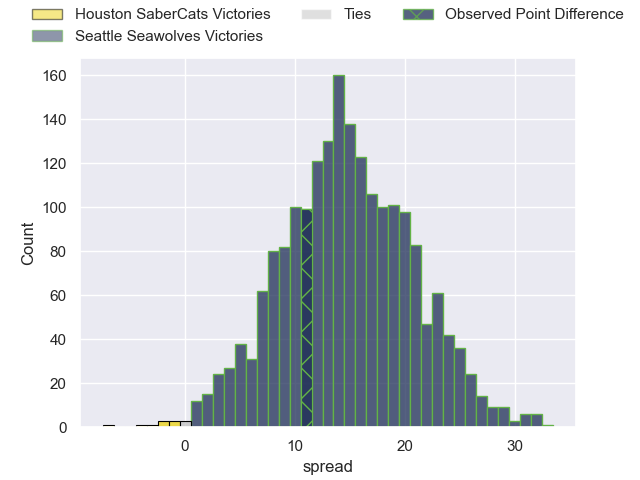
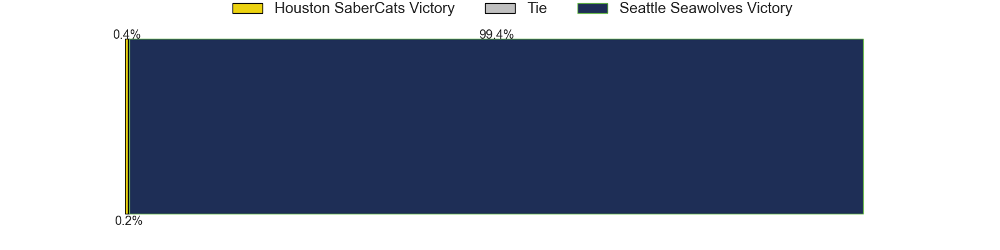

---  
layout: page  
title: Houston SaberCats at Seattle Seawolves; 26-37  
date: 2023-06-25 00:00:00 18:00:00 -0500  
categories: match review  
---
# Houston SaberCats at Seattle Seawolves; 26-37

# Club Level Predictions

The first set of predictions treats a club as the smallest object, as the club develops its members, organizes a gameplan, and deploys its players as needed for each match. This club model has a prediction of 0.836, which translates to predicting Seattle Seawolves to win by 14.5.

Each club has a rating and a rating deviation (simiar to a Glicko system), and expected performances can be generated. This allows for simulated matches and spreads like the ones below.
## Projected Performances

## Projected Spreads

## Projected Results

# Player Level Predictions

Treating teams instead as an entity made up of the currently active players, I have ratings for each player in an altogether different system. These can be combined to form team ratings once teamsheets are announced, weighting starters a bit higher than the reserves. After the match is played, players can be weighted by their minutes on the field, allowing for an accurate measure of the team's composition. With these compiled team ratings, we can make predictions, measure inaccuracy, and update the individual player ratings.
## Prediction with Player Minutes: Seattle Seawolves by 3.4

Houston SaberCats by 0.6 on a neutral field

There were 9 large changes in win probability in this match
## Prediction without Player Minutes: Seattle Seawolves by 2.9

Houston SaberCats by 1.1 on a neutral pitch

|   Away Minutes | Away Player                   |   Away elo |   Away Percentile |   Number |   Home Percentile |   Home elo | Home Player            |   Home Minutes |
|---------------:|:------------------------------|-----------:|------------------:|---------:|------------------:|-----------:|:-----------------------|---------------:|
|             59 | Rob Cobb                      |      64.1  |                20 |        1 |                24 |      66.38 | Mzamo Majola           |             60 |
|             52 | Dean Muir                     |      66.3  |                27 |        2 |                23 |      62.29 | Peter Malcolm          |             60 |
|             59 | Morgan Mitchell               |      55.75 |                10 |        3 |                14 |      59.79 | Sam Matenga            |             59 |
|             80 | Marno Redelinghuys            |      92.44 |                77 |        4 |                16 |      61.49 | Ben Landry             |             75 |
|             52 | Nathan Den Hoedt              |      62.91 |                19 |        5 |                20 |      63.41 | Rhyno Herbst           |             80 |
|             46 | Malon Maurice Al-Jiboori      |      68.3  |                28 |        6 |                27 |      67.68 | Charles Elton          |             80 |
|             52 | Keni Nasoqeqe                 |      31.16 |                 0 |        7 |                 5 |      49.27 | Ronan Foley            |             77 |
|             80 | Gideon van Wyk                |      89.67 |                71 |        8 |                16 |      61.04 | Riekert Hattingh       |             80 |
|             80 | Dillon Smit                   |      69.53 |                31 |        9 |                55 |      80.61 | JP Smith               |             79 |
|             80 | David Coetzer                 |      59.34 |                13 |       10 |                14 |      59.68 | AJ Alatimu             |             80 |
|             80 | Vereniki Tikoisolomone        |      74.75 |                44 |       11 |                96 |     114.55 | Lauina Futi            |             80 |
|             80 | Louritz van der Schyff        |      68.74 |                28 |       12 |                 6 |      49.98 | Daniel David Kriel     |             71 |
|             80 | Dominic Akina                 |      68.95 |                29 |       13 |                 9 |      54.67 | Tevita Lopeti          |             80 |
|             80 | Line Latu                     |      55.44 |                10 |       14 |                14 |      58.98 | Duncan Victor Matthews |             60 |
|             62 | Gherardus Jacobus Labuschagne |      68.78 |                26 |       15 |                57 |      82.59 | Adriaan John Carelse   |             80 |
|             21 | Alec McDonnell                |      64.1  |                20 |       16 |                56 |      79.94 | Jake Turnbull          |             20 |
|             28 | Joseph Taufete'e              |      63.58 |                19 |       17 |                26 |      65.92 | James Malcolm          |             20 |
|             21 | Val Lee-Lo                    |      65.21 |                21 |       18 |                40 |      73.27 | Mason Pedersen         |             21 |
|             28 | Emmanuel Albert               |      58.81 |                14 |       19 |                 0 |     -32.09 | Ben Mitchell           |              5 |
|             34 | Danny Barrett                 |      65.42 |                23 |       20 |                32 |      69.49 | Nakai Penny            |              3 |
|             28 | Hanco Germishuys              |      54.9  |                 9 |       21 |                 0 |      11.04 | Devereaux Ferris       |              1 |
|             18 | Carlo de Nysschen             |      63.68 |                20 |       22 |                48 |      77.38 | Lopeti Aisea           |              9 |
|            nan | nan                           |     nan    |               nan |       23 |                12 |      56.11 | Jeremiah Sio           |             20 |

