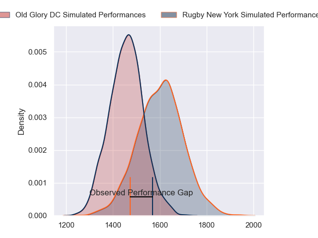
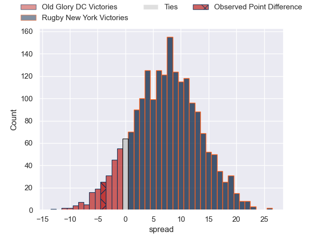
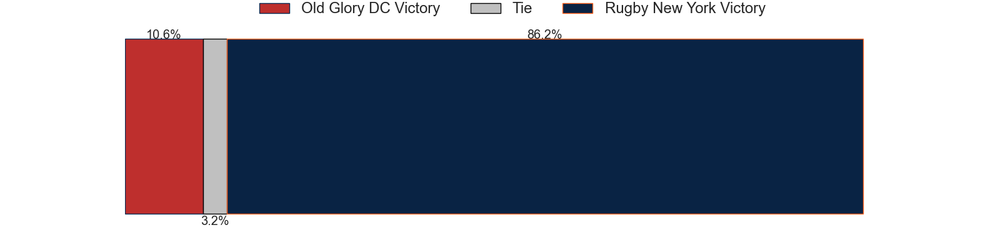

---  
layout: page  
title: Old Glory DC at Rugby New York; 37-33  
date: 2023-06-26 00:00:00 18:00:00 -0500  
categories: match review  
---
# Old Glory DC at Rugby New York; 37-33

# Club Level Predictions

The first set of predictions treats a club as the smallest object, as the club develops its members, organizes a gameplan, and deploys its players as needed for each match. This club model has a prediction of 0.689, which translates to predicting Rugby New York to win by 7.1.

Each club has a rating and a rating deviation (simiar to a Glicko system), and expected performances can be generated. This allows for simulated matches and spreads like the ones below.
## Projected Performances

## Projected Spreads

## Projected Results

# Player Level Predictions

Treating teams instead as an entity made up of the currently active players, I have ratings for each player in an altogether different system. These can be combined to form team ratings once teamsheets are announced, weighting starters a bit higher than the reserves. After the match is played, players can be weighted by their minutes on the field, allowing for an accurate measure of the team's composition. With these compiled team ratings, we can make predictions, measure inaccuracy, and update the individual player ratings.
## Prediction with Player Minutes: Rugby New York by 7.5

Rugby New York by 3.5 on a neutral field

There were 8 large changes in win probability in this match
## Prediction without Player Minutes: Rugby New York by 9.8

Rugby New York by 5.8 on a neutral pitch

|   Away Minutes | Away Player              |   Away elo |   Away Percentile |   Number |   Home Percentile |   Home elo | Home Player       |   Home Minutes |
|---------------:|:-------------------------|-----------:|------------------:|---------:|------------------:|-----------:|:------------------|---------------:|
|             80 | Jack Iscaro              |      23.69 |                 0 |        1 |                17 |      62.58 | Chance Wenglewski |             61 |
|             55 | Nic Souchon              |      60.5  |                16 |        2 |                 5 |      49.24 | Dylan Fawsitt     |             80 |
|             70 | Kyle Stewart             |      51.38 |                 5 |        3 |                77 |      89.82 | Kaleb Geiger      |             61 |
|             48 | Tevita Naqali            |      42.72 |                 2 |        4 |                79 |      93.66 | Charlie Hewitt    |             15 |
|             80 | Kyle Baillie             |      54.76 |                10 |        5 |                 7 |      48.75 | Hamish Dalzell    |             80 |
|             47 | Jamason Fa'anana Schultz |      90.32 |                74 |        6 |                 4 |      46.65 | Brad Tucker       |             80 |
|             80 | Lautaro Ezequiel Bavaro  |      73.65 |                41 |        7 |                 7 |      52.57 | Brendon O'Connor  |             80 |
|             70 | Niko Jones               |      66.97 |                24 |        8 |                 6 |      50.48 | Pago Haini        |             61 |
|             80 | Danny Joseph Tusitala    |      47.6  |                 2 |        9 |                 6 |      49.21 | Connor Buckley    |             47 |
|             80 | Joaquin Diaz Bonilla     |      49.01 |                 6 |       10 |                 5 |      48.22 | Jason Emery       |             61 |
|             70 | Tafeaga Junior Sau       |      37.86 |                 1 |       11 |                55 |      80.22 | Teofilo Ed Fidow  |             80 |
|             53 | Douglas Fraser           |      50.33 |                 6 |       12 |                18 |      62.26 | Teihorangi Walden |             80 |
|             80 | William Talataina-Mu     |      30.09 |                 0 |       13 |                 6 |      50.32 | Fa'asiu Fuatai    |             80 |
|             80 | Marcos Young             |      84.02 |                61 |       14 |                 8 |      51.92 | Brooklyn Hardaker |             80 |
|             80 | Kurt Baker               |      70.38 |                29 |       15 |                15 |      60.24 | Samuel Windsor    |             80 |
|             25 | Facundo Gattas           |      57.09 |               nan |       16 |                43 |      74.47 | Tevita Langi      |             19 |
|             10 | Quentin Newcomer         |      37.64 |                 1 |       17 |                 7 |      56.61 | Sam Davies        |             19 |
|             32 | Colin Grosse             |      68.71 |                32 |       18 |                 5 |      49.56 | Kara Pryor        |             64 |
|             33 | Alejandro Daireaux       |      81.54 |                62 |       19 |               nan |      65.72 | DaQuan Perry      |              1 |
|             10 | Langilangi Haupeakui     |     102.5  |                89 |       20 |                22 |      64.8  | Akuei Monate      |             19 |
|             10 | John Rizzo               |      44.5  |                 4 |       21 |                66 |      86.66 | Connor McManus    |             33 |
|             27 | Thretton Palamo          |      43.37 |                 7 |       22 |                 8 |      50.42 | Nick Feakes       |             19 |

