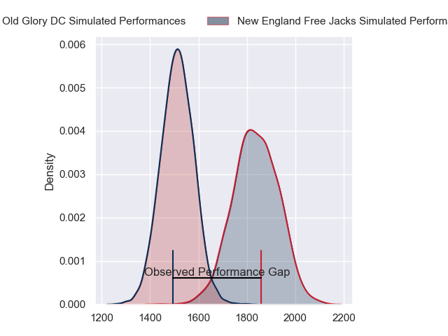
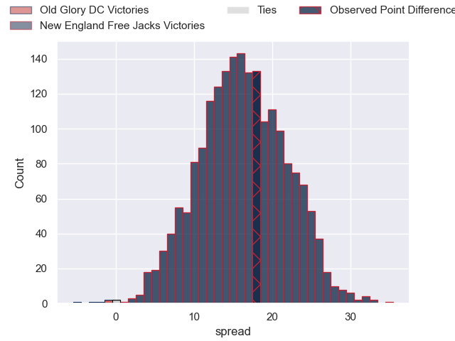
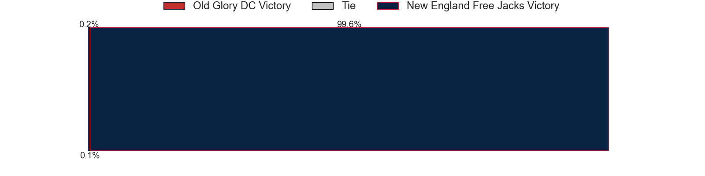

---  
layout: page  
title: Old Glory DC at New England Free Jacks; 7-25  
date: 2023-07-01 23:30:00 18:00:00 -0500  
categories: match review  
---
# Old Glory DC at New England Free Jacks; 7-25

# Club Level Predictions

The first set of predictions treats a club as the smallest object, as the club develops its members, organizes a gameplan, and deploys its players as needed for each match. This club model has a prediction of 0.861, which translates to predicting New England Free Jacks to win by 16.2.

Each club has a rating and a rating deviation (simiar to a Glicko system), and expected performances can be generated. This allows for simulated matches and spreads like the ones below.
## Projected Performances

## Projected Spreads

## Projected Results

# Player Level Predictions

Treating teams instead as an entity made up of the currently active players, I have ratings for each player in an altogether different system. These can be combined to form team ratings once teamsheets are announced, weighting starters a bit higher than the reserves. After the match is played, players can be weighted by their minutes on the field, allowing for an accurate measure of the team's composition. With these compiled team ratings, we can make predictions, measure inaccuracy, and update the individual player ratings.
## Prediction with Player Minutes: New England Free Jacks by 22.5

New England Free Jacks by 18.5 on a neutral field

There were 2 large changes in win probability in this match
## Prediction without Player Minutes: New England Free Jacks by 18.6

New England Free Jacks by 14.6 on a neutral pitch

|   Away Minutes | Away Player              |   Away elo |   Away Percentile |   Number |   Home Percentile |   Home elo | Home Player        |   Home Minutes |
|---------------:|:-------------------------|-----------:|------------------:|---------:|------------------:|-----------:|:-------------------|---------------:|
|             60 | Jack Iscaro              |      27.3  |                 0 |        1 |                25 |      67.23 | Kianu Kereru-Symes |             47 |
|             55 | Nic Souchon              |      62.96 |                19 |        2 |                16 |      63.65 | Andrew Quattrin    |             47 |
|             55 | Kyle Stewart             |      63.55 |                19 |        3 |                 9 |      57.96 | Joel Hintz         |             47 |
|             47 | Tevita Naqali            |      45.33 |                 3 |        4 |                55 |      80.35 | Conor Keys         |             80 |
|             80 | Kyle Baillie             |      61.46 |                16 |        5 |                34 |      71.6  | Reegan O'Gorman    |             47 |
|             47 | Jamason Fa'anana Schultz |      88.57 |                75 |        6 |                34 |      70.54 | Mitchell Jacobson  |             80 |
|             80 | Lautaro Ezequiel Bavaro  |      73.3  |                41 |        7 |                 0 |      19.57 | Joe Johnston       |             65 |
|             55 | Niko Jones               |      73.25 |                38 |        8 |                59 |      83.52 | Wian Conradie      |             80 |
|             80 | Danny Joseph Tusitala    |      51.18 |                 5 |        9 |                93 |     110.3  | John Poland        |             73 |
|             80 | Gradyn Bowd              |      66.04 |                21 |       10 |                57 |      83.29 | Jayson Potroz      |             73 |
|             80 | Tafeaga Junior Sau       |      47.62 |                 5 |       11 |                65 |      85.28 | Paul Balekana      |             80 |
|             47 | Douglas Fraser           |      59.03 |                13 |       12 |                64 |      85.44 | Le Roux Malan      |             80 |
|             80 | William Talataina-Mu     |      37.95 |                 1 |       13 |                31 |      69.61 | Ben Lesage         |             80 |
|             47 | Marcos Young             |      82.89 |                60 |       14 |                26 |      66.46 | Taniela Filimone   |             73 |
|             80 | Kurt Baker               |      79.14 |                49 |       15 |                39 |      73.46 | Reece MacDonald    |             80 |
|             20 | Cali Martinez            |      58.54 |                12 |       16 |                65 |      84.29 | Kyle Ciquera       |             33 |
|             25 | Facundo Gattas           |      63.38 |               nan |       17 |                44 |      75.08 | Millenium Sanerivi |             33 |
|             25 | Quentin Newcomer         |      36.63 |                 0 |       18 |                21 |      64.72 | Cole Keith         |             33 |
|             33 | Colin Grosse             |      66.93 |                23 |       19 |                53 |      79.91 | Semisi Paea        |             33 |
|             33 | Langilangi Haupeakui     |      93.91 |                80 |       20 |                 1 |      39.1  | Cam Davidowicz     |             15 |
|             25 | Alejandro Daireaux       |      84.19 |                65 |       21 |               nan |      30.23 | Holden Yungert     |              7 |
|             33 | Thretton Palamo          |      50.54 |                11 |       22 |                21 |      64.97 | Spencer Jones      |              7 |
|             33 | John Rizzo               |      46.34 |                 5 |       23 |                10 |      56.92 | Zach Bastres       |              7 |

