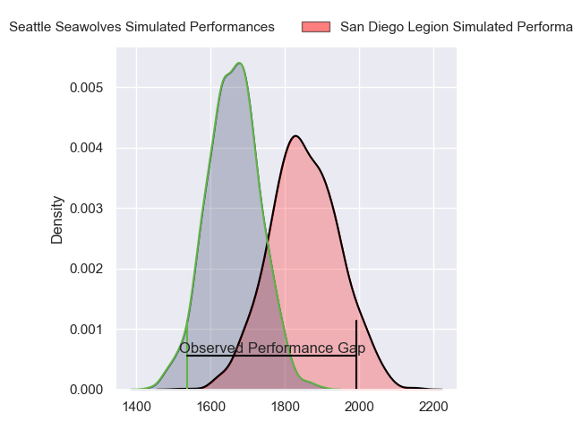
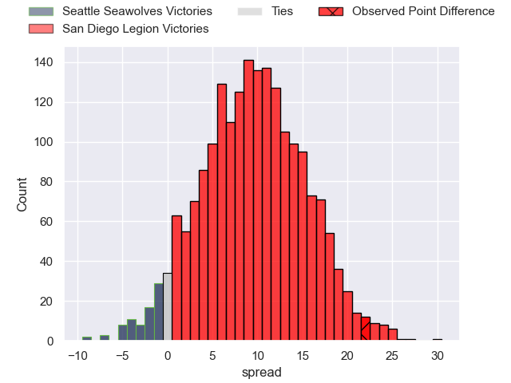
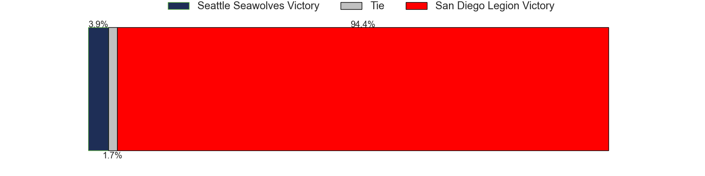

---  
layout: page  
title: Seattle Seawolves at San Diego Legion; 10-32  
date: 2023-07-03 00:00:00 18:00:00 -0500  
categories: match review  
---
# Seattle Seawolves at San Diego Legion; 10-32

# Club Level Predictions

The first set of predictions treats a club as the smallest object, as the club develops its members, organizes a gameplan, and deploys its players as needed for each match. This club model has a prediction of 0.744, which translates to predicting San Diego Legion to win by 9.5.

Each club has a rating and a rating deviation (simiar to a Glicko system), and expected performances can be generated. This allows for simulated matches and spreads like the ones below.
## Projected Performances

## Projected Spreads

## Projected Results

# Player Level Predictions

Treating teams instead as an entity made up of the currently active players, I have ratings for each player in an altogether different system. These can be combined to form team ratings once teamsheets are announced, weighting starters a bit higher than the reserves. After the match is played, players can be weighted by their minutes on the field, allowing for an accurate measure of the team's composition. With these compiled team ratings, we can make predictions, measure inaccuracy, and update the individual player ratings.
## Prediction with Player Minutes: San Diego Legion by 5.3

San Diego Legion by 1.3 on a neutral field

There were 10 large changes in win probability in this match
## Prediction without Player Minutes: San Diego Legion by 6.5

San Diego Legion by 2.5 on a neutral pitch

|   Away Minutes | Away Player          |   Away elo |   Away Percentile |   Number |   Home Percentile |   Home elo | Home Player          |   Home Minutes |
|---------------:|:---------------------|-----------:|------------------:|---------:|------------------:|-----------:|:---------------------|---------------:|
|             53 | Mzamo Majola         |      68.89 |                29 |        1 |                 1 |      38.81 | Faka'osi Pifeleti    |             56 |
|             49 | James Malcolm        |      63.44 |                18 |        2 |                83 |      95.74 | Sama Malolo          |             52 |
|             56 | Sam Matenga          |      61.43 |                16 |        3 |                32 |      70.47 | Luke Green           |             68 |
|             53 | Samu Manoa           |      49.14 |                 5 |        4 |                81 |      95.03 | Ben Grant            |             75 |
|              8 | Rhyno Herbst         |      74.25 |                41 |        5 |                12 |      58.76 | Thomas Franklin      |             62 |
|             80 | Ben Landry           |      64.76 |                22 |        6 |                17 |      61.64 | Christian Poidevin   |             80 |
|             80 | Charles Elton        |      73.34 |                41 |        7 |                66 |      83.31 | Tupou Afungia        |             56 |
|             80 | Riekert Hattingh     |      65.46 |                21 |        8 |                47 |      78.25 | David Tameilau       |             80 |
|             80 | JP Smith             |      82.42 |                60 |        9 |                34 |      70.54 | Richard Judd         |             63 |
|             80 | Jordan Chait         |      66.63 |                22 |       10 |                18 |      63.45 | Will Hooley          |             80 |
|             63 | Martin Iosefo        |      57.06 |                12 |       11 |                34 |      69.45 | Nathaniel Augspurger |             80 |
|             60 | AJ Alatimu           |      60.39 |                13 |       12 |                48 |      77.91 | Ma'a Nonu            |             72 |
|             80 | Daniel David Kriel   |      53.31 |                 8 |       13 |                28 |      68.48 | Marcel Brache        |             80 |
|             80 | Lauina Futi          |     121.56 |                97 |       14 |                37 |      72.56 | Tomas Aoake          |             80 |
|             72 | Adriaan John Carelse |      85.96 |                62 |       15 |                35 |      71.31 | Mike Te'o            |             80 |
|             27 | Jake Turnbull        |      92.49 |                77 |       16 |                13 |      59.39 | Nathan Sylvia        |             24 |
|             31 | Peter Malcolm        |      60.27 |                15 |       17 |                13 |      56.08 | Shilo Klein          |             28 |
|             24 | Mason Pedersen       |      73.72 |                37 |       18 |                10 |      57.22 | Chris Baumann        |             12 |
|             27 | Nakai Penny          |      68.42 |                28 |       19 |                63 |      81    | Chris Turori         |              5 |
|             72 | Ronan Foley          |      53.08 |                 7 |       20 |                10 |      56.34 | Isaac Ross           |             18 |
|             17 | Jeremiah Sio         |      62.71 |                18 |       21 |                13 |      58.86 | Michael Smith        |             24 |
|             20 | Tevita Lopeti        |      62.85 |                18 |       22 |                16 |      60.34 | Ryan Matyas          |             17 |
|              8 | Devereaux Ferris     |      14.39 |                 0 |       23 |                13 |      60.08 | Josh Henderson       |              8 |

