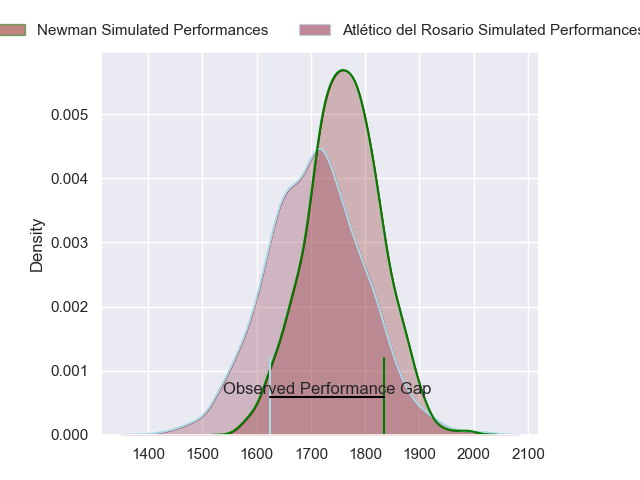
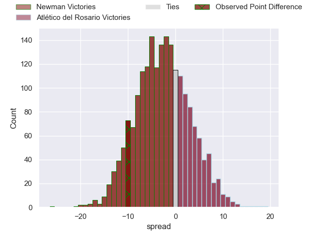

---  
layout: page  
title: Newman at Atlético del Rosario; 43-33  
date: 2023-07-15 20:30:00 18:00:00 -0500  
categories: match review  
---
# Newman at Atlético del Rosario; 43-33

# Club Level Predictions

The first set of predictions treats a club as the smallest object, as the club develops its members, organizes a gameplan, and deploys its players as needed for each match. This club model has a prediction of 0.425, which translates to predicting Newman to win by 2.7.

Each club has a rating and a rating deviation (simiar to a Glicko system), and expected performances can be generated. This allows for simulated matches and spreads like the ones below.
## Projected Performances

## Projected Spreads

## Projected Results

# Player Level Predictions

Treating teams instead as an entity made up of the currently active players, I have ratings for each player in an altogether different system. These can be combined to form team ratings once teamsheets are announced, weighting starters a bit higher than the reserves. After the match is played, players can be weighted by their minutes on the field, allowing for an accurate measure of the team's composition. With these compiled team ratings, we can make predictions, measure inaccuracy, and update the individual player ratings.
## Prediction with Player Minutes: Atlético del Rosario by 19.8

Atlético del Rosario by 15.8 on a neutral field

There were 11 large changes in win probability in this match
## Prediction without Player Minutes: Atlético del Rosario by 16.4

Atlético del Rosario by 12.4 on a neutral pitch

|   Away Minutes | Away Player               |   Away elo |   Away Percentile |   Number |   Home Percentile |   Home elo | Home Player         |   Home Minutes |
|---------------:|:--------------------------|-----------:|------------------:|---------:|------------------:|-----------:|:--------------------|---------------:|
|             40 | Alberto Porolli           |      99.74 |                86 |        1 |               nan |      76.95 | Joaquin Viola       |             80 |
|             69 | Marcelo Brandi            |      67.09 |                28 |        2 |                59 |      82.8  | Jeremias Aime       |             62 |
|             54 | Mariano Urtubey           |      66.94 |                22 |        3 |                 4 |      51.05 | Lisandro Dipierri   |             48 |
|             80 | Pablo Cardinal            |      80.83 |                51 |        4 |                69 |      90.46 | Matias Kremer       |             46 |
|             80 | Alejandro Urtubey         |      62.62 |                19 |        5 |                25 |      66.79 | Octavio Capella     |             80 |
|             80 | Jeronimo Ureta            |      54.78 |                 9 |        6 |                57 |      81.86 | Santiago Casals     |             80 |
|             80 | Mateo Montoya             |      73.24 |                29 |        7 |                61 |      85.13 | Lucas Malanos       |             80 |
|             80 | Rodrigo Diaz de Vivar     |      66.76 |                25 |        8 |                18 |      62.4  | Jeronimo Gomez Vara |             79 |
|             69 | Felix Branca              |      54.54 |                 8 |        9 |                49 |      79.1  | Tomas Cornego       |             80 |
|             80 | Gonzalo Gutierrez Taboada |      66.7  |                23 |       10 |                36 |      73.95 | Manuel Nogues       |             80 |
|             54 | Agustin Gosio             |      94.91 |                75 |       11 |                76 |      96.31 | Pedro Bisio         |             80 |
|             80 | Tomas Keena               |      75.03 |                41 |       12 |                30 |      69.11 | Pedro De Haro       |             80 |
|             80 | Juan Billote              |      81.26 |                53 |       13 |                31 |      69.4  | Valentino Aime      |             58 |
|             80 | Juan Lanza                |      52.78 |                 9 |       14 |                76 |      95.22 | Tomas Malanos       |             80 |
|             80 | Francisco Pasman          |      40.93 |                 2 |       15 |                95 |     117.75 | Martin Elias        |             80 |
|             40 | Miguel Angel Prince       |      73.33 |                36 |       16 |               nan |      59.34 | Sebastian Camino    |             34 |
|             26 | Luciano Borio             |      73.82 |                37 |       17 |                16 |      67.97 | Daniel Almeira      |             32 |
|             26 | Marcos Zirolli            |      62.01 |               nan |       18 |                31 |      69.69 | Tomas Oria          |             22 |
|             11 | Beltrán Salese            |      83.36 |               nan |       19 |                 0 |      20.5  | Matias Malanos      |             18 |
|             11 | Facundo Torello           |      66.53 |               nan |       20 |                32 |      71.11 | Federico Mayol      |              1 |

