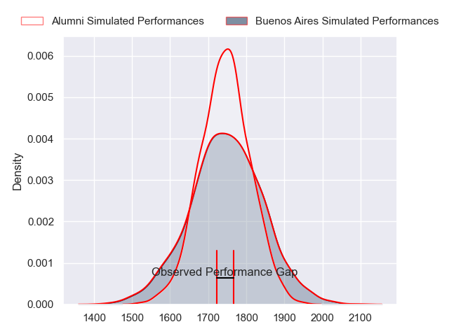
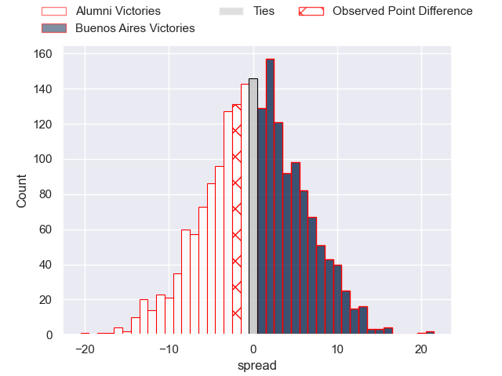

---  
layout: page  
title: Alumni at Buenos Aires; 20-18  
date: 2023-07-15 20:30:00 18:00:00 -0500  
categories: match review  
---
# Alumni at Buenos Aires; 20-18

# Club Level Predictions

The first set of predictions treats a club as the smallest object, as the club develops its members, organizes a gameplan, and deploys its players as needed for each match. This club model has a prediction of 0.5, which translates to predicting Buenos Aires to win by -0.0.

Each club has a rating and a rating deviation (simiar to a Glicko system), and expected performances can be generated. This allows for simulated matches and spreads like the ones below.
## Projected Performances

## Projected Spreads

## Projected Results

# Player Level Predictions

Treating teams instead as an entity made up of the currently active players, I have ratings for each player in an altogether different system. These can be combined to form team ratings once teamsheets are announced, weighting starters a bit higher than the reserves. After the match is played, players can be weighted by their minutes on the field, allowing for an accurate measure of the team's composition. With these compiled team ratings, we can make predictions, measure inaccuracy, and update the individual player ratings.
## Prediction with Player Minutes: Alumni by 12.5

Alumni by 16.5 on a neutral field

There were 11 large changes in win probability in this match
## Prediction without Player Minutes: Alumni by 12.9

Alumni by 16.9 on a neutral pitch

|   Away Minutes | Away Player                |   Away elo |   Away Percentile |   Number |   Home Percentile |   Home elo | Home Player       |   Home Minutes |
|---------------:|:---------------------------|-----------:|------------------:|---------:|------------------:|-----------:|:------------------|---------------:|
|             54 | Ezequiel Oliva             |      39.79 |                 1 |        1 |                 0 |      33.33 | Gaston Vaca       |             66 |
|             80 | Tomas Bivort               |      22.64 |                 0 |        2 |                10 |      55.19 | Diego Petrongolo  |             80 |
|             49 | Francisco Bottoni          |      77.07 |                46 |        3 |                45 |      76.74 | Nicolás Esteban   |             66 |
|             80 | Juan Patricio Anderson     |      61.73 |                17 |        4 |                 4 |      46.28 | Bautista Durañona |             80 |
|             80 | Nicolas Promanzio          |      60.04 |                15 |        5 |                13 |      59.35 | Franco Baldoni    |             80 |
|             80 | Ignacio Cubilla            |      69.95 |                30 |        6 |                18 |      62.44 | Pedro Del Carril  |             80 |
|             56 | Ignacio Milou              |      35.75 |                 1 |        7 |                 1 |      38.77 | Francisco Ibarra  |             80 |
|             80 | Tobias Moyano              |      94.39 |                76 |        8 |                 1 |      37.04 | Tomas Etcheverry  |             46 |
|             63 | Tomas Passerotti           |      64.93 |                23 |        9 |                 7 |      53.79 | Mateo Freire      |             80 |
|             80 | Bautista Canzani           |      70.39 |                31 |       10 |                 5 |      47.47 | Mateo Capalbo     |             80 |
|             72 | Franco Sabato              |     106.01 |                88 |       11 |                10 |      53.99 | Benjamin Handley  |             80 |
|             80 | Franco Battezzati          |      78.13 |                47 |       12 |                20 |      63.49 | Agustin Lamensa   |             80 |
|             80 | Alejo Gonzalez Chavez      |      75.29 |                42 |       13 |                12 |      56.58 | Tomas Diaz Borda  |             72 |
|             80 | Santiago Pernas            |      67.14 |                26 |       14 |                24 |      65.53 | Alfonso Latorre   |             80 |
|             80 | Santiago Gonzalez Iglesias |      61.58 |                14 |       15 |               nan |      54.79 | Alejo Novo        |             80 |
|             31 | Bautista Vidal             |      56.26 |                 7 |       16 |                37 |      71.91 | Lucas Etcheverry  |             34 |
|             26 | Juan Cruz Bottoni          |      70.74 |                30 |       17 |                86 |      97.66 | Thomas Gallo      |             14 |
|             24 | Santiago Piazzardi         |      65.91 |               nan |       18 |               nan |      59.98 | Juan Giovanelli   |             14 |
|             17 | Santiago Ambroa            |      70.05 |                35 |       19 |                 4 |      46.98 | Luis Prieto       |              8 |
|              8 | Luca Sabato                |      60.5  |               nan |       20 |               nan |     nan    | nan               |            nan |

