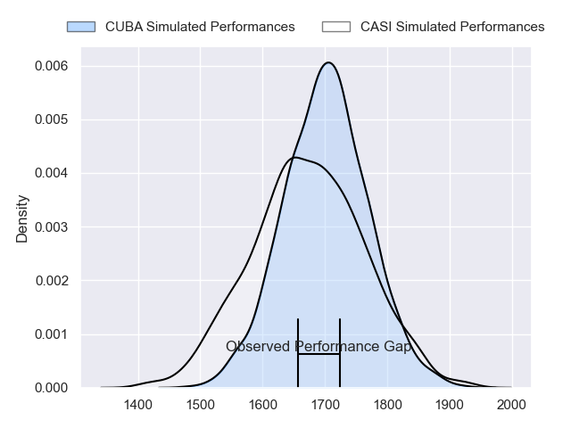
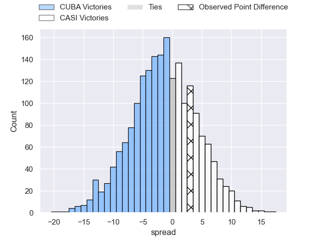

---  
layout: page  
title: CUBA at CASI; 27-30  
date: 2023-07-15 20:30:00 18:00:00 -0500  
categories: match review  
---
# CUBA at CASI; 27-30

# Club Level Predictions

The first set of predictions treats a club as the smallest object, as the club develops its members, organizes a gameplan, and deploys its players as needed for each match. This club model has a prediction of 0.455, which translates to predicting CUBA to win by 1.6.

Each club has a rating and a rating deviation (simiar to a Glicko system), and expected performances can be generated. This allows for simulated matches and spreads like the ones below.
## Projected Performances

## Projected Spreads

## Projected Results

# Player Level Predictions

Treating teams instead as an entity made up of the currently active players, I have ratings for each player in an altogether different system. These can be combined to form team ratings once teamsheets are announced, weighting starters a bit higher than the reserves. After the match is played, players can be weighted by their minutes on the field, allowing for an accurate measure of the team's composition. With these compiled team ratings, we can make predictions, measure inaccuracy, and update the individual player ratings.
## Prediction with Player Minutes: CUBA by 0.7

CUBA by 4.7 on a neutral field

There were 17 large changes in win probability in this match
## Prediction without Player Minutes: CASI by 2.5

CUBA by 1.5 on a neutral pitch

|   Away Minutes | Away Player              |   Away elo |   Away Percentile |   Number |   Home Percentile |   Home elo | Home Player                |   Home Minutes |
|---------------:|:-------------------------|-----------:|------------------:|---------:|------------------:|-----------:|:---------------------------|---------------:|
|             70 | Facundo Aguirre          |      73.13 |                35 |        1 |                38 |      74.22 | Facundo Scaiano            |             80 |
|             80 | Tomas Anderlic           |      51.69 |                 8 |        2 |               nan |      40.43 | Juan Torres Obeid          |             72 |
|             80 | Estanislao Carullo       |      62.22 |                16 |        3 |                58 |      83.01 | Juan Ignacio Nieto Sanchez |             64 |
|             80 | Santiago Uriarte         |      69.92 |                30 |        4 |                34 |      72.13 | Leo Mazzini                |             69 |
|             72 | Marcos Loza              |      72.67 |                35 |        5 |                35 |      72.87 | Ignacio Larrague           |             80 |
|             50 | Francisco Sied           |      60.96 |               nan |        6 |               nan |      58.28 | Mateo Castiglioni          |             80 |
|             80 | Segundo Pisani           |      30.81 |                 0 |        7 |                 6 |      44.65 | Benjamín Rocca             |             80 |
|             80 | Santiago Landau          |      60.72 |                18 |        8 |                22 |      64.91 | Joaquin Sáenz de Miera     |             64 |
|             80 | Rafael Iriarte           |      75.61 |                50 |        9 |                 9 |      55.36 | Tomas Descalzo             |             64 |
|             80 | Juan Manuel Cat          |      55.86 |                10 |       10 |                22 |      65.34 | Felipe Hileman             |             80 |
|             80 | Benjamin Gutierrez Meabe |      70.46 |                32 |       11 |                 6 |      49.76 | Felipe Probaos             |             80 |
|              7 | Felipe de la Vega        |      57.02 |                12 |       12 |                 0 |      30.73 | Jeronimo Solveyra          |             80 |
|             70 | Felipe Perdomo           |      61.76 |               nan |       13 |                21 |      64.21 | Benjamin Belaga            |             80 |
|             80 | Bautista Casaurang       |      58.78 |                14 |       14 |                17 |      61.63 | Jeronimo Tumbarello        |             76 |
|             80 | Marcos Elicagaray        |      82.8  |                54 |       15 |                22 |      66.01 | Juan Akemeier              |             80 |
|             73 | Marcos Herrero Anzorena  |      67.52 |                27 |       16 |               nan |      66.05 | Hugo Garcia                |             16 |
|             30 | Pedro Mastroizzi         |      53.98 |                 8 |       17 |                 5 |      53.8  | Luca Canzani               |             16 |
|             10 | Emilio Perez Maraviglia  |      57.45 |               nan |       18 |                 9 |      57.87 | Eugenio Sartori            |             16 |
|             10 | Ramiro Cardini           |      58.99 |               nan |       19 |                17 |      61.27 | Agustin Posleman           |             11 |
|              8 | José De Carabassa        |      56.45 |               nan |       20 |                38 |      72.74 | Facundo Andreotti          |              8 |
|            nan | nan                      |     nan    |               nan |       21 |               nan |      69.87 | Bruno Maria Devoto         |              4 |

