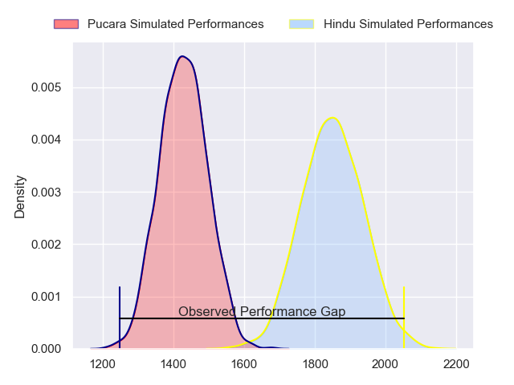
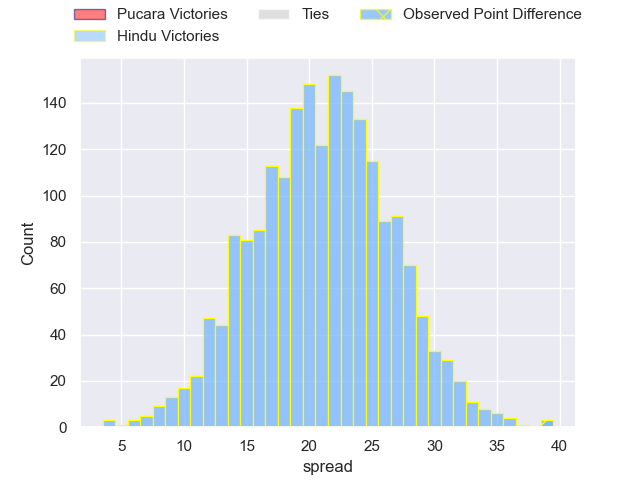

---  
layout: page  
title: Pucara at Hindu; 18-57  
date: 2023-07-15 20:30:00 18:00:00 -0500  
categories: match review  
---
# Pucara at Hindu; 18-57

# Club Level Predictions

The first set of predictions treats a club as the smallest object, as the club develops its members, organizes a gameplan, and deploys its players as needed for each match. This club model has a prediction of 0.915, which translates to predicting Hindu to win by 21.1.

Each club has a rating and a rating deviation (simiar to a Glicko system), and expected performances can be generated. This allows for simulated matches and spreads like the ones below.
## Projected Performances

## Projected Spreads

## Projected Results

# Player Level Predictions

Treating teams instead as an entity made up of the currently active players, I have ratings for each player in an altogether different system. These can be combined to form team ratings once teamsheets are announced, weighting starters a bit higher than the reserves. After the match is played, players can be weighted by their minutes on the field, allowing for an accurate measure of the team's composition. With these compiled team ratings, we can make predictions, measure inaccuracy, and update the individual player ratings.
## Prediction with Player Minutes: Hindu by 14.8

Hindu by 10.8 on a neutral field

There were 3 large changes in win probability in this match
## Prediction without Player Minutes: Hindu by 15.3

Hindu by 11.3 on a neutral pitch

|   Away Minutes | Away Player       |   Away elo |   Away Percentile |   Number |   Home Percentile |   Home elo | Home Player               |   Home Minutes |
|---------------:|:------------------|-----------:|------------------:|---------:|------------------:|-----------:|:--------------------------|---------------:|
|             56 | Damian Fernandez  |      57.14 |                10 |        1 |                11 |      57.94 | Franco Diviesti           |             75 |
|             62 | Tomas Chimenti    |      43.95 |                 4 |        2 |                34 |      71.21 | Agustin Capurro           |             80 |
|             45 | Guido Romandetto  |      70.85 |                30 |        3 |                19 |      63.74 | Nicolas Leiva             |             72 |
|             80 | Eliseo Fourcade   |      31.6  |                 1 |        4 |                91 |     109.91 | Juan Ignacio Comolli      |             80 |
|             62 | Tomas Alda        |      60.4  |                15 |        5 |                 3 |      45.38 | Federico Ignacio Lavanini |             80 |
|             80 | Valentin Urcullu  |      55.28 |                10 |        6 |                52 |      79.25 | Lautaro Ezequiel Bavaro   |             72 |
|             79 | Bautista Ballone  |      58.15 |               nan |        7 |                54 |      80.32 | Agustin Arburua           |             51 |
|             62 | Leandro Urriza    |      59.65 |                14 |        8 |                69 |      89.96 | Nicolas Amaya             |             62 |
|             80 | German Klubus     |      61.73 |                19 |        9 |                56 |      82.46 | Lucas Fernandez Miranda   |             80 |
|             80 | Valentin Cruz     |      97.51 |               nan |       10 |                29 |      69.19 | Santiago Fernandez        |             65 |
|             72 | Juan Delguy       |      52.48 |                 8 |       11 |                36 |      73.12 | Torcuato Pulido           |             80 |
|             80 | Mariano Navarro   |      56.29 |                11 |       12 |                13 |      58.08 | Joaquin de la Vega        |             80 |
|             72 | Francisco Jorge   |      68.14 |                28 |       13 |                15 |      59.84 | Federico Graglia          |             72 |
|             80 | Inaki Delguy      |      76.02 |                42 |       14 |                30 |      69.33 | Belisario Agulla          |             65 |
|             80 | Tomas Jorge       |      80.2  |                50 |       15 |               nan |      56.66 | Juan Aranoa               |             80 |
|             35 | Aron Norro        |      57.54 |               nan |       16 |                 2 |      40.98 | Gonzalo Delguy            |             29 |
|             24 | Jeremias de Sarro |      56.79 |               nan |       17 |               nan |      56.32 | Juan Ulibarri             |             18 |
|             18 | Matias Santagati  |      58.43 |               nan |       18 |                 6 |      49.53 | Lucas Pulido              |             15 |
|             18 | Tomas Montes      |      53.89 |                12 |       19 |                 9 |      54.29 | Martin Cancelliere        |             15 |
|             18 | Tomas Indomito    |      78.14 |                49 |       20 |                16 |      62.29 | Mariano Leiva             |              8 |
|              8 | Felipe Barla      |      53.84 |                 8 |       21 |               nan |      72.16 | Tomas Ahmer               |              8 |
|              8 | Ramiro Moran      |      58.29 |               nan |       22 |               nan |      54.87 | Benjamin Silveyra         |              8 |
|              1 | Manuel Tognola    |      58.57 |               nan |       23 |               nan |      55.76 | Rodrigo Palma             |              5 |

