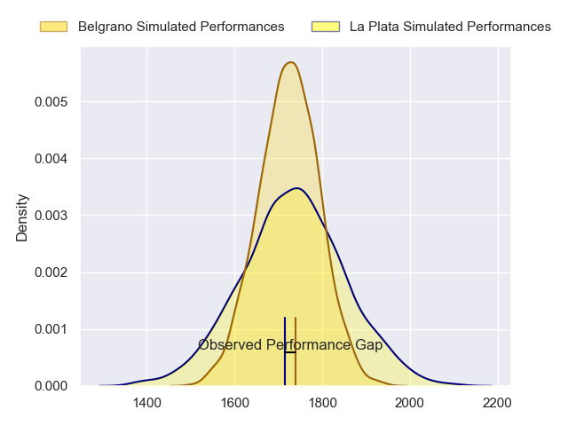
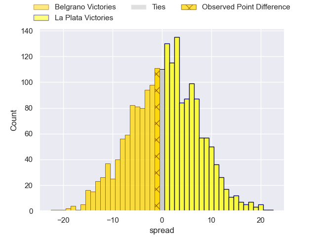

---  
layout: page  
title: Belgrano at La Plata; 27-26  
date: 2023-07-15 20:30:00 18:00:00 -0500  
categories: match review  
---
# Belgrano at La Plata; 27-26

# Club Level Predictions

The first set of predictions treats a club as the smallest object, as the club develops its members, organizes a gameplan, and deploys its players as needed for each match. This club model has a prediction of 0.515, which translates to predicting La Plata to win by 0.5.

Each club has a rating and a rating deviation (simiar to a Glicko system), and expected performances can be generated. This allows for simulated matches and spreads like the ones below.
## Projected Performances

## Projected Spreads

## Projected Results

# Player Level Predictions

Treating teams instead as an entity made up of the currently active players, I have ratings for each player in an altogether different system. These can be combined to form team ratings once teamsheets are announced, weighting starters a bit higher than the reserves. After the match is played, players can be weighted by their minutes on the field, allowing for an accurate measure of the team's composition. With these compiled team ratings, we can make predictions, measure inaccuracy, and update the individual player ratings.
## Prediction with Player Minutes: La Plata by 10.7

La Plata by 6.7 on a neutral field

There were 11 large changes in win probability in this match
## Prediction without Player Minutes: La Plata by 14.7

La Plata by 10.7 on a neutral pitch

|   Away Minutes | Away Player              |   Away elo |   Away Percentile |   Number |   Home Percentile |   Home elo | Home Player            |   Home Minutes |
|---------------:|:-------------------------|-----------:|------------------:|---------:|------------------:|-----------:|:-----------------------|---------------:|
|             80 | Francisco Ferronato      |      54.12 |                 7 |        1 |                32 |      71.48 | Ariel Del Cerro        |             80 |
|             80 | Francisco Lusaretta      |      52.87 |                 9 |        2 |                15 |      59.58 | Joaquin Nunez          |             80 |
|             80 | Justo Durañona           |      52.15 |                 6 |        3 |               nan |      61.8  | Jerónimo  Chicherquia  |             73 |
|             80 | Augusto Vaccarino        |      59.95 |                15 |        4 |                16 |      60.54 | Bautista Ozog          |             80 |
|             80 | Rodrigo Fernandez Criado |      79.5  |                49 |        5 |                45 |      77.57 | Tomas Bernasconi       |             73 |
|             80 | Joaquin De la Serna      |      55.33 |                10 |        6 |                28 |      68.31 | Carlos Mendieta        |             78 |
|             80 | Joaquin Moro             |      62.89 |                20 |        7 |                 7 |      53.24 | Francisco Suarez Folch |             80 |
|             58 | Matias Filgueira         |      55.16 |                13 |        8 |                48 |      78.87 | Manuel Dacal           |             80 |
|             80 | Ignacio Marino           |      69.61 |                30 |        9 |                 5 |      51.51 | Homero Alegre          |             73 |
|             80 | Martin Arana             |      68.18 |                27 |       10 |                11 |      56.84 | Tomas Suarez Folch     |             80 |
|             69 | Tobias Bernabé           |      57    |                12 |       11 |                52 |      81.19 | Isidro Iassi           |             80 |
|             80 | Tomas Teglia             |      67.8  |                27 |       12 |                14 |      59.06 | Luca Juliano           |             80 |
|             80 | Santiago Ruzzante        |      51.59 |                 8 |       13 |                17 |      61    | Manuel Arteche         |             71 |
|             80 | Nicolas Spinelli         |      58.17 |                13 |       14 |                28 |      67.19 | Facundo Panigatti      |             80 |
|             80 | Pedro Arana              |      60.77 |                14 |       15 |                26 |      66.08 | Luciano Di Lucca       |             80 |
|             22 | Ramon Duggan             |      62.46 |                19 |       16 |                13 |      60.43 | Santino Di Lucca       |              9 |
|             11 | Félix Ceñal              |      63.68 |                25 |       17 |               nan |      67.69 | Manuel Garcia Monaco   |              7 |
|            nan | nan                      |     nan    |               nan |       18 |                15 |      60.47 | Alejandro Rocha        |              7 |
|            nan | nan                      |     nan    |               nan |       19 |               nan |      67.47 | Ignacio Luna           |              7 |
|            nan | nan                      |     nan    |               nan |       20 |               nan |      67.49 | Justo Lundin           |              2 |

