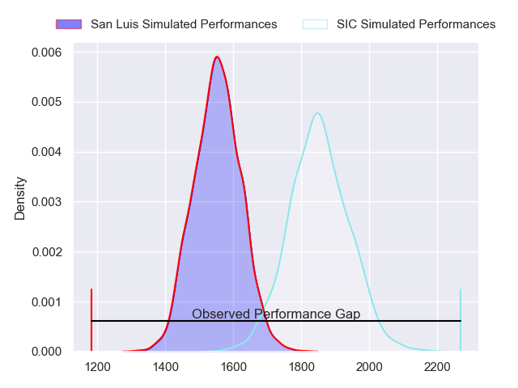
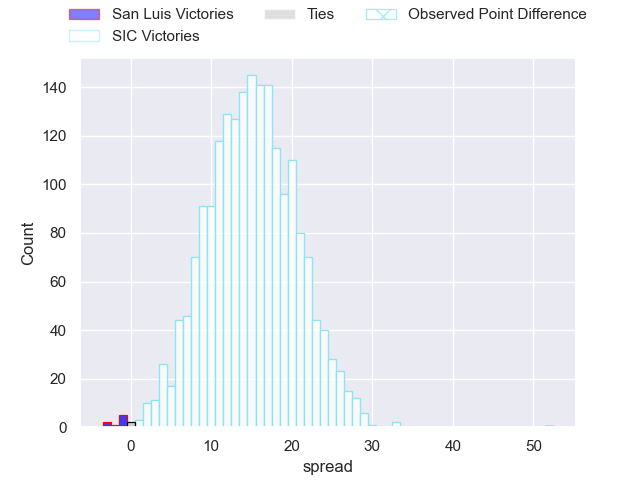

---  
layout: page  
title: San Luis at SIC; 5-57  
date: 2023-07-15 20:30:00 18:00:00 -0500  
categories: match review  
---
# San Luis at SIC; 5-57

# Club Level Predictions

The first set of predictions treats a club as the smallest object, as the club develops its members, organizes a gameplan, and deploys its players as needed for each match. This club model has a prediction of 0.843, which translates to predicting SIC to win by 14.9.

Each club has a rating and a rating deviation (simiar to a Glicko system), and expected performances can be generated. This allows for simulated matches and spreads like the ones below.
## Projected Performances

## Projected Spreads

## Projected Results

# Player Level Predictions

Treating teams instead as an entity made up of the currently active players, I have ratings for each player in an altogether different system. These can be combined to form team ratings once teamsheets are announced, weighting starters a bit higher than the reserves. After the match is played, players can be weighted by their minutes on the field, allowing for an accurate measure of the team's composition. With these compiled team ratings, we can make predictions, measure inaccuracy, and update the individual player ratings.
## Prediction with Player Minutes: SIC by 20.7

SIC by 16.7 on a neutral field

There were 3 large changes in win probability in this match
## Prediction without Player Minutes: SIC by 19.9

SIC by 15.9 on a neutral pitch

|   Away Minutes | Away Player           |   Away elo |   Away Percentile |   Number |   Home Percentile |   Home elo | Home Player             |   Home Minutes |
|---------------:|:----------------------|-----------:|------------------:|---------:|------------------:|-----------:|:------------------------|---------------:|
|             80 | Santiago Bonavento    |      78.37 |                48 |        1 |                21 |      65.21 | Marcos Piccinini        |             80 |
|             63 | Gaston Gimenez        |      35.15 |                 1 |        2 |                35 |      71.64 | Ignacio Bottazini       |             73 |
|             52 | Mateo Calistro        |      51.33 |                 4 |        3 |                53 |      80.34 | Benjamin Chiappe        |             63 |
|             80 | Santiago Canal        |      74.53 |                38 |        4 |                92 |     111.85 | Lucas Sommer            |             80 |
|             41 | Santiago Wallace      |      58.53 |                12 |        5 |                39 |      74.82 | Bautista Viero          |             68 |
|             80 | Manuel Gnecco         |     106.04 |                90 |        6 |                81 |      97.01 | Andrea Panzarini        |             80 |
|             80 | Nahuel Curti          |      40.6  |                 2 |        7 |                56 |      80.85 | Franco Delger           |             71 |
|             41 | Facundo Alvarez Amado |      99.78 |                83 |        8 |                44 |      76.58 | Tomas Meyrelles         |             80 |
|             80 | Juan Vaca             |      66.01 |                25 |        9 |                52 |      80.39 | Joan Soares Gache       |             68 |
|             80 | Felipe Campodonico    |      56.72 |                11 |       10 |                35 |      73.36 | Joaquin Lamas           |             73 |
|             47 | Eduardo Ruesta        |      90    |                68 |       11 |                39 |      74.49 | Bernabé Lopez Fleming   |             80 |
|             80 | Segundo Blanco Fresco |      65.29 |                23 |       12 |                59 |      84.69 | Santos Rubio            |             80 |
|             80 | Facundo Gibert        |      80.94 |                53 |       13 |                68 |      91.01 | Carlos Piran            |             80 |
|             80 | Facundo Cucolo        |      92.78 |                72 |       14 |                76 |      95.66 | Justo Piccardo          |             65 |
|             80 | Valentino Quattrochi  |      79.27 |                48 |       15 |                37 |      73.25 | Jacinto Campbell        |             80 |
|              9 | Pedro Acerbo          |      51.46 |               nan |       16 |                 4 |      47.54 | Francico Calandra       |             17 |
|             39 | Agustin Torello       |      43.94 |                 3 |       17 |                10 |      51.77 | Alberto Miguens         |             15 |
|             33 | Felipe Hernandez      |      61.94 |                13 |       18 |               nan |      62.22 | Marcos Rodriguez Gauxax |             12 |
|             30 | Gonzalo Molina Ferrer |      68.52 |                32 |       19 |                22 |      64.16 | Pedro Georgalos         |             12 |
|             28 | Alexis Uvieda         |      47.39 |               nan |       20 |                38 |      74.13 | Cirio Plorutti          |              9 |
|             17 | Francisco Cantalupo   |      56.26 |               nan |       21 |                13 |      58.01 | Lucas Rocha             |              7 |
|            nan | nan                   |     nan    |               nan |       22 |                26 |      67.96 | Santiago Pavlovsky      |              7 |

