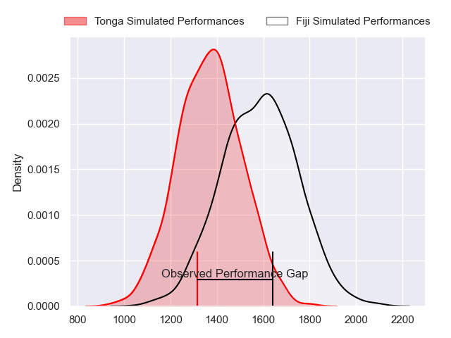
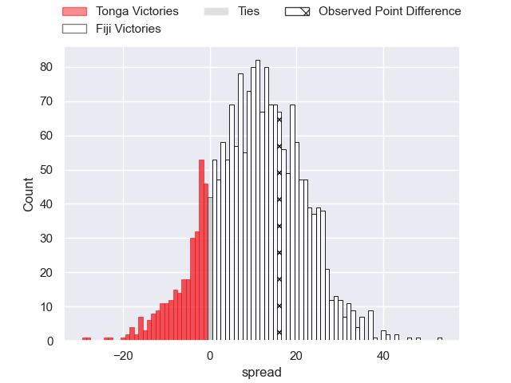
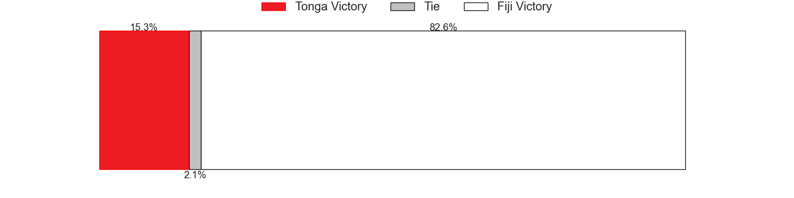

---  
layout: page  
title: Tonga at Fiji; 20.0-36.0  
date: 2023-07-21 23:00:00 18:00:00 -0500  
categories: match review  
---
# Tonga at Fiji; 20.0-36.0

# Club Level Predictions

The first set of predictions treats a club as the smallest object, as the club develops its members, organizes a gameplan, and deploys its players as needed for each match. This club model has a prediction of 0.758, which translates to predicting Fiji to win by 10.8.

Each club has a rating and a rating deviation (simiar to a Glicko system), and expected performances can be generated. This allows for simulated matches and spreads like the ones below.
## Projected Performances

## Projected Spreads

## Projected Results

# Player Level Predictions

Treating teams instead as an entity made up of the currently active players, I have ratings for each player in an altogether different system. These can be combined to form team ratings once teamsheets are announced, weighting starters a bit higher than the reserves. After the match is played, players can be weighted by their minutes on the field, allowing for an accurate measure of the team's composition. With these compiled team ratings, we can make predictions, measure inaccuracy, and update the individual player ratings.
## Prediction with Player Minutes: Fiji by 9.9

Fiji by 5.9 on a neutral field

There were 7 large changes in win probability in this match
## Prediction without Player Minutes: Fiji by 10.0

Fiji by 6.0 on a neutral pitch

|   Away Minutes | Away Player         |   Away elo |   Away Percentile |   Number |   Home Percentile |   Home elo | Home Player             |   Home Minutes |
|---------------:|:--------------------|-----------:|------------------:|---------:|------------------:|-----------:|:------------------------|---------------:|
|             53 | Siegfried Fisi'ihoi |      76.97 |               nan |        1 |                75 |      90.27 | Peni Ravai              |             61 |
|             53 | Siua Maile          |      77.27 |               nan |        2 |               nan |      80.02 | Sam Matavesi            |             61 |
|             53 | Ben Tameifuna       |      77.59 |               nan |        3 |                17 |      62.66 | Mesake Doge             |             53 |
|             81 | Leva Fifita         |      75.57 |               nan |        4 |                94 |     115.23 | Isoa Nasilasila         |             81 |
|             73 | Sam Lousi           |      75.2  |               nan |        5 |               nan |      81.22 | Temo Mayanavanua        |             51 |
|             81 | Tanginoa Halaifonua |      78.34 |               nan |        6 |               nan |      80.23 | Lekima Tagitagivalu     |             81 |
|             81 | Solomone Funaki     |      81.38 |                52 |        7 |               nan |      80.45 | Levani Botia            |             69 |
|             58 | Vaea Fifita         |      78.78 |               nan |        8 |               nan |      80.69 | Albert Tuisue           |             81 |
|             69 | Sonatane Takulua    |      76.7  |               nan |        9 |                37 |      72.89 | Frank Lomani            |             78 |
|             81 | Otumaka Mausia      |      76.44 |               nan |       10 |                37 |      74.2  | Caleb Muntz             |             81 |
|             58 | Solomone Kata       |      76.2  |               nan |       11 |                32 |      70.55 | Selestino Ravutaumada   |             81 |
|             81 | Malakai Fekitoa     |      75.98 |               nan |       12 |               nan |      95.36 | Josua Tuisova           |             81 |
|             81 | Afusipa Taumoepeau  |      75.77 |               nan |       13 |               nan |      79.82 | Waisea Nayacalevu       |             81 |
|             45 | Fine Inisi          |      70.84 |                32 |       14 |               nan |      79.63 | Jiuta Wainiqolo         |             57 |
|             81 | Charles Piutau      |     102.56 |                82 |       15 |               nan |      87.36 | Sireli Maqala           |             69 |
|             28 | Samiuela Moli       |      56.78 |                11 |       16 |                95 |     112.71 | Tevita Ikanivere        |             20 |
|             28 | Feao Fotuaika       |      79.27 |               nan |       17 |                 1 |      40.38 | Eroni Mawi              |             20 |
|             28 | Tau Koloamatangi    |     112.2  |                95 |       18 |               nan |      80.94 | Luke Tagi               |             28 |
|              8 | Steve Mafi          |      75.03 |               nan |       19 |                71 |      91.27 | Te Ahiwaru Cirikidaveta |             12 |
|             23 | Sione Vailanu       |      79.84 |               nan |       20 |               nan |      81.51 | Viliame Mata            |             30 |
|             12 | Manu Paea           |      80.52 |               nan |       21 |                65 |      87.48 | Peni Matawalu           |              3 |
|             23 | Patrick Pellegrini  |      75.38 |               nan |       22 |               nan |      79.45 | Ben Volavola            |             12 |
|             36 | Kyren Taumoefolau   |      77.95 |               nan |       23 |                94 |     114.99 | Semi Radradra           |             24 |

