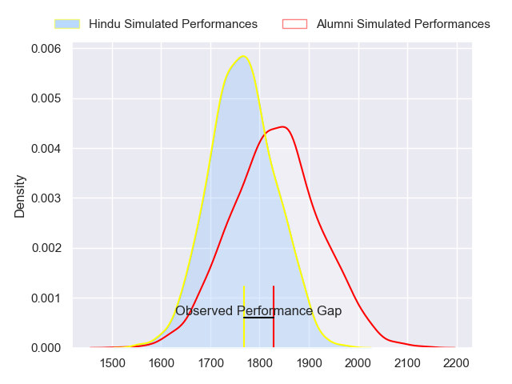
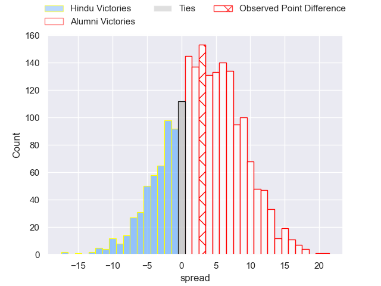
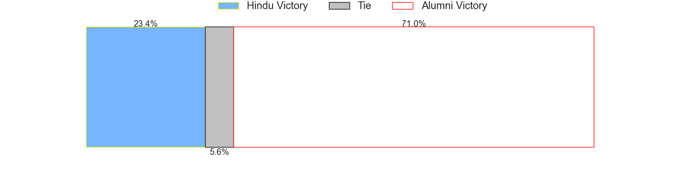

---  
layout: page  
title: Hindu at Alumni; 20-23  
date: 2023-07-22 20:30:00 18:00:00 -0500  
categories: match review  
---
# Hindu at Alumni; 20-23

# Club Level Predictions

The first set of predictions treats a club as the smallest object, as the club develops its members, organizes a gameplan, and deploys its players as needed for each match. This club model has a prediction of 0.6, which translates to predicting Alumni to win by 3.6.

Each club has a rating and a rating deviation (simiar to a Glicko system), and expected performances can be generated. This allows for simulated matches and spreads like the ones below.
## Projected Performances

## Projected Spreads

## Projected Results

# Player Level Predictions

Treating teams instead as an entity made up of the currently active players, I have ratings for each player in an altogether different system. These can be combined to form team ratings once teamsheets are announced, weighting starters a bit higher than the reserves. After the match is played, players can be weighted by their minutes on the field, allowing for an accurate measure of the team's composition. With these compiled team ratings, we can make predictions, measure inaccuracy, and update the individual player ratings.
## Prediction with Player Minutes: Hindu by 11.6

Hindu by 15.6 on a neutral field

There were 8 large changes in win probability in this match
## Prediction without Player Minutes: Hindu by 0.8

Hindu by 4.8 on a neutral pitch

|   Away Minutes | Away Player               |   Away elo |   Away Percentile |   Number |   Home Percentile |   Home elo | Home Player                |   Home Minutes |
|---------------:|:--------------------------|-----------:|------------------:|---------:|------------------:|-----------:|:---------------------------|---------------:|
|             80 | Franco Diviesti           |      63.58 |                18 |        1 |                 0 |      35.76 | Ezequiel Oliva             |             48 |
|             80 | Agustin Capurro           |      75.81 |                44 |        2 |                 0 |      18.91 | Tomas Bivort               |             80 |
|             80 | Mariano Leiva             |      62.83 |                17 |        3 |                30 |      70.42 | Francisco Bottoni          |             48 |
|             80 | Carlos Repetto            |      80.72 |                51 |        4 |                 7 |      50.94 | Nicolas Promanzio          |             79 |
|             50 | Federico Ignacio Lavanini |      49.68 |                 6 |        5 |               nan |      90.47 | Joaquin Gonzalez Iglesias  |             58 |
|             80 | Lautaro Ezequiel Bavaro   |      90.14 |                73 |        6 |                15 |      59.61 | Ignacio Cubilla            |             80 |
|             80 | Gonzalo Delguy            |      42.1  |                 2 |        7 |                 8 |      51.71 | Juan Patricio Anderson     |             80 |
|             80 | Nicolas Amaya             |      95.57 |                77 |        8 |                52 |      81.17 | Tobias Moyano              |             80 |
|             80 | Lucas Fernandez Miranda   |      83.46 |                57 |        9 |                14 |      58.16 | Tomas Passerotti           |             58 |
|             80 | Santiago Fernandez        |      72.76 |                33 |       10 |                16 |      60.55 | Bautista Canzani           |             80 |
|             80 | Torcuato Pulido           |      84.31 |                59 |       11 |                12 |      57.04 | Santiago Pernas            |             80 |
|             80 | Joaquin de la Vega        |      57.48 |                13 |       12 |                31 |      69.7  | Franco Battezzati          |              4 |
|             80 | Federico Graglia          |      58.34 |                14 |       13 |                35 |      72.01 | Alejo Gonzalez Chavez      |             80 |
|             80 | Belisario Agulla          |      72.5  |                35 |       14 |                75 |      94.27 | Franco Sabato              |             80 |
|             80 | Bautista Farisé           |      56.16 |                 7 |       15 |                 8 |      52.01 | Santiago Gonzalez Iglesias |             80 |
|             30 | Juan Ignacio Comolli      |     110.74 |                92 |       16 |               nan |      60.04 | Luca Sabato                |             76 |
|            nan | nan                       |     nan    |               nan |       17 |                23 |      64.41 | Juan Cruz Bottoni          |             32 |
|            nan | nan                       |     nan    |               nan |       18 |                 8 |      52.44 | Bautista Vidal             |             32 |
|            nan | nan                       |     nan    |               nan |       19 |                29 |      65.32 | Santiago Ambroa            |             22 |
|            nan | nan                       |     nan    |               nan |       20 |               nan |      63.74 | Santiago Piazzardi         |             22 |
|            nan | nan                       |     nan    |               nan |       21 |               nan |      58.36 | Federico Canovas           |              1 |

