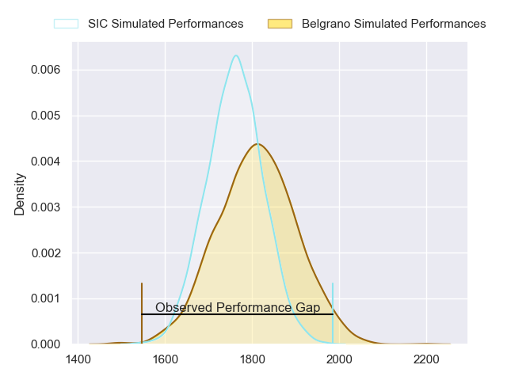
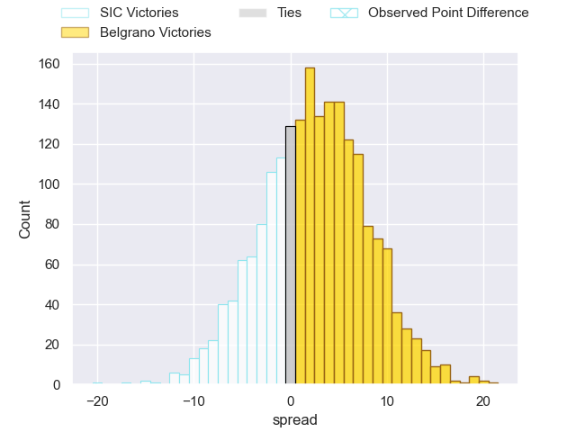
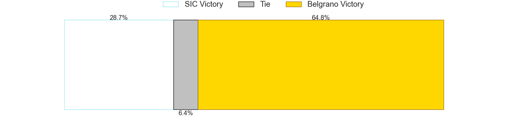

---  
layout: page  
title: SIC at Belgrano; 37-17  
date: 2023-07-22 20:30:00 18:00:00 -0500  
categories: match review  
---
# SIC at Belgrano; 37-17

# Club Level Predictions

The first set of predictions treats a club as the smallest object, as the club develops its members, organizes a gameplan, and deploys its players as needed for each match. This club model has a prediction of 0.573, which translates to predicting Belgrano to win by 2.6.

Each club has a rating and a rating deviation (simiar to a Glicko system), and expected performances can be generated. This allows for simulated matches and spreads like the ones below.
## Projected Performances

## Projected Spreads

## Projected Results

# Player Level Predictions

Treating teams instead as an entity made up of the currently active players, I have ratings for each player in an altogether different system. These can be combined to form team ratings once teamsheets are announced, weighting starters a bit higher than the reserves. After the match is played, players can be weighted by their minutes on the field, allowing for an accurate measure of the team's composition. With these compiled team ratings, we can make predictions, measure inaccuracy, and update the individual player ratings.
## Prediction with Player Minutes: SIC by 27.7

SIC by 31.7 on a neutral field
## Prediction without Player Minutes: SIC by 22.7

SIC by 26.7 on a neutral pitch

|   Away Minutes | Away Player             |   Away elo |   Away Percentile |   Number |   Home Percentile |   Home elo | Home Player              |   Home Minutes |
|---------------:|:------------------------|-----------:|------------------:|---------:|------------------:|-----------:|:-------------------------|---------------:|
|             80 | Marcos Piccinini        |      71.08 |                31 |        1 |                14 |      60.92 | Francisco Ferronato      |             80 |
|             80 | Ignacio Bottazini       |      77    |                46 |        2 |                15 |      59.67 | Francisco Lusaretta      |             34 |
|             66 | Benjamin Chiappe        |      84.97 |                63 |        3 |                12 |      58.95 | Justo Durañona           |             80 |
|             54 | Bautista Viero          |      79.82 |                50 |        4 |                62 |      86.3  | Rodrigo Fernandez Criado |             80 |
|             80 | Lucas Sommer            |     117.72 |                94 |        5 |                18 |      64.33 | Ramon Duggan             |             54 |
|             80 | Andrea Panzarini        |     102.89 |                87 |        6 |                17 |      62.13 | Joaquin De la Serna      |             80 |
|             80 | Franco Delger           |      86.07 |                66 |        7 |                25 |      66.75 | Augusto Vaccarino        |             80 |
|             80 | Tomas Meyrelles         |      82.46 |                54 |        8 |                17 |      60.09 | Matias Filgueira         |             80 |
|             66 | Joan Soares Gache       |      85.39 |                61 |        9 |                43 |      76.41 | Ignacio Marino           |             80 |
|             80 | Joaquin Lamas           |      78.72 |                46 |       10 |                14 |      59.71 | Theo Blaksley            |             80 |
|             80 | Bernabé Lopez Fleming   |      80.37 |                50 |       11 |                19 |      62.87 | Tobias Bernabé           |             54 |
|             80 | Santos Rubio            |      90.57 |                68 |       12 |                14 |      58.39 | Santiago Ruzzante        |             80 |
|             80 | Carlos Piran            |      96.89 |                78 |       13 |               nan |      62.5  | Ramon Arana              |             80 |
|             80 | Justo Piccardo          |     100.44 |                83 |       14 |                26 |      64.61 | Félix Ceñal              |             80 |
|             80 | Jacinto Campbell        |      79.13 |                49 |       15 |                56 |      83.19 | Juan Ignacio Lando       |             45 |
|             26 | Pedro Georgalos         |      65.04 |                22 |       16 |                25 |      67.57 | Pedro Arana              |             35 |
|             14 | Francico Calandra       |      48.78 |                 4 |       17 |               nan |      62.32 | Ignacio Saporiti         |             46 |
|             14 | Marcos Rodriguez Gauxax |      63.1  |               nan |       18 |               nan |      61.51 | Luciano Tecca            |             26 |
|            nan | nan                     |     nan    |               nan |       19 |                23 |      64.98 | Nicolas Spinelli         |             26 |

