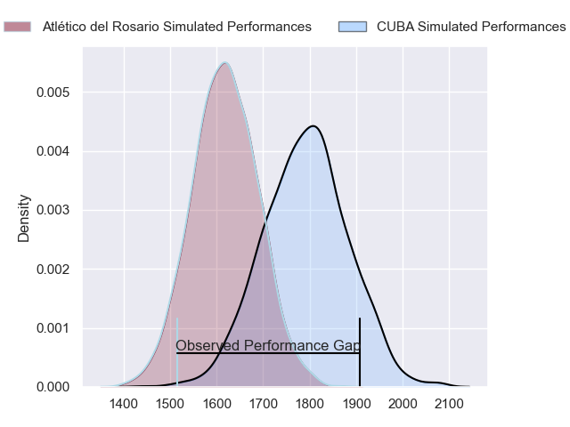
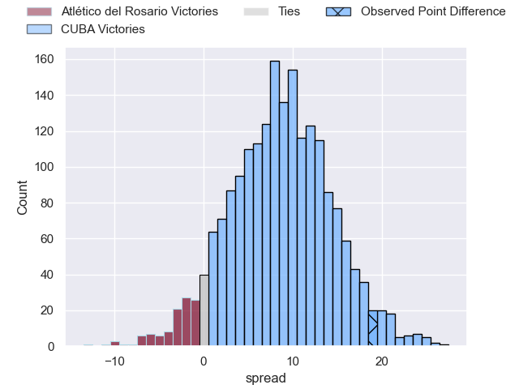
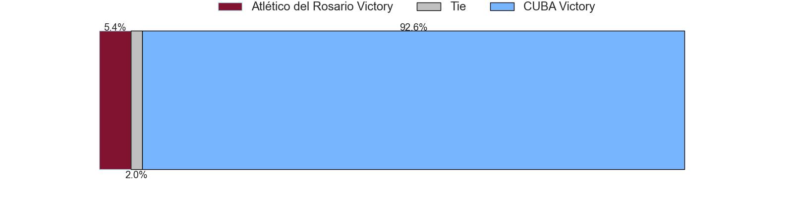

---  
layout: page  
title: Atlético del Rosario at CUBA; 15-34  
date: 2023-07-22 20:30:00 18:00:00 -0500  
categories: match review  
---
# Atlético del Rosario at CUBA; 15-34

# Club Level Predictions

The first set of predictions treats a club as the smallest object, as the club develops its members, organizes a gameplan, and deploys its players as needed for each match. This club model has a prediction of 0.729, which translates to predicting CUBA to win by 8.8.

Each club has a rating and a rating deviation (simiar to a Glicko system), and expected performances can be generated. This allows for simulated matches and spreads like the ones below.
## Projected Performances

## Projected Spreads

## Projected Results

# Player Level Predictions

Treating teams instead as an entity made up of the currently active players, I have ratings for each player in an altogether different system. These can be combined to form team ratings once teamsheets are announced, weighting starters a bit higher than the reserves. After the match is played, players can be weighted by their minutes on the field, allowing for an accurate measure of the team's composition. With these compiled team ratings, we can make predictions, measure inaccuracy, and update the individual player ratings.
## Prediction with Player Minutes: Atlético del Rosario by 4.4

Atlético del Rosario by 8.4 on a neutral field

There were 7 large changes in win probability in this match
## Prediction without Player Minutes: Atlético del Rosario by 3.3

Atlético del Rosario by 7.3 on a neutral pitch

|   Away Minutes | Away Player         |   Away elo |   Away Percentile |   Number |   Home Percentile |   Home elo | Home Player             |   Home Minutes |
|---------------:|:--------------------|-----------:|------------------:|---------:|------------------:|-----------:|:------------------------|---------------:|
|             80 | Joaquin Viola       |      65.93 |                22 |        1 |                43 |      76.1  | Facundo Aguirre         |             74 |
|             60 | Jeremias Aime       |      75.55 |                43 |        2 |                 9 |      52.97 | Tomas Anderlic          |             80 |
|             54 | Valentin Marciali   |      70.7  |                30 |        3 |                16 |      61.75 | Estanislao Carullo      |             80 |
|             80 | Matias Kremer       |      77.27 |                45 |        4 |                29 |      69.75 | Santiago Uriarte        |             80 |
|             80 | Octavio Capella     |      48.69 |                 5 |        5 |                41 |      76.03 | Marcos Loza             |             57 |
|             80 | Santiago Casals     |      58.83 |                14 |        6 |                19 |      62.82 | Francisco Sied          |             74 |
|             80 | Lucas Malanos       |      69.68 |                30 |        7 |                 1 |      35.51 | Segundo Pisani          |             80 |
|             80 | Jeronimo Gomez Vara |      50.49 |                 7 |        8 |                20 |      62.68 | Santiago Landau         |             80 |
|             80 | Tomas Cornejo       |      50.36 |                 4 |        9 |                40 |      74.8  | Rafael Iriarte          |             80 |
|             80 | Tomas Cornego       |      66.64 |                25 |        9 |                40 |      74.8  | Rafael Iriarte          |             80 |
|             80 | Manuel Nogues       |      51.62 |                 7 |       10 |                 6 |      51.16 | Juan Manuel Cat         |             80 |
|             80 | Pedro Bisio         |      78.86 |                47 |       11 |               nan |      62.9  | Ramiro Cardini          |             80 |
|             80 | Pedro De Haro       |      50.02 |                 6 |       12 |                19 |      58.45 | Marcos Herrero Anzorena |             80 |
|             69 | Tomas Malanos       |      76.74 |                43 |       13 |                22 |      64.89 | Felipe Perdomo          |             73 |
|             80 | Valentino Aime      |      53.25 |                 9 |       14 |                17 |      61.19 | Bautista Casaurang      |             80 |
|             80 | Martin Elias        |     111.53 |                90 |       15 |                57 |      84.27 | Marcos Elicagaray       |             80 |
|             12 | Roberto Almeira     |      64.42 |                26 |       16 |               nan |      61.66 | José De Carabassa       |             23 |
|             20 | Matias Malanos      |       9.23 |                 0 |       17 |               nan |      62.34 | Joaquin Corleto         |              7 |
|             14 | Agustin Fernandez   |      56.26 |                 7 |       18 |                 9 |      52.93 | Pedro Mastroizzi        |              6 |
|             11 | Rodrigo Figueroa    |      64.67 |                23 |       19 |               nan |      84.7  | Francisco Garoby        |              6 |

