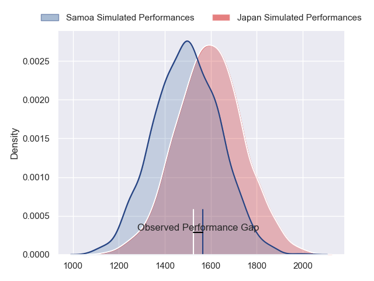
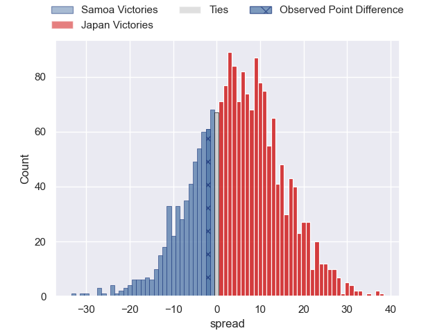

---  
layout: page  
title: Samoa at Japan; 24.0-22.0  
date: 2023-07-22 01:50:00 18:00:00 -0500  
categories: match review  
---
# Samoa at Japan; 24.0-22.0

# Club Level Predictions

The first set of predictions treats a club as the smallest object, as the club develops its members, organizes a gameplan, and deploys its players as needed for each match. This club model has a prediction of 0.632, which translates to predicting Japan to win by 5.1.

Each club has a rating and a rating deviation (simiar to a Glicko system), and expected performances can be generated. This allows for simulated matches and spreads like the ones below.
## Projected Performances

## Projected Spreads

## Projected Results

# Player Level Predictions

Treating teams instead as an entity made up of the currently active players, I have ratings for each player in an altogether different system. These can be combined to form team ratings once teamsheets are announced, weighting starters a bit higher than the reserves. After the match is played, players can be weighted by their minutes on the field, allowing for an accurate measure of the team's composition. With these compiled team ratings, we can make predictions, measure inaccuracy, and update the individual player ratings.
## Prediction with Player Minutes: Japan by 0.7

Samoa by 3.3 on a neutral field

There were 12 large changes in win probability in this match
## Prediction without Player Minutes: Japan by 0.3

Samoa by 3.7 on a neutral pitch

|   Away Minutes | Away Player           |   Away elo |   Away Percentile |   Number |   Home Percentile |   Home elo | Home Player         |   Home Minutes |
|---------------:|:----------------------|-----------:|------------------:|---------:|------------------:|-----------:|:--------------------|---------------:|
|             71 | Jordan Lay            |      69.61 |                29 |        1 |               nan |      82.77 | Keita Inagaki       |             61 |
|             53 | Luteru Tolai          |      99.47 |                85 |        2 |               nan |      81.9  | Atsushi Sakate      |             61 |
|             53 | Paul Alo-Emile        |      82.72 |               nan |        3 |               nan |      95    | Jiwon Gu            |             66 |
|             59 | Brian Alainu'uese     |      83.46 |               nan |        4 |               nan |      90.25 | James Moore         |             80 |
|             80 | Michael Curry         |     108.37 |                90 |        5 |               nan |      79.2  | Amato Fakatava      |             65 |
|             80 | Taleni Seu            |      85.79 |                63 |        6 |               nan |      81.52 | Jack Cornelsen      |             80 |
|             80 | Alamanda Motuga       |      70.7  |                31 |        7 |               nan |      81.18 | Kazuki Himeno       |             80 |
|             59 | So'otala Fa'aso'o     |     103.81 |                87 |        8 |               nan |      80.87 | Michael Leitch      |             80 |
|             68 | Jonathan Taumateine   |      65.6  |                25 |        9 |               nan |      83.29 | Yutaka Nagare       |             55 |
|             80 | Christian Leali'ifano |     103.47 |                83 |       10 |               nan |      83.89 | Seungsin Lee        |             69 |
|             80 | Tumua Manu            |      83.2  |               nan |       11 |               nan |      84.59 | Jone Naikabula      |             80 |
|             80 | Duncan Paia'aua       |      82.95 |               nan |       12 |               nan |      85.45 | Shogo Nakano        |             55 |
|             80 | Ulupano Seuteni       |      82.5  |               nan |       13 |               nan |      79.01 | Dylan Riley         |             61 |
|             59 | Neria Fomai           |      77.76 |                45 |       14 |               nan |      86.53 | Kotaro Matsushima   |             80 |
|             65 | Danny Toala           |      93.77 |                73 |       15 |               nan |      87.99 | Ryohei Yamanaka     |             80 |
|             27 | Ray Niuia             |      93.21 |                79 |       16 |               nan |      80.58 | Shota Horie         |             19 |
|              9 | Tietie Tuimauga       |      82.3  |               nan |       17 |               nan |      80.31 | Craig Millar        |             19 |
|             27 | Charlie Faumuina      |      82.1  |               nan |       18 |               nan |      80.06 | Shinnosuke Kakinaga |             14 |
|             21 | Genesis Mamea Lemalu  |      81.92 |               nan |       19 |               nan |      79.83 | Uwe Helu            |             15 |
|             21 | Miracle Faiilagi      |      77.61 |                48 |       20 |               nan |      79.61 | Shota Fukui         |             25 |
|             12 | Ere Enari             |     100.81 |                82 |       21 |               nan |      79.4  | Naoto Saito         |             25 |
|             15 | Martini Talapusi      |      84.04 |               nan |       22 |               nan |      82.31 | Rikiya Matsuda      |             11 |
|             21 | Ed Fidow              |      83.74 |               nan |       23 |               nan |      78.83 | Tomoki Osada        |             19 |

