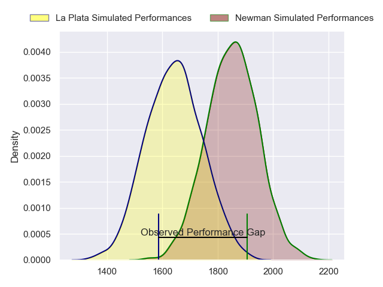
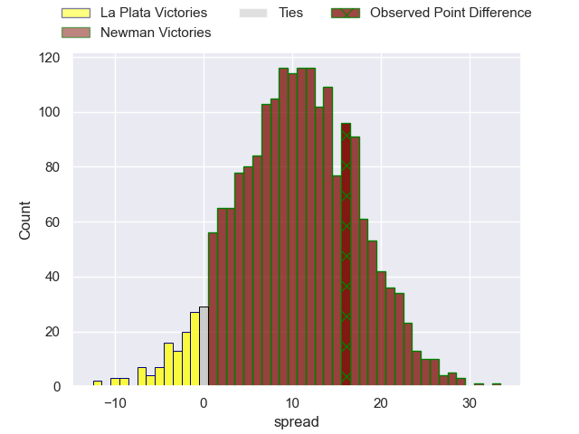
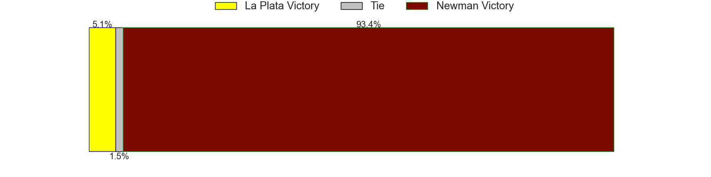

---  
layout: page  
title: La Plata at Newman; 17-33  
date: 2023-07-22 20:30:00 18:00:00 -0500  
categories: match review  
---
# La Plata at Newman; 17-33

# Club Level Predictions

The first set of predictions treats a club as the smallest object, as the club develops its members, organizes a gameplan, and deploys its players as needed for each match. This club model has a prediction of 0.758, which translates to predicting Newman to win by 10.4.

Each club has a rating and a rating deviation (simiar to a Glicko system), and expected performances can be generated. This allows for simulated matches and spreads like the ones below.
## Projected Performances

## Projected Spreads

## Projected Results

# Player Level Predictions

Treating teams instead as an entity made up of the currently active players, I have ratings for each player in an altogether different system. These can be combined to form team ratings once teamsheets are announced, weighting starters a bit higher than the reserves. After the match is played, players can be weighted by their minutes on the field, allowing for an accurate measure of the team's composition. With these compiled team ratings, we can make predictions, measure inaccuracy, and update the individual player ratings.
## Prediction with Player Minutes: Newman by 21.8

Newman by 17.8 on a neutral field

There were 5 large changes in win probability in this match
## Prediction without Player Minutes: Newman by 24.5

Newman by 20.5 on a neutral pitch

|   Away Minutes | Away Player            |   Away elo |   Away Percentile |   Number |   Home Percentile |   Home elo | Home Player               |   Home Minutes |
|---------------:|:-----------------------|-----------:|------------------:|---------:|------------------:|-----------:|:--------------------------|---------------:|
|             80 | Ariel Del Cerro        |      69.11 |                28 |        1 |                79 |      93.41 | Alberto Porolli           |             45 |
|             66 | Joaquin Nunez          |      57.99 |                13 |        2 |               nan |      84.77 | Beltrán Salese            |             51 |
|             80 | Jeremias Chicherquia   |      57.51 |                10 |        3 |                27 |      72    | Luciano Borio             |             45 |
|             70 | Bautista Ozog          |      58.59 |                13 |        4 |                71 |      90.83 | Pablo Cardinal            |             80 |
|             70 | Mateo Lorenzo          |      60.43 |               nan |        5 |                17 |      61.23 | Alejandro Urtubey         |             80 |
|             80 | Carlos Mendieta        |      70.07 |                30 |        6 |                41 |      75.19 | Mateo Montoya             |             72 |
|             80 | Francisco Suarez Folch |      49.77 |                 5 |        7 |                24 |      66.07 | Jeronimo Ureta            |             76 |
|             80 | Manuel Dacal           |      76.37 |                44 |        8 |                35 |      71.75 | Rodrigo Diaz de Vivar     |             80 |
|             80 | Homero Alegre          |      52.15 |                 6 |        9 |                22 |      64.34 | Felix Branca              |             80 |
|             80 | Tomas Suarez Folch     |      55.71 |                10 |       10 |                42 |      77.37 | Gonzalo Gutierrez Taboada |             80 |
|             80 | Isidro Iassi           |      77.38 |                45 |       11 |                78 |      96.41 | Agustin Gosio             |             72 |
|             60 | Manuel Arteche         |      59.02 |                14 |       12 |               nan |      74.73 | Mateo D'Elia              |             80 |
|             80 | Luca Juliano           |      57.47 |                12 |       13 |                65 |      88.53 | Juan Billote              |             80 |
|             80 | Valentino Cinti        |      61.5  |                18 |       14 |                16 |      60.41 | Juan Lanza                |             80 |
|             80 | Santino Di Lucca       |      60.17 |                14 |       15 |                 5 |      48.62 | Francisco Pasman          |             80 |
|             10 | Tomas Bernasconi       |      77.1  |                44 |       16 |                41 |      80.4  | Miguel Angel Prince       |             35 |
|             10 | Alejandro Brocha       |      60.61 |               nan |       17 |                38 |      74.1  | Mariano Urtubey           |             35 |
|             14 | Martin Jimenez Chavero |      60.27 |               nan |       18 |                31 |      69.52 | Marcelo Brandi            |             29 |
|             20 | Federico Sica          |      80.94 |               nan |       19 |               nan |      65.84 | Marcos Zirolli            |              8 |
|            nan | nan                    |     nan    |               nan |       20 |                11 |      56.21 | Teofilo Garay             |              8 |
|            nan | nan                    |     nan    |               nan |       21 |                 9 |      53.39 | Tomas Ureta               |              4 |

