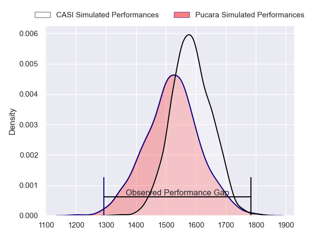
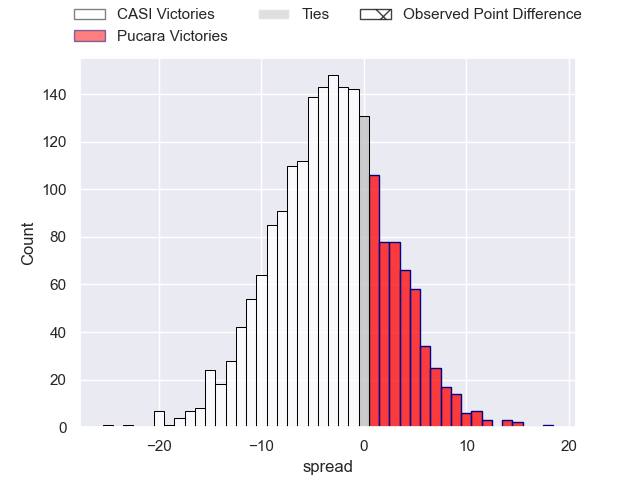
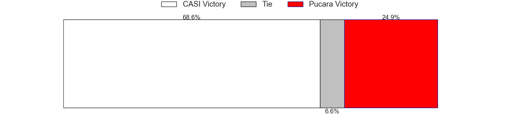

---  
layout: page  
title: CASI at Pucara; 42-19  
date: 2023-07-22 20:30:00 18:00:00 -0500  
categories: match review  
---
# CASI at Pucara; 42-19

# Club Level Predictions

The first set of predictions treats a club as the smallest object, as the club develops its members, organizes a gameplan, and deploys its players as needed for each match. This club model has a prediction of 0.412, which translates to predicting CASI to win by 3.2.

Each club has a rating and a rating deviation (simiar to a Glicko system), and expected performances can be generated. This allows for simulated matches and spreads like the ones below.
## Projected Performances

## Projected Spreads

## Projected Results

# Player Level Predictions

Treating teams instead as an entity made up of the currently active players, I have ratings for each player in an altogether different system. These can be combined to form team ratings once teamsheets are announced, weighting starters a bit higher than the reserves. After the match is played, players can be weighted by their minutes on the field, allowing for an accurate measure of the team's composition. With these compiled team ratings, we can make predictions, measure inaccuracy, and update the individual player ratings.
## Prediction with Player Minutes: CASI by 15.3

CASI by 19.3 on a neutral field

There were 3 large changes in win probability in this match
## Prediction without Player Minutes: CASI by 17.1

CASI by 21.1 on a neutral pitch

|   Away Minutes | Away Player                |   Away elo |   Away Percentile |   Number |   Home Percentile |   Home elo | Home Player           |   Home Minutes |
|---------------:|:---------------------------|-----------:|------------------:|---------:|------------------:|-----------:|:----------------------|---------------:|
|             57 | Facundo Scaiano            |      83.86 |                60 |        1 |               nan |      53.84 | Jeremias de Sarro     |             54 |
|             66 | Juan Torres Obeid          |      50.17 |                 6 |        2 |                25 |      68.24 | Guido Romandetto      |             52 |
|             49 | Hugo Garcia                |      69.9  |               nan |        3 |                 3 |      46.39 | Damian Fernandez      |             40 |
|             57 | Leo Mazzini                |      73.54 |                36 |        4 |                 0 |      22.39 | Eliseo Fourcade       |             80 |
|             80 | Ignacio Larrague           |      74.14 |                37 |        5 |                 8 |      52.96 | Leandro Urriza        |             53 |
|             66 | Mateo Castiglioni          |      70.7  |                32 |        6 |                 3 |      43.88 | Valentin Urcullu      |             80 |
|             80 | Eugenio Sartori            |      61.99 |                16 |        7 |                39 |      72.83 | Tomas Indomito        |             80 |
|             80 | Luis Briatore              |      91.8  |                75 |        8 |                41 |      69.77 | Gregorio Pascual      |             80 |
|             60 | Tomas Descalzo             |      62.82 |                20 |        9 |                 5 |      50.74 | German Klubus         |             57 |
|             80 | Felipe Hileman             |      75.85 |                41 |       10 |                 6 |      49.91 | Felipe Barla          |             53 |
|             80 | Jeronimo Solveyra          |      43.66 |                 2 |       11 |                 2 |      40.74 | Juan Delguy           |             64 |
|             80 | Felipe Probaos             |      61.11 |                18 |       12 |                66 |      90.87 | Valentin Cruz         |             80 |
|             80 | Benjamin Belaga            |      73.17 |                38 |       13 |                 4 |      45.83 | Mariano Navarro       |             80 |
|             69 | Jeronimo Tumbarello        |      70.2  |                31 |       14 |                21 |      63.3  | Inaki Delguy          |             80 |
|             67 | Juan Akemeier              |      76.84 |                44 |       15 |                31 |      71.25 | Tomas Jorge           |             80 |
|             31 | Juan Ignacio Nieto Sanchez |      91.88 |                78 |       16 |               nan |      63.66 | Joaquin Girado        |             40 |
|             23 | Martin Brousson            |      66.57 |                19 |       17 |                 1 |      34.21 | Tomas Chimenti        |             28 |
|             23 | Joaquin Sáenz de Miera     |      68.46 |                28 |       18 |                 8 |      52.51 | Tomas Alda            |             27 |
|             20 | Luca Canzani               |      57.09 |                 6 |       19 |                 8 |      52.55 | Francisco Jorge       |             27 |
|             14 | Benjamín Rocca             |      50.89 |                 6 |       20 |               nan |      58.82 | Leandro Ciucio        |             26 |
|             14 | Facundo Andreotti          |      73.69 |                38 |       21 |               nan |      53.75 | Manuel Tognola        |             23 |
|             13 | Bruno Maria Devoto         |      69.08 |               nan |       22 |                10 |      54.62 | Ramiro Gonzalez Moran |             16 |
|             11 | Matias Phelan              |      59.75 |                13 |       23 |               nan |     nan    | nan                   |            nan |

