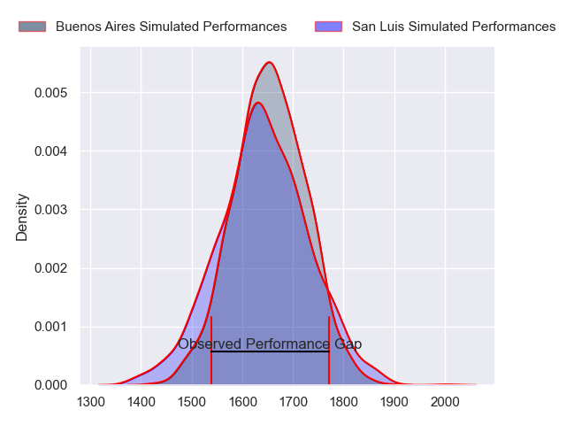
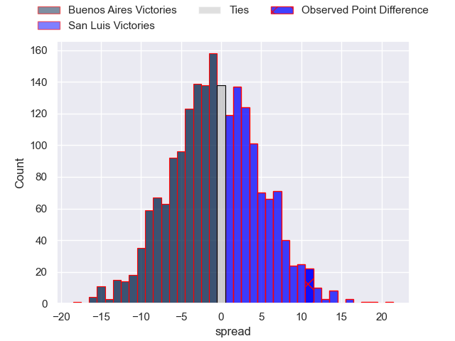

---  
layout: page  
title: Buenos Aires at San Luis; 23-34  
date: 2023-07-22 20:30:00 18:00:00 -0500  
categories: match review  
---
# Buenos Aires at San Luis; 23-34

# Club Level Predictions

The first set of predictions treats a club as the smallest object, as the club develops its members, organizes a gameplan, and deploys its players as needed for each match. This club model has a prediction of 0.485, which translates to predicting Buenos Aires to win by 0.5.

Each club has a rating and a rating deviation (simiar to a Glicko system), and expected performances can be generated. This allows for simulated matches and spreads like the ones below.
## Projected Performances

## Projected Spreads

## Projected Results

# Player Level Predictions

Treating teams instead as an entity made up of the currently active players, I have ratings for each player in an altogether different system. These can be combined to form team ratings once teamsheets are announced, weighting starters a bit higher than the reserves. After the match is played, players can be weighted by their minutes on the field, allowing for an accurate measure of the team's composition. With these compiled team ratings, we can make predictions, measure inaccuracy, and update the individual player ratings.
## Prediction with Player Minutes: San Luis by 16.4

San Luis by 12.4 on a neutral field

There were 8 large changes in win probability in this match
## Prediction without Player Minutes: San Luis by 10.1

San Luis by 6.1 on a neutral pitch

|   Away Minutes | Away Player         |   Away elo |   Away Percentile |   Number |   Home Percentile |   Home elo | Home Player           |   Home Minutes |
|---------------:|:--------------------|-----------:|------------------:|---------:|------------------:|-----------:|:----------------------|---------------:|
|             60 | Gaston Vaca         |      37.08 |                 0 |        1 |                37 |      73.47 | Santiago Bonavento    |             80 |
|             50 | Diego Petrongolo    |      59.2  |                15 |        2 |               nan |      55.03 | Francisco Cantalupo   |             80 |
|             47 | Agustin Piedrabuena |      57.08 |               nan |        3 |                 3 |      48.92 | Mateo Calistro        |             80 |
|             80 | Bautista Durañona   |      52.78 |                 8 |        4 |                25 |      67.27 | Santiago Canal        |             80 |
|             60 | Franco Baldoni      |      63.55 |                20 |        5 |                 3 |      39.87 | Agustin Torello       |             80 |
|             80 | Pedro Del Carril    |      67.15 |                26 |        6 |                 1 |      35.92 | Nahuel Curti          |             59 |
|             80 | Francisco Ibarra    |      44.89 |                 3 |        7 |                89 |     104.72 | Manuel Gnecco         |             80 |
|             80 | Jordi Dieguez       |      56.97 |               nan |        8 |                77 |      95.61 | Facundo Alvarez Amado |             72 |
|             47 | Mateo Freire        |      57.1  |                11 |        9 |                19 |      61.51 | Juan Vaca             |             80 |
|             80 | Mateo Capalbo       |      52.75 |                 8 |       10 |                 9 |      54.4  | Felipe Campodonico    |             80 |
|             80 | Benjamin Handley    |      57.45 |                13 |       11 |                14 |      60.69 | Felipe Hernandez      |             80 |
|             80 | Agustin Lamensa     |      69.3  |                30 |       12 |                19 |      62.16 | Segundo Blanco Fresco |             80 |
|             80 | Luis Prieto         |      46.57 |                 4 |       13 |                38 |      73.84 | Facundo Gibert        |             80 |
|             60 | Cristobal Botto     |      57.01 |               nan |       14 |                46 |      78.19 | Eduardo Ruesta        |             80 |
|             80 | Alejo Novo          |      60.59 |                14 |       15 |                41 |      74.94 | Valentino Quattrochi  |             80 |
|             33 | Nicolás Esteban     |      78.7  |                50 |       16 |                22 |      64.61 | Matias Perissinotto   |             21 |
|             33 | Juan Monasterio     |      67.97 |               nan |       17 |                20 |      63.08 | Felipe Piatti         |              8 |
|             30 | Tomas Rosasco       |      65.02 |               nan |       18 |               nan |     nan    | nan                   |            nan |
|             20 | Thomas Gallo        |      72.44 |                34 |       19 |               nan |     nan    | nan                   |            nan |
|             20 | Alfonso Latorre     |      71.46 |                33 |       20 |               nan |     nan    | nan                   |            nan |
|             20 | Jaime McGrech       |      62.11 |               nan |       21 |               nan |     nan    | nan                   |            nan |

