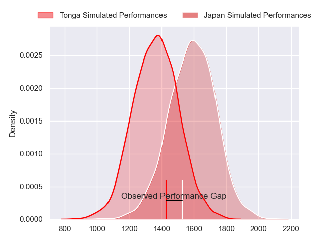
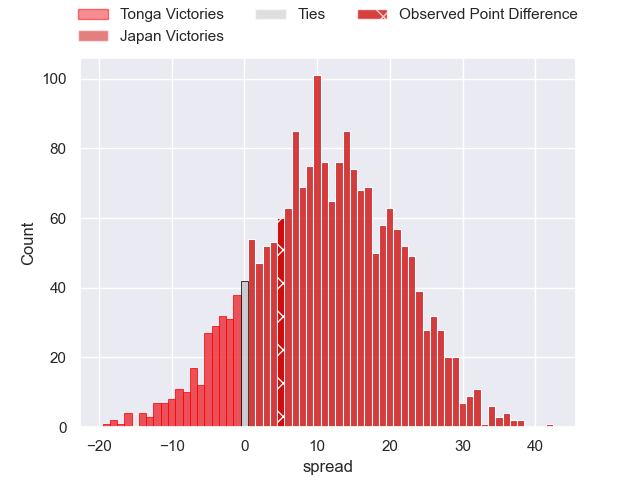
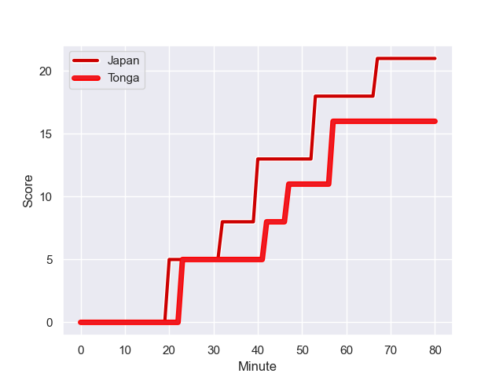
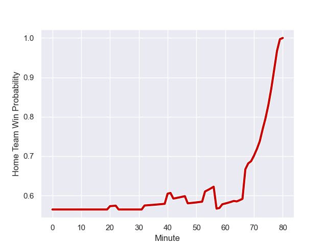

---  
layout: page  
title: Tonga at Japan; 16-21  
date: 2023-07-28 18:00:00 -0500  
categories: match review  
---
# Tonga at Japan; 16-21

# Club Level Predictions

The first set of predictions treats a club as the smallest object, as the club develops its members, organizes a gameplan, and deploys its players as needed for each match. This club model has a prediction of 0.766, which translates to predicting Japan to win by 11.2.

Each club has a rating and a rating deviation (simiar to a Glicko system), and expected performances can be generated. This allows for simulated matches and spreads like the ones below.
## Projected Performances

## Projected Spreads

## Projected Results

# Player Level Predictions - Version 1

Treating teams instead as an entity made up of the currently active players, I have ratings for each player in an altogether different system. These can be combined to form team ratings once teamsheets are announced, weighting starters a bit higher than the reserves. After the match is played, players can be weighted by their minutes on the field, allowing for an accurate measure of the team's composition. With these compiled team ratings, we can make predictions, measure inaccuracy, and update the individual player ratings.
## Prediction with Player Minutes: Japan by 15.3

Japan by 11.3 on a neutral field
## Prediction without Player Minutes: Japan by 15.4

Japan by 11.4 on a neutral pitch

## Scores over Time

## Win Probability over Time

There were 11 large changes in win probability in this match

|   Away Minutes | Away Player         |   Away elo |   Away Percentile |   Number |   Home Percentile |   Home elo | Home Player       |   Home Minutes |
|---------------:|:--------------------|-----------:|------------------:|---------:|------------------:|-----------:|:------------------|---------------:|
|             69 | Siegfried Fisi'ihoi |      88.05 |                68 |        1 |                73 |      99.49 | Keita Inagaki     |             59 |
|             69 | Samiuela Moli       |      52.62 |                14 |        2 |                23 |      74.24 | Atsushi Sakate    |             59 |
|             69 | Ben Tameifuna       |     104.16 |                92 |        3 |                97 |     127.63 | Asaeli Ai Valu    |             53 |
|             80 | Leva Fifita         |      74.02 |                34 |        4 |                40 |      85.35 | Amato Fakatava    |             80 |
|             47 | Steve Mafi          |      94.9  |                76 |        5 |                63 |      90.17 | Uwe Helu          |             47 |
|             80 | Vaea Fifita         |     120.04 |                97 |        6 |                90 |     122.41 | Jack Cornelsen    |             80 |
|             80 | Sione Havili        |      78.16 |                45 |        7 |                92 |     113.73 | Ben Gunter        |             59 |
|             47 | Lopeti Timani       |      97.08 |                84 |        8 |                37 |      86.5  | Kazuki Himeno     |             80 |
|             68 | Sonatane Takulua    |      80.11 |                52 |        9 |                48 |      87.96 | Naoto Saito       |             53 |
|             73 | William Havili      |     107.73 |                91 |       10 |                38 |      80.12 | Seungsin Lee      |             47 |
|             64 | Kyren Taumoefolau   |      84.68 |                68 |       11 |                91 |     125.42 | Semisi Masirewa   |             80 |
|             80 | Pita Ahki           |      85.34 |                58 |       12 |                34 |      88.5  | Tomoki Osada      |             80 |
|             80 | Afusipa Taumoepeau  |      82.04 |                52 |       13 |                82 |     114.99 | Dylan Riley       |             80 |
|             80 | Solomone Kata       |     101.46 |                84 |       14 |                27 |      83.89 | Jone Naikabula    |             80 |
|             80 | Charles Piutau      |      89.7  |                69 |       15 |                44 |      83.62 | Ryohei Yamanaka   |             64 |
|             11 | Paula Ngauamo       |      84.67 |                63 |       16 |                98 |     125.76 | Shota Horie       |             21 |
|             11 | Feao Fotuaika       |      89.98 |                81 |       17 |                69 |      86.63 | Craig Millar      |             21 |
|             11 | David Lolohea       |      84.26 |               nan |       18 |                65 |      86.73 | Jiwon Gu          |             27 |
|             33 | Tanginoa Halaifonua |      91.85 |                66 |       19 |                 7 |      63.41 | James Moore       |             33 |
|             33 | Solomone Funaki     |      70.59 |                31 |       20 |               nan |      90.43 | Tevita Tatafu     |             21 |
|             12 | Manu Paea           |      70.66 |                35 |       21 |                56 |      83.03 | Yutaka Nagare     |             27 |
|              7 | Otumaka Mausia      |      90.18 |                65 |       22 |                29 |      79.91 | Rikiya Matsuda    |             33 |
|             16 | Malakai Fekitoa     |     113.31 |                93 |       23 |                72 |     104.6  | Kotaro Matsushima |             16 |

# Player Level Predictions - Version 2

Treating teams instead as an entity made up of the currently active players, I have ratings for each player in an altogether different system. These can be combined to form team ratings once teamsheets are announced, weighting starters a bit higher than the reserves. After the match is played, players can be weighted by their minutes on the field, allowing for an accurate measure of the team's composition. With these compiled team ratings, we can make predictions, measure inaccuracy, and update the individual player ratings.
## Prediction with Player Minutes: Japan by 8.3

Japan by 5.0 on a neutral field
## Prediction without Player Minutes: Japan by 9.1

Japan by 5.9 on a neutral pitch

|   Away Minutes | Away Player         |   Away elo |   Away variance |   Number |   Home variance |   Home elo | Home Player       |   Home Minutes |
|---------------:|:--------------------|-----------:|----------------:|---------:|----------------:|-----------:|:------------------|---------------:|
|             69 | Siegfried Fisi'ihoi |      51.67 |           50    |        1 |           50    |     102.17 | Keita Inagaki     |             59 |
|             69 | Samiuela Moli       |      31.78 |           48.91 |        2 |           50    |      48.49 | Atsushi Sakate    |             59 |
|             69 | Ben Tameifuna       |      91.75 |           48.07 |        3 |           50    |     100.76 | Asaeli Ai Valu    |             53 |
|             80 | Leva Fifita         |      33.87 |           50    |        4 |           50    |      46.65 | Amato Fakatava    |             80 |
|             47 | Steve Mafi          |      45.47 |           50    |        5 |           50    |      71.89 | Uwe Helu          |             47 |
|             80 | Vaea Fifita         |     112.01 |           50    |        6 |           50    |     104.31 | Jack Cornelsen    |             80 |
|             80 | Sione Havili        |      74.69 |           48.71 |        7 |           50    |     112.78 | Ben Gunter        |             59 |
|             47 | Lopeti Timani       |      64.78 |           50    |        8 |           50    |      78.1  | Kazuki Himeno     |             80 |
|             68 | Sonatane Takulua    |      46.65 |           50    |        9 |           50    |      47.71 | Naoto Saito       |             53 |
|             73 | William Havili      |      51.47 |           48.42 |       10 |           50    |      24.79 | Seungsin Lee      |             47 |
|             64 | Kyren Taumoefolau   |      46.65 |           50    |       11 |           50    |      64.59 | Semisi Masirewa   |             80 |
|             80 | Pita Ahki           |      53.27 |           47.81 |       12 |           50    |      46.65 | Tomoki Osada      |             80 |
|             80 | Afusipa Taumoepeau  |      82.57 |           50    |       13 |           49.96 |     121.25 | Dylan Riley       |             80 |
|             80 | Solomone Kata       |      46.41 |           50    |       14 |           50    |      46.65 | Jone Naikabula    |             80 |
|             80 | Charles Piutau      |     104.96 |           50    |       15 |           50    |      51.73 | Ryohei Yamanaka   |             64 |
|             11 | Paula Ngauamo       |      63.46 |           50    |       16 |           50    |     119.71 | Shota Horie       |             21 |
|             11 | Feao Fotuaika       |      45.68 |           49.45 |       17 |           50    |      55.51 | Craig Millar      |             21 |
|             11 | David Lolohea       |      46.65 |           50    |       18 |           50    |      41.61 | Jiwon Gu          |             27 |
|             33 | Tanginoa Halaifonua |      58.86 |           45.6  |       19 |           50    |     -11.46 | James Moore       |             33 |
|             33 | Solomone Funaki     |      51.36 |           48.33 |       20 |           50    |      46.65 | Tevita Tatafu     |             21 |
|             12 | Manu Paea           |      38.79 |           50    |       21 |           50    |      80.4  | Yutaka Nagare     |             27 |
|              7 | Otumaka Mausia      |      43.5  |           50    |       22 |           50    |     116.66 | Rikiya Matsuda    |             33 |
|             16 | Malakai Fekitoa     |      89.3  |           50    |       23 |           50    |     108.54 | Kotaro Matsushima |             16 |

