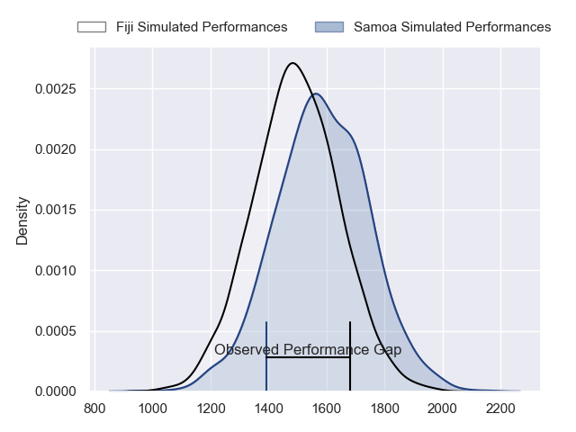
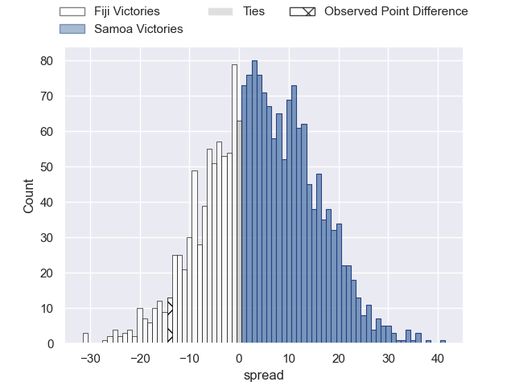
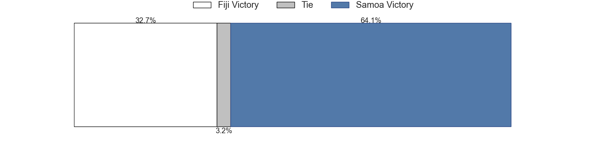

---  
layout: page  
title: Fiji at Samoa; 33-19  
date: 2023-07-28 15:00:00 18:00:00 -0500  
categories: match review  
---
# Fiji at Samoa; 33-19

# Club Level Predictions

The first set of predictions treats a club as the smallest object, as the club develops its members, organizes a gameplan, and deploys its players as needed for each match. This club model has a prediction of 0.609, which translates to predicting Samoa to win by 4.3.

Each club has a rating and a rating deviation (simiar to a Glicko system), and expected performances can be generated. This allows for simulated matches and spreads like the ones below.
## Projected Performances

## Projected Spreads

## Projected Results

# Player Level Predictions

Treating teams instead as an entity made up of the currently active players, I have ratings for each player in an altogether different system. These can be combined to form team ratings once teamsheets are announced, weighting starters a bit higher than the reserves. After the match is played, players can be weighted by their minutes on the field, allowing for an accurate measure of the team's composition. With these compiled team ratings, we can make predictions, measure inaccuracy, and update the individual player ratings.
## Prediction with Player Minutes: Samoa by 24.0

Samoa by 20.0 on a neutral field

There were 11 large changes in win probability in this match
## Prediction without Player Minutes: Samoa by 24.1

Samoa by 20.1 on a neutral pitch

|   Away Minutes | Away Player             |   Away elo |   Away Percentile |   Number |   Home Percentile |   Home elo | Home Player           |   Home Minutes |
|---------------:|:------------------------|-----------:|------------------:|---------:|------------------:|-----------:|:----------------------|---------------:|
|             62 | Eroni Mawi              |      42.65 |                 1 |        1 |                40 |      75.44 | Jordan Lay            |             56 |
|             68 | Tevita Ikanivere        |     115.9  |                94 |        2 |                77 |      94.76 | Ray Niuia             |             38 |
|             74 | Luke Tagi               |      74.92 |                31 |        3 |                90 |     101.8  | Paul Alo-Emile        |             62 |
|             56 | Te Ahiwaru Cirikidaveta |      98.48 |                79 |        4 |                53 |      81.74 | Chris Vui             |             80 |
|             80 | Isoa Nasilasila         |     124.1  |                96 |        5 |                73 |      91.31 | Taleni Seu            |             80 |
|             80 | Ratu Meli Derenalagi    |      85.51 |                61 |        6 |                96 |     122.91 | Steven Luatua         |             55 |
|             68 | Vilive Miramira         |      66.71 |                24 |        7 |                60 |      84.08 | Jack Lam              |             47 |
|             80 | Viliame Mata            |      62.16 |                15 |        8 |                98 |     131.84 | Fritz Lee             |             80 |
|             41 | Simione Kuruvoli        |      81.33 |               nan |        9 |                83 |     104.31 | Ere Enari             |             56 |
|             69 | Caleb Muntz             |      86.28 |                57 |       10 |                90 |     110.96 | Christian Leali'ifano |             80 |
|             58 | Kalaveti Ravouvou       |     137.6  |                99 |       11 |                96 |     121.21 | Tumua Manu            |             66 |
|             80 | Semi Radradra           |     117.12 |                93 |       12 |                98 |     130.83 | Duncan Paia'aua       |             80 |
|             80 | Iosefo Masi             |      70.33 |                31 |       13 |                48 |      78.73 | Stacey Ili            |             80 |
|             80 | Selestino Ravutaumada   |      81.94 |                53 |       14 |                84 |     101.02 | Nigel Ah Wong         |             80 |
|             80 | Ilaisa Droasese         |      73.41 |                37 |       15 |                76 |      96.53 | Danny Toala           |             55 |
|             12 | Zuriel Togiatama        |      75.64 |                45 |       16 |               nan |      93.51 | Sama Malolo           |             42 |
|             18 | Peni Ravai              |      98.91 |                86 |       17 |                61 |      85.01 | Tietie Tuimauga       |             24 |
|              6 | Samuela Tawake          |      72.14 |                32 |       18 |                98 |     128.3  | Charlie Faumuina      |             18 |
|             24 | Joseva Tamani           |      69.01 |                28 |       19 |                87 |     105.34 | Brian Alainu'uese     |             25 |
|             12 | Kitione Kamikamica      |      77.33 |                44 |       20 |                64 |      87.97 | Genesis Mamea Lemalu  |             33 |
|             39 | Peni Matawalu           |      88.6  |                65 |       21 |               nan |      76.72 | Melani Matavao        |             24 |
|             22 | Vilimoni Botitu         |      85.39 |                60 |       22 |                79 |      98.3  | D'Angelo Leuila       |             14 |
|             11 | Josua Tuisova           |      85.47 |                61 |       23 |                11 |      56.41 | Ed Fidow              |             25 |

