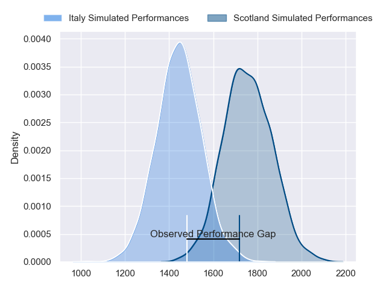
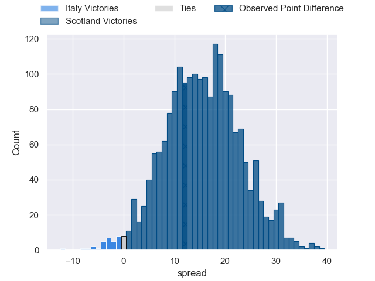

---  
layout: page  
title: Italy at Scotland; 13-25  
date: 2023-07-28 15:15:00 18:00:00 -0500  
categories: match review  
---
# Italy at Scotland; 13-25

# Club Level Predictions

The first set of predictions treats a club as the smallest object, as the club develops its members, organizes a gameplan, and deploys its players as needed for each match. This club model has a prediction of 0.848, which translates to predicting Scotland to win by 15.7.

Each club has a rating and a rating deviation (simiar to a Glicko system), and expected performances can be generated. This allows for simulated matches and spreads like the ones below.
## Projected Performances

## Projected Spreads

## Projected Results

# Player Level Predictions

Treating teams instead as an entity made up of the currently active players, I have ratings for each player in an altogether different system. These can be combined to form team ratings once teamsheets are announced, weighting starters a bit higher than the reserves. After the match is played, players can be weighted by their minutes on the field, allowing for an accurate measure of the team's composition. With these compiled team ratings, we can make predictions, measure inaccuracy, and update the individual player ratings.
## Prediction with Player Minutes: Scotland by 29.4

Scotland by 25.4 on a neutral field

There were 8 large changes in win probability in this match
## Prediction without Player Minutes: Scotland by 30.7

Scotland by 26.7 on a neutral pitch

|   Away Minutes | Away Player        |   Away elo |   Away Percentile |   Number |   Home Percentile |   Home elo | Home Player       |   Home Minutes |
|---------------:|:-------------------|-----------:|------------------:|---------:|------------------:|-----------:|:------------------|---------------:|
|             51 | Federico Zani      |      83.88 |               nan |        1 |               nan |     101.28 | Rory Sutherland   |             46 |
|             57 | Hame Faiva         |      80.65 |                53 |        2 |               nan |     102.33 | George Turner     |             46 |
|             60 | Pietro Ceccarelli  |      84.58 |               nan |        3 |               nan |     104.51 | Murphy Walker     |             46 |
|             57 | David Sisi         |      85.43 |               nan |        4 |               nan |     102.64 | Sam Skinner       |             81 |
|             81 | Andrea Zambonin    |      86.52 |               nan |        5 |                98 |     130.86 | Scott Cummings    |             64 |
|             81 | Federico Ruzza     |      98.94 |                82 |        6 |               nan |     102.96 | Luke Crosbie      |             69 |
|             51 | Manuel Zuliani     |      90.22 |                73 |        7 |                98 |     129.33 | Rory Darge        |             81 |
|             81 | Toa Halafihi       |     107.6  |                89 |        8 |                84 |     100.25 | Matt Fagerson     |             81 |
|             64 | Martin Page-Relo   |      84.1  |               nan |        9 |               nan |     101.53 | Ali Price         |             57 |
|             81 | Tommaso Allan      |      82.4  |                51 |       10 |               nan |     101.78 | Ben Healy         |             81 |
|             81 | Monty Ioane        |     118.76 |                96 |       11 |               nan |     101.05 | Kyle Steyn        |             81 |
|             57 | Luca Morisi        |      84.84 |               nan |       12 |               nan |     102.05 | Stafford McDowall |             81 |
|             81 | Tommaso Menoncello |     103.97 |                85 |       13 |                78 |      97.36 | Chris Harris      |             57 |
|             51 | Pierre Bruno       |      84.33 |               nan |       14 |                99 |     149.73 | Darcy Graham      |             72 |
|             81 | Lorenzo Pani       |      74.18 |                37 |       15 |                52 |      82.67 | Ollie Smith       |             81 |
|             24 | Marco Manfredi     |      85.13 |               nan |       16 |               nan |     103.3  | Stuart McInally   |             35 |
|             30 | Danilo Fischetti   |      77.14 |                44 |       17 |                81 |      95.15 | Jamie Bhatti      |             35 |
|             21 | Filippo Alongi     |      86.12 |               nan |       18 |               nan |     103.67 | Javan Sebastian   |             35 |
|             24 | Edoardo Iachizzi   |      85.76 |               nan |       19 |                95 |     120.69 | Cameron Henderson |             17 |
|             30 | Lorenzo Cannone    |      76.82 |                44 |       20 |                42 |      77.42 | Josh Bayliss      |             12 |
|             30 | Alessandro Garbisi |      83.67 |               nan |       21 |               nan |     104.07 | Jamie Dobie       |             24 |
|             17 | Giacomo Da Re      |      83.28 |               nan |       22 |                99 |     141.59 | Blair Kinghorn    |              9 |
|             24 | Federico Mori      |      83.47 |               nan |       23 |                59 |      85.03 | Cameron Redpath   |             24 |

