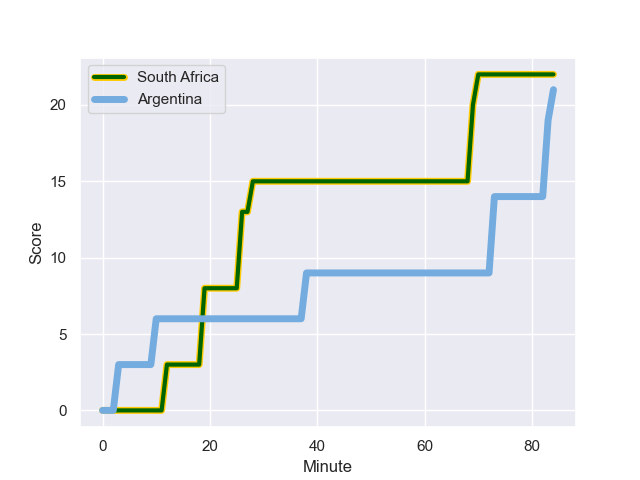
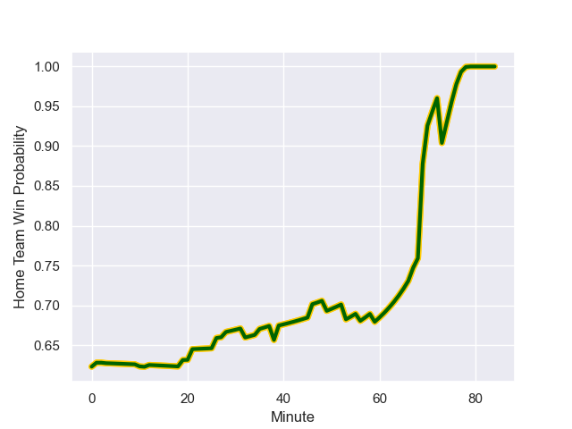

---  
layout: page  
title: Argentina at South Africa; 21-22  
date: 2023-07-29 18:00:00 -0500  
categories: match review  
---
# Argentina at South Africa; 21-22

# Club Level Predictions

The first set of predictions treats a club as the smallest object, as the club develops its members, organizes a gameplan, and deploys its players as needed for each match. This club model has a prediction of 0.881, which translates to predicting South Africa to win by 18.3.

Each club has a rating and a rating deviation (simiar to a Glicko system), and expected performances can be generated. This allows for simulated matches and spreads like the ones below.
## Projected Performances

## Projected Spreads

## Projected Results

# Player Level Predictions - Version 1

Treating teams instead as an entity made up of the currently active players, I have ratings for each player in an altogether different system. These can be combined to form team ratings once teamsheets are announced, weighting starters a bit higher than the reserves. After the match is played, players can be weighted by their minutes on the field, allowing for an accurate measure of the team's composition. With these compiled team ratings, we can make predictions, measure inaccuracy, and update the individual player ratings.
## Prediction with Player Minutes: South Africa by 25.8

South Africa by 21.8 on a neutral field
## Prediction without Player Minutes: South Africa by 24.4

South Africa by 20.4 on a neutral pitch

## Scores over Time

## Win Probability over Time

There were 5 large changes in win probability in this match

|   Away Minutes | Away Player            |   Away elo |   Away Percentile |   Number |   Home Percentile |   Home elo | Home Player          |   Home Minutes |
|---------------:|:-----------------------|-----------:|------------------:|---------:|------------------:|-----------:|:---------------------|---------------:|
|             49 | Thomas Gallo           |      91.89 |                80 |        1 |                83 |     102.63 | Steven Kitshoff      |             59 |
|             76 | Julian Montoya         |     102.33 |                91 |        2 |                84 |     105.1  | Malcolm Marx         |             59 |
|             59 | Francisco Gomez Kodela |     112.01 |                96 |        3 |                98 |     127.44 | Frans Malherbe       |             59 |
|             39 | Lucas Paulos           |     111.73 |                94 |        4 |                93 |     123.61 | Eben Etzebeth        |             84 |
|             84 | Tomas Lavanini         |     122.71 |                97 |        5 |                46 |      80.99 | Marvin Orie          |             46 |
|             84 | Pablo Matera           |     114.1  |                96 |        6 |                83 |     104.99 | Marco van Staden     |             56 |
|             56 | Santiago Grondona      |      84.76 |                69 |        7 |                37 |      82.99 | Pieter-Steph du Toit |             84 |
|             84 | Juan Martin Gonzalez   |      86.51 |                72 |        8 |                91 |     116.68 | Duane Vermeulen      |             84 |
|             49 | Lautaro Bazan Velez    |      83.45 |                66 |        9 |                86 |     104.33 | Grant Williams       |              1 |
|             73 | Santiago Carreras      |     128.42 |                98 |       10 |                73 |      99.9  | Manie Libbok         |             84 |
|             67 | Juan Imhoff            |      89.42 |                78 |       11 |                99 |     145.78 | Kurt-Lee Arendse     |             53 |
|             84 | Santiago Chocobares    |     102.79 |                92 |       12 |                87 |     115.78 | Damian de Allende    |             84 |
|             84 | Lucio Cinti            |      70.3  |                40 |       13 |                90 |     118.63 | Jesse Kriel          |             84 |
|             84 | Mateo Carreras         |      73.15 |                55 |       14 |                98 |     138.38 | Cheslin Kolbe        |             84 |
|             84 | Juan Cruz Mallia       |      76.93 |                61 |       15 |                67 |      99.97 | Willie Le Roux       |             79 |
|              8 | Ignacio Ruiz           |      91.62 |               nan |       16 |                95 |     114.16 | Bongi Mbonambi       |             25 |
|             35 | Nahuel Tetaz Chaparro  |     103.71 |                90 |       17 |                96 |     112.64 | Trevor Nyakane       |             25 |
|             25 | Joel Sclavi            |      94.65 |                81 |       18 |                15 |      62.18 | Vincent Koch         |             25 |
|             45 | Pedro Rubiolo          |      79.97 |                55 |       19 |                90 |     105.66 | Kwagga Smith         |             28 |
|             28 | Facundo Isa            |     109.96 |                93 |       20 |                90 |     110.3  | RG Snyman            |             38 |
|             35 | Gonzalo Bertranou      |     101.21 |                83 |       21 |                93 |     113.48 | Faf de Klerk         |             83 |
|             11 | Tomas Albornoz         |     103.92 |                83 |       22 |                83 |     103.26 | Lukhanyo Am          |             31 |
|             17 | Matias Moroni          |      77.78 |                40 |       23 |                85 |     101.88 | Damian Willemse      |              5 |

# Player Level Predictions - Version 2

Treating teams instead as an entity made up of the currently active players, I have ratings for each player in an altogether different system. These can be combined to form team ratings once teamsheets are announced, weighting starters a bit higher than the reserves. After the match is played, players can be weighted by their minutes on the field, allowing for an accurate measure of the team's composition. With these compiled team ratings, we can make predictions, measure inaccuracy, and update the individual player ratings.
## Prediction with Player Minutes: South Africa by 31.3

South Africa by 27.7 on a neutral field
## Prediction without Player Minutes: South Africa by 28.0

South Africa by 24.4 on a neutral pitch

|   Away Minutes | Away Player            |   Away elo |   Away variance |   Number |   Home variance |   Home elo | Home Player          |   Home Minutes |
|---------------:|:-----------------------|-----------:|----------------:|---------:|----------------:|-----------:|:---------------------|---------------:|
|             49 | Thomas Gallo           |      48.73 |           47.65 |        1 |           49.79 |      93.45 | Steven Kitshoff      |             59 |
|             76 | Julian Montoya         |      60.65 |           46.01 |        2 |           50    |     128.4  | Malcolm Marx         |             59 |
|             59 | Francisco Gomez Kodela |      64.25 |           49.37 |        3 |           50    |      73.47 | Frans Malherbe       |             59 |
|             39 | Lucas Paulos           |      62.7  |           50    |        4 |           50    |     131.87 | Eben Etzebeth        |             84 |
|             84 | Tomas Lavanini         |      58.56 |           50    |        5 |           50    |      71.06 | Marvin Orie          |             46 |
|             84 | Pablo Matera           |     115.4  |           50    |        6 |           49.21 |      69.35 | Marco van Staden     |             56 |
|             56 | Santiago Grondona      |      64.76 |           50    |        7 |           50    |      69.53 | Pieter-Steph du Toit |             84 |
|             84 | Juan Martin Gonzalez   |      65.75 |           49.21 |        8 |           49.4  |     141.73 | Duane Vermeulen      |             84 |
|             49 | Lautaro Bazan Velez    |      43.89 |           50    |        9 |           50    |      47.07 | Grant Williams       |              1 |
|             73 | Santiago Carreras      |      68.88 |           45.3  |       10 |           49.01 |      66.21 | Manie Libbok         |             84 |
|             67 | Juan Imhoff            |      46.65 |           50    |       11 |           50    |     107.34 | Kurt-Lee Arendse     |             53 |
|             84 | Santiago Chocobares    |      33.95 |           48.47 |       12 |           50    |     125.62 | Damian de Allende    |             84 |
|             84 | Lucio Cinti            |      35.65 |           50    |       13 |           49.66 |     143.29 | Jesse Kriel          |             84 |
|             84 | Mateo Carreras         |      24.46 |           49.69 |       14 |           49.68 |     157.59 | Cheslin Kolbe        |             84 |
|             84 | Juan Cruz Mallia       |      46.65 |           50    |       15 |           50    |      46.65 | Willie Le Roux       |             79 |
|              8 | Ignacio Ruiz           |      46.65 |           50    |       16 |           50    |      91.55 | Bongi Mbonambi       |             25 |
|             35 | Nahuel Tetaz Chaparro  |      75.02 |           50    |       17 |           47.06 |      58.64 | Trevor Nyakane       |             25 |
|             25 | Joel Sclavi            |      54.91 |           48.05 |       18 |           47.66 |      45.6  | Vincent Koch         |             25 |
|             45 | Pedro Rubiolo          |      33.89 |           50    |       19 |           50    |      89.33 | Kwagga Smith         |             28 |
|             28 | Facundo Isa            |      82.14 |           46.28 |       20 |           50    |     123.3  | RG Snyman            |             38 |
|             35 | Gonzalo Bertranou      |      51.42 |           50    |       21 |           50    |     111.39 | Faf de Klerk         |             83 |
|             11 | Tomas Albornoz         |      62.28 |           50    |       22 |           50    |      65.84 | Lukhanyo Am          |             31 |
|             17 | Matias Moroni          |     117.65 |           38.84 |       23 |           49.1  |      96.02 | Damian Willemse      |              5 |

