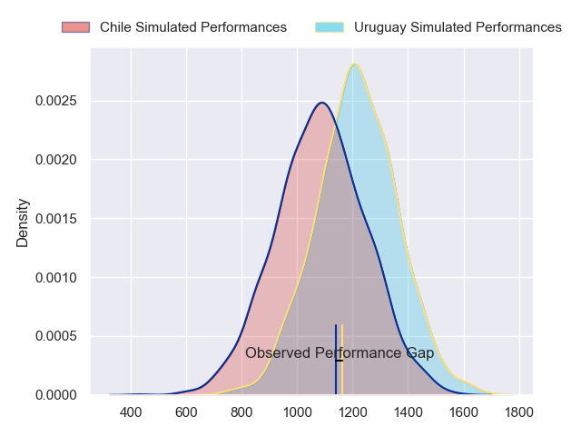
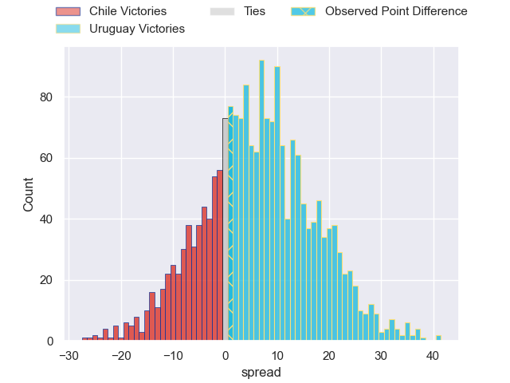
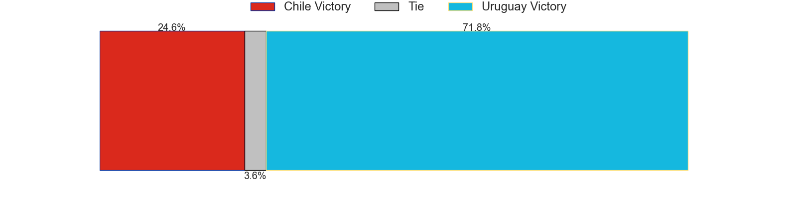
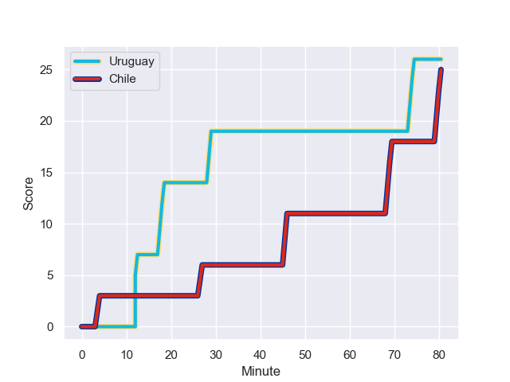
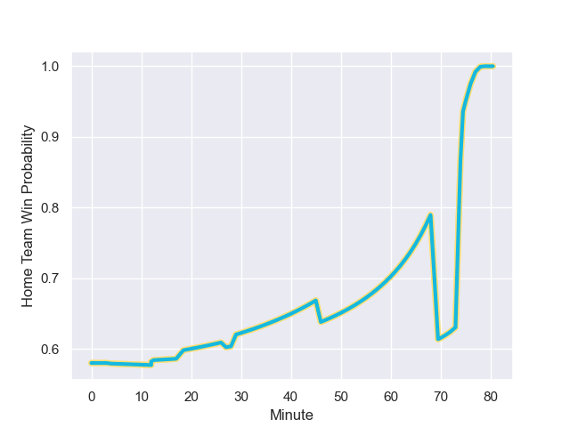

---  
layout: page  
title: Chile at Uruguay; 25-26  
date: 2023-07-29 18:00:00 -0500  
categories: match review  
---
# Chile at Uruguay; 25-26

# Club Level Predictions

The first set of predictions treats a club as the smallest object, as the club develops its members, organizes a gameplan, and deploys its players as needed for each match. This club model has a prediction of 0.671, which translates to predicting Uruguay to win by 6.9.

Each club has a rating and a rating deviation (simiar to a Glicko system), and expected performances can be generated. This allows for simulated matches and spreads like the ones below.
## Projected Performances

## Projected Spreads

## Projected Results

# Player Level Predictions - Version 1

Treating teams instead as an entity made up of the currently active players, I have ratings for each player in an altogether different system. These can be combined to form team ratings once teamsheets are announced, weighting starters a bit higher than the reserves. After the match is played, players can be weighted by their minutes on the field, allowing for an accurate measure of the team's composition. With these compiled team ratings, we can make predictions, measure inaccuracy, and update the individual player ratings.
## Prediction with Player Minutes: Uruguay by 18.0

Uruguay by 14.0 on a neutral field
## Prediction without Player Minutes: Uruguay by 18.0

Uruguay by 14.0 on a neutral pitch

## Scores over Time

## Win Probability over Time

There were 5 large changes in win probability in this match

|   Away Minutes | Away Player             |   Away elo |   Away Percentile |   Number |   Home Percentile |   Home elo | Home Player                      |   Home Minutes |
|---------------:|:------------------------|-----------:|------------------:|---------:|------------------:|-----------:|:---------------------------------|---------------:|
|             80 | Javier Carrasco         |      58.34 |                23 |        1 |                 7 |      61.51 | Matteo Sanguinetti               |             80 |
|             80 | Augusto Bohme           |      62.51 |                32 |        2 |                14 |      66.79 | German Kessler                   |             80 |
|             80 | Matias Dittus           |      57.41 |                21 |        3 |                13 |      67.63 | Ignacio Alfredo Peculo Rodriguez |             80 |
|             80 | Javier Eissmann         |      58.08 |                23 |        4 |                26 |      77.07 | Felipe Aliaga                    |             80 |
|             80 | Pablo Huete             |      62.12 |                29 |        5 |                47 |      80.41 | Manuel Leindekar                 |             80 |
|             80 | Clemente Saavedra       |      62.43 |                31 |        6 |                11 |      65.02 | Manuel Ardao                     |             80 |
|             80 | Ignacio Silva           |      56.25 |                21 |        7 |                 8 |      61.41 | Lucas Bianchi                    |             80 |
|             80 | Alfonso Escobar Alvarez |      68.57 |                44 |        8 |                19 |      70.01 | Manuel Diana                     |             80 |
|             80 | Marcelo Torrealba       |      57.1  |                24 |        9 |                33 |      78.2  | Santiago Álvarez Viera Da Cunha  |             80 |
|             80 | Rodrigo Fernandez       |      60.09 |                24 |       10 |                10 |      63.35 | Felipe Etcheverry                |             80 |
|             80 | Santiago Videla         |      55.59 |                21 |       11 |                38 |      82.33 | Nicolas Freitas                  |             80 |
|             80 | Matias Garafulic        |      57.83 |                24 |       12 |                32 |      70.93 | Andres Vilaseca                  |             80 |
|             80 | Pablo Casas             |      61.26 |                29 |       13 |                13 |      65.76 | Tomas Inciarte Rachetti          |             80 |
|             80 | Cristobal Game          |      68.22 |                42 |       14 |                26 |      66.29 | Bautista Basso                   |             80 |
|             80 | Inaki Ayarza Saporta    |      57.61 |                20 |       15 |                12 |      66.53 | Baltazar Amaya                   |             80 |

# Player Level Predictions - Version 2

Treating teams instead as an entity made up of the currently active players, I have ratings for each player in an altogether different system. These can be combined to form team ratings once teamsheets are announced, weighting starters a bit higher than the reserves. After the match is played, players can be weighted by their minutes on the field, allowing for an accurate measure of the team's composition. With these compiled team ratings, we can make predictions, measure inaccuracy, and update the individual player ratings.
## Prediction with Player Minutes: Uruguay by 5.8

Uruguay by 2.7 on a neutral field
## Prediction without Player Minutes: Uruguay by 5.8

Uruguay by 2.7 on a neutral pitch

|   Away Minutes | Away Player             |   Away elo |   Away variance |   Number |   Home variance |   Home elo | Home Player                      |   Home Minutes |
|---------------:|:------------------------|-----------:|----------------:|---------:|----------------:|-----------:|:---------------------------------|---------------:|
|             80 | Javier Carrasco         |      46.65 |              50 |        1 |           50    |      46.65 | Matteo Sanguinetti               |             80 |
|             80 | Augusto Bohme           |      46.65 |              50 |        2 |           50    |      46.65 | German Kessler                   |             80 |
|             80 | Matias Dittus           |      46.65 |              50 |        3 |           50    |      46.65 | Ignacio Alfredo Peculo Rodriguez |             80 |
|             80 | Javier Eissmann         |      46.65 |              50 |        4 |           48.18 |      88.3  | Felipe Aliaga                    |             80 |
|             80 | Pablo Huete             |      46.65 |              50 |        5 |           50    |      46.65 | Manuel Leindekar                 |             80 |
|             80 | Clemente Saavedra       |      46.65 |              50 |        6 |           50    |      46.65 | Manuel Ardao                     |             80 |
|             80 | Ignacio Silva           |      46.65 |              50 |        7 |           50    |      46.65 | Lucas Bianchi                    |             80 |
|             80 | Alfonso Escobar Alvarez |      46.65 |              50 |        8 |           50    |      46.65 | Manuel Diana                     |             80 |
|             80 | Marcelo Torrealba       |      46.65 |              50 |        9 |           48.04 |      74    | Santiago Álvarez Viera Da Cunha  |             80 |
|             80 | Rodrigo Fernandez       |      46.65 |              50 |       10 |           50    |      46.65 | Felipe Etcheverry                |             80 |
|             80 | Santiago Videla         |      46.65 |              50 |       11 |           50    |      46.65 | Nicolas Freitas                  |             80 |
|             80 | Matias Garafulic        |      46.65 |              50 |       12 |           50    |      38.56 | Andres Vilaseca                  |             80 |
|             80 | Pablo Casas             |      46.65 |              50 |       13 |           50    |      46.65 | Tomas Inciarte Rachetti          |             80 |
|             80 | Cristobal Game          |      41.38 |              50 |       14 |           50    |      46.65 | Bautista Basso                   |             80 |
|             80 | Inaki Ayarza Saporta    |      46.65 |              50 |       15 |           50    |      46.65 | Baltazar Amaya                   |             80 |

